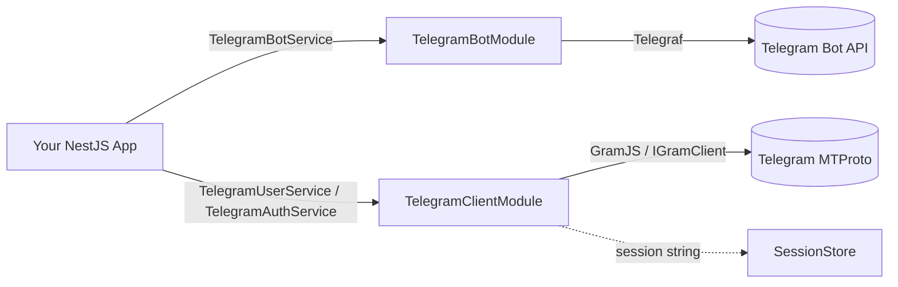

# nestjs-telegram

A fully-typed [NestJS](https://nestjs.com) module for Telegram that wraps **two** different Telegram APIs behind one cohesive, strictly-typed package. Use the **Bot API** (powered by [Telegraf](https://telegraf.js.org)) to run a normal `@BotFather` bot, and/or use the **MTProto user-account client** (powered by [GramJS](https://gram.js.org)) to sign in as **your own Telegram account** and drive it from your app. Both sides share one error hierarchy, ship with pluggable session persistence, and are designed around testable seams so you can unit-test everything without ever touching the network.

---

## Features

### Bot API side (Telegraf — a normal bot)

- `TelegramBotModule.forRoot` / `forRootAsync` — synchronous or `ConfigService`-driven async configuration.
- `TelegramBotService` — an injectable, strongly-typed facade over Telegraf whose method signatures are derived from Telegraf's own `Telegram` type (via `Parameters`/`ReturnType`), so they never drift from the installed version.
  - Messaging: `sendMessage`, `sendPhoto`, `sendDocument`, `sendVideo`, `sendAudio`, `sendMediaGroup`, `sendLocation`, `sendChatAction`, `forwardMessage`, `copyMessage`.
  - Editing & deletion: `editMessageText`, `editMessageReplyMarkup`, `deleteMessage`.
  - Callbacks: `answerCbQuery`.
  - Chat & member management: `getMe`, `getChat`, `getChatMembersCount`, `banChatMember`, `pinChatMessage`.
  - Commands: `setMyCommands`, `getMyCommands`.
  - Files: `getFile`, `getFileLink`.
  - Webhooks: `setWebhook`, `deleteWebhook`, `getWebhookInfo`, `webhookCallback`.
  - Handler delegates: `start`, `help`, `command`, `hears`, `action`, `on`, `use`, `catch`.
- Automatic launch/stop wired into the Nest lifecycle (long-polling by default, webhook mode supported); set `launch: false` to take manual control.
- Escape hatches: `TelegramBotService.instance` (raw `Telegraf`) and `TelegramBotService.telegram` (raw Telegraf `Telegram` client), plus the `TELEGRAM_BOT` injection token — nothing is hidden behind the facade.
- Fluent keyboard builders: `InlineKeyboardBuilder`, `ReplyKeyboardBuilder`, plus the `removeKeyboard` and `forceReply` helpers.

### User-account side (GramJS / MTProto — sign in as yourself)

- `TelegramClientModule.forRoot` / `forRootAsync` — configured with the `apiId` / `apiHash` from [my.telegram.org](https://my.telegram.org).
- `TelegramAuthService` — drives the login state machine: `sendCode` → `signIn` → (`checkPassword` for 2FA), plus `logOut`, `isAuthorized`, and `exportSession`.
- `TelegramUserService` — act **as your own account**: `getMe`, `getDialogs`, `getMessages`, `sendMessage`, and the `sendToSelf` convenience for your "Saved Messages".
- Pluggable session persistence via the `SessionStore` interface, with `InMemorySessionStore` and `FileSessionStore` (writes `0o600`, owner-only) included — bring your own (Redis, a secrets manager, etc.) by implementing three methods (`load` / `save` / `clear`).
- A clean test seam: services depend only on the `IGramClient` interface, and the GramJS package is touched in exactly one adapter file. Inject a fake via `clientFactory` and you never hit the network.
- Library-owned DTOs (`GramUser`, `GramDialog`, `GramMessage`, `GramSendMessageParams`, …) so consumers never import GramJS just to model a user or a message.

### Shared

- One typed error hierarchy: a `TelegramError` base with `TelegramConfigError`, `TelegramBotApiError`, `TelegramClientError`, `TelegramAuthError` (carrying a closed `TelegramAuthErrorCode` set), and `TelegramSessionError`, plus the `isTelegramError` type guard.
- `TelegramModule.forRoot({ bot?, client?, isGlobal? })` — an umbrella module that composes both sides from a single synchronous options object.
- Strict TypeScript throughout (no `any`, no `enum` — `as const` unions only), and every export documented with JSDoc.

---

## Install

```bash
npm i nestjs-telegram
```

The NestJS runtime peers are always required:

```bash
npm i @nestjs/common @nestjs/core reflect-metadata rxjs
```

Then install **only the Telegram client(s) you use** — `telegraf` and `telegram`
are **optional** peer dependencies:

```bash
# Bot API only
npm i telegraf

# User account (MTProto) only
npm i telegram

# Both
npm i telegraf telegram
```

### Import only the side you need (subpath exports)

The package exposes three independent entry points so a bot-only app never pulls
in GramJS, and a user-account-only app never pulls in Telegraf:

| Import | Pulls in | Use when |
| --- | --- | --- |
| `nestjs-telegram/bot` | `telegraf` only | You only run a bot |
| `nestjs-telegram/client` | `telegram` (GramJS) only | You only control a user account |
| `nestjs-telegram/common` | neither | Just the shared error/types layer |
| `nestjs-telegram` (root) | both | You use both sides |

```ts
import { TelegramBotModule } from 'nestjs-telegram/bot';       // no GramJS loaded
import { TelegramClientModule } from 'nestjs-telegram/client'; // no Telegraf loaded
```

> Importing from the root (`nestjs-telegram`) re-exports everything and therefore
> loads both SDKs — use the subpaths when you only need one side.

---

## Two APIs at a glance

| | **Bot API** (Telegraf) | **User account** (MTProto / GramJS) |
| --- | --- | --- |
| **Identity** | A bot created via `@BotFather` | Your own real Telegram account |
| **Auth** | A single bot `token` | `apiId` + `apiHash` from my.telegram.org, then a phone/code/2FA login that yields a **string session** |
| **What it can do** | Reply to users, run commands, push notifications, manage groups/channels where the bot is an admin, inline keyboards, webhooks | Read your dialog list, fetch message history, send messages **as you** (including to "Saved Messages"), reach any chat you're a member of |
| **Module** | `TelegramBotModule` | `TelegramClientModule` |
| **Main service** | `TelegramBotService` | `TelegramUserService` (+ `TelegramAuthService`) |
| **When to use** | Building a bot users talk to; sending automated notifications from a server | Automating your own account; reading/aggregating your own chats; user-only actions a bot cannot perform |

---

## 📚 Documentation

**[→ Complete Documentation Index](./docs/INDEX.md)**

### Quick Links

- **[Getting Started](./docs/GETTING-STARTED.md)** — Installation & first bot/client setup
- **[API Reference](./docs/API-REFERENCE.md)** — Complete API documentation
- **[Examples & Recipes](./docs/EXAMPLES.md)** — Practical copy-paste examples
- **[Advanced Usage](./docs/ADVANCED-USAGE.md)** — Production patterns & best practices

### By Topic

- **Bot API**: [BOT-API.md](./docs/BOT-API.md) | [Update Decorators](./docs/BOT-UPDATE-DECORATORS.md) | [Mini Apps](./docs/MINI-APP-INIT-DATA.md)
- **MTProto Client**: [User Client Guide](./docs/USER-CLIENT-MTPROTO.md) | [Authentication](./docs/AUTHENTICATION.md)
- **General**: [Testing](./docs/TESTING.md) | [Architecture](./docs/TELEGRAM-MODULE.md)



> **A bot cannot do everything a user can, and vice-versa.** Many apps run both: a bot for user-facing interactions and a user-account client for reading/automating your own chats.

---

## Quick Start — Bot API

Configure the bot module (async, pulling the token from `ConfigService`) and inject `TelegramBotService` anywhere.

```ts
import { Module, Injectable } from '@nestjs/common';
import { ConfigModule, ConfigService } from '@nestjs/config';
import { TelegramBotModule, TelegramBotService } from 'nestjs-telegram';

@Module({
  imports: [
    ConfigModule.forRoot({ isGlobal: true }),
    TelegramBotModule.forRootAsync({
      isGlobal: true,
      inject: [ConfigService],
      useFactory: (config: ConfigService) => ({
        token: config.getOrThrow<string>('BOT_TOKEN'),
        // launch: false, // disable auto-launch to mount a webhook yourself
      }),
    }),
  ],
})
export class AppModule {}
```

```ts
@Injectable()
export class NotificationsService {
  public constructor(private readonly bot: TelegramBotService) {}

  /** Sends a notification to a chat as the bot. */
  public async notify(chatId: number | string, text: string): Promise<void> {
    await this.bot.sendMessage(chatId, text);
  }
}
```

Register handlers and attach an inline keyboard with the builders:

```ts
import { InlineKeyboardBuilder } from 'nestjs-telegram';

this.bot.start(async (ctx) => {
  const keyboard = new InlineKeyboardBuilder()
    .url('Docs', 'https://core.telegram.org/bots/api')
    .callback('Ping', 'ping')
    .build();
  await ctx.reply('Welcome!', { reply_markup: keyboard });
});

this.bot.action('ping', async (ctx) => {
  await ctx.answerCbQuery('pong');
});
```

By default the bot launches in long-polling mode on application bootstrap and stops on shutdown. Pass a `launchOptions.webhook` block (or set `launch: false` and mount `bot.webhookCallback(...)` yourself) to run in webhook mode.

---

## Quick Start — User account (MTProto)

### 1. Get a session string

The user-account side authenticates **your account**, so it needs a one-time interactive login. The bundled CLI (`examples/login-cli.ts`) walks you through it and prints a portable session string.

```bash
# .env: TG_API_ID and TG_API_HASH from https://my.telegram.org
npm run login
```

```text
Phone (+countrycode…): +15551234567
Login code from Telegram: 12345
Two-factor (2FA) password: ********   # only if 2FA is enabled
Signed in successfully.

=== SESSION STRING (save as TG_SESSION) ===
1BVtsOMM...   # copy this into .env as TG_SESSION
```

> The session string grants full access to your account — treat it like a password and never commit it. See the [Security](#security) note below.

### 2. Wire the module and use your account

Configure `TelegramClientModule` with your `apiId` / `apiHash`, resume from `TG_SESSION`, and persist future sessions with a `SessionStore`.

```ts
import { Module, Injectable } from '@nestjs/common';
import { ConfigModule, ConfigService } from '@nestjs/config';
import {
  TelegramClientModule,
  TelegramUserService,
  FileSessionStore,
} from 'nestjs-telegram';

@Module({
  imports: [
    ConfigModule.forRoot({ isGlobal: true }),
    TelegramClientModule.forRootAsync({
      isGlobal: true,
      inject: [ConfigService],
      useFactory: (config: ConfigService) => ({
        apiId: Number(config.getOrThrow<string>('TG_API_ID')),
        apiHash: config.getOrThrow<string>('TG_API_HASH'),
        session: config.get<string>('TG_SESSION'), // resume from the CLI output
        sessionStore: new FileSessionStore('./.telegram.session'),
      }),
    }),
  ],
})
export class AppModule {}
```

```ts
@Injectable()
export class SelfNotesService {
  public constructor(private readonly user: TelegramUserService) {}

  /** Sends a note to your own "Saved Messages" chat — as YOU, not a bot. */
  public async remember(text: string): Promise<void> {
    await this.user.sendToSelf(text);
  }
}
```

Need both sides at once? Use the umbrella module:

```ts
import { TelegramModule } from 'nestjs-telegram';

TelegramModule.forRoot({
  isGlobal: true,
  bot: { token: process.env.BOT_TOKEN! },
  client: {
    apiId: Number(process.env.TG_API_ID),
    apiHash: process.env.TG_API_HASH!,
  },
});
```

---

## Documentation

| Guide | What it covers |
| --- | --- |
| [docs/TELEGRAM-MODULE.md](docs/TELEGRAM-MODULE.md) | The umbrella `TelegramModule`, module composition, and global registration |
| [docs/BOT-API.md](docs/BOT-API.md) | `TelegramBotModule`, `TelegramBotService`, keyboards, and the launch/webhook lifecycle |
| [docs/BOT-UPDATE-DECORATORS.md](docs/BOT-UPDATE-DECORATORS.md) | `@TelegramUpdate` handler classes — `@Command`/`@Hears`/`@Action`/`@On` + `@Ctx`/`@Sender` param decorators |
| [docs/MINI-APP-INIT-DATA.md](docs/MINI-APP-INIT-DATA.md) | `validateWebAppInitData()` — verify & parse Telegram Mini App `initData` server-side |
| [docs/USER-CLIENT-MTPROTO.md](docs/USER-CLIENT-MTPROTO.md) | `TelegramClientModule`, `TelegramUserService`, dialogs/messages, and the DTOs |
| [docs/AUTHENTICATION.md](docs/AUTHENTICATION.md) | The `sendCode` → `signIn` → `checkPassword` flow and `SessionStore` persistence |
| [docs/TESTING.md](docs/TESTING.md) | Unit-testing both sides via the `IGramClient` / `clientFactory` seam |

---

## Testing

The library ships with **150 tests** and is built to keep network I/O out of your suite:

- The MTProto services depend only on the `IGramClient` interface — the `telegram` (GramJS) package is imported in exactly one adapter file. Supply a hand-rolled fake `IGramClient` and construct `TelegramUserService` / `TelegramAuthService` directly (the bundled login CLI does exactly this when run outside of Nest DI).
- Inside Nest, pass a `clientFactory` to `TelegramClientModule` (or override the `TELEGRAM_GRAM_CLIENT` token) to swap in a fake client without touching the network.
- On the Bot side, `InMemorySessionStore` gives the client side a zero-I/O session backend, and every facade method funnels through a single error-normalizing path that wraps failures in `TelegramBotApiError`.

---

## Security

- **A session string is a credential equivalent to your password.** It encodes the auth keys that let anyone reconnect as your account *without* the phone code or 2FA. Never commit it, never log it, never paste it into a chat or an issue.
- Keep session files (`FileSessionStore` writes them `0o600`, owner read/write only) out of version control and off shared volumes. Add `.telegram.session` and `TG_SESSION` to your `.gitignore` / secret store.
- If a session leaks, revoke it immediately: call `TelegramAuthService.logOut()` (or terminate the session from Telegram's *Settings → Devices*), then run the login flow again to mint a fresh one.
- `apiId` / `apiHash` and the bot `token` are likewise secrets — load them from the environment or a secrets manager, not from source.

---

## License

[MIT](LICENSE)
