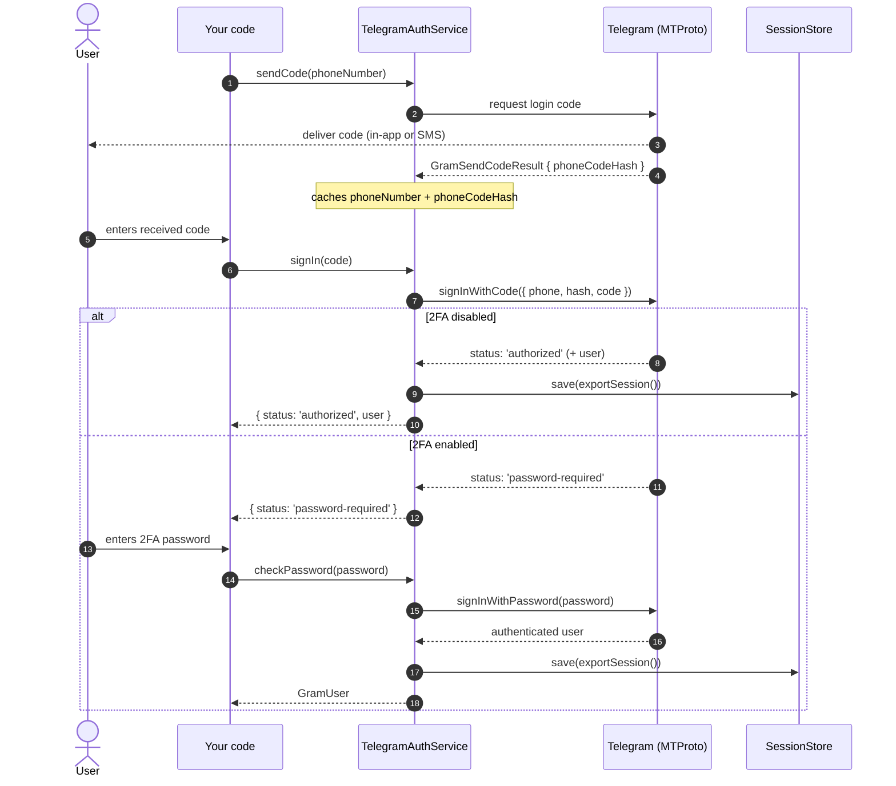
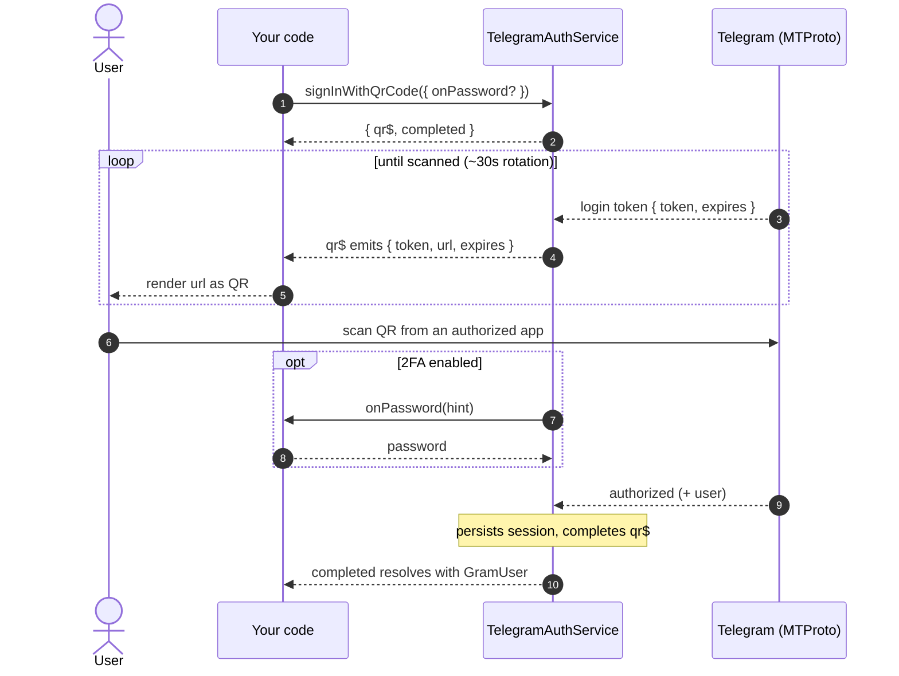

# User-Account Authentication (MTProto)

This guide covers signing in through the MTProto client side of `nestjs-telegram`
— as **your own Telegram account** (phone/code/2FA or QR code) or as a **bot over
MTProto**. It documents the `TelegramAuthService` login state machine, the
alternative QR-code and bot-token flows, two-factor (2FA) password management,
the `GramSignInResult` discriminated union, every `TelegramAuthErrorCode`, how to
mint a reusable session string with `examples/login-cli.ts`, and how sessions are
persisted and reused.

> **Two kinds of bot.** A normal bot driven by the **Bot API** (`TelegramBotModule`
> / Telegraf) is a different surface and is not covered here. This guide's
> `signInAsBot` instead logs a bot in over the **MTProto** transport via
> `TelegramClientModule`, giving it the user-client method set (higher limits and
> features the Bot API lacks). Pick the Bot API for ordinary bots; pick MTProto
> bot-login only when you specifically need the MTProto surface.

---

## Table of contents

- [Prerequisites](#prerequisites)
- [The login state machine](#the-login-state-machine)
- [`TelegramAuthService` reference](#telegramauthservice-reference)
- [QR-code login](#qr-code-login)
- [Bot-token login (MTProto)](#bot-token-login-mtproto)
- [Two-factor (2FA) password management](#two-factor-2fa-password-management)
- [`GramSignInResult` discriminated union](#gramsigninresult-discriminated-union)
- [`TelegramAuthErrorCode` reference](#telegramautherrorcode-reference)
- [Handling errors in practice](#handling-errors-in-practice)
- [Minting a session with the login CLI](#minting-a-session-with-the-login-cli)
- [Session persistence and reuse](#session-persistence-and-reuse)
- [Keep your session string secret](#keep-your-session-string-secret)

---

## Prerequisites

You authenticate at two distinct levels:

| Level | What it identifies | Where it comes from |
| --- | --- | --- |
| **Application** | `apiId` + `apiHash` | <https://my.telegram.org> → *API development tools* |
| **Account** | the phone / code / 2FA flow | the Telegram account you are signing in as |

The `apiId` and `apiHash` configure `TelegramClientModule` via
[`TelegramClientModuleOptions`](../src/lib/client/telegram-client.options.ts):

```ts
import { TelegramClientModule, FileSessionStore } from 'nestjs-telegram';

TelegramClientModule.forRoot({
  apiId: Number(process.env.TG_API_ID),
  apiHash: process.env.TG_API_HASH!,
  sessionStore: new FileSessionStore('./.telegram.session'),
});
```

The phone / code / 2FA flow authenticates the **account** and is driven by
[`TelegramAuthService`](../src/lib/client/telegram-auth.service.ts).

---

## The login state machine

A login walks the following states:

```
sendCode(phone) ─▶ signIn(code) ─┬─▶ authorized
                                 └─▶ password-required ─▶ checkPassword(pw) ─▶ authorized
```

On success, the resulting string session is written to the configured
`SessionStore` (when one is supplied) so the next process start can skip the
login entirely.



A minimal driver:

```ts
import { TelegramAuthService } from 'nestjs-telegram';

async function login(auth: TelegramAuthService): Promise<void> {
  await auth.sendCode('+15551234567');
  const step = await auth.signIn('12345'); // code the user received
  if (step.status === 'password-required') {
    await auth.checkPassword('my-2fa-password');
  }
  // Session is now authorized (and persisted if a SessionStore is configured).
}
```

---

## `TelegramAuthService` reference

`TelegramAuthService` is an `@Injectable()` exported by `TelegramClientModule`.
It holds the pending phone number and `phoneCodeHash` on the instance, so it
drives exactly **one** account at a time — do not share a single instance across
concurrent logins for different numbers.

| Method | Signature | Description |
| --- | --- | --- |
| `sendCode` | `sendCode(phoneNumber: string, forceSMS?: boolean): Promise<GramSendCodeResult>` | Requests a login code for `phoneNumber` (international format, e.g. `+15551234567`). Pass `forceSMS = true` to force SMS delivery instead of the in-app code. Caches the returned `phoneCodeHash` internally for `signIn`. Throws `TelegramAuthError` (`PHONE_INVALID`) when the number is rejected. |
| `signIn` | `signIn(phoneCode: string): Promise<GramSignInResult>` | Completes sign-in with the code the user received. Returns a [`GramSignInResult`](#gramsigninresult-discriminated-union): `authorized` (session persisted) or `password-required` (2FA enabled). Throws `TelegramAuthError` with `CODE_NOT_REQUESTED` if called before `sendCode`, or `CODE_INVALID` when the code is wrong. |
| `checkPassword` | `checkPassword(password: string): Promise<GramUser>` | Completes a 2FA-protected sign-in with the two-step-verification password. Returns the authenticated `GramUser` and persists the session. Throws `TelegramAuthError` (`PASSWORD_INVALID`) when wrong. |
| `signInWithQrCode` | `signInWithQrCode(options?: QrLoginOptions): QrLoginHandle` | Starts a QR-code login. Returns a `{ qr$, completed }` handle — subscribe to `qr$` to render each rotating QR token and await `completed` for the authenticated `GramUser` (session persisted). Pass `options.onPassword` for 2FA accounts. See [QR-code login](#qr-code-login). |
| `signInAsBot` | `signInAsBot(botToken: string): Promise<GramUser>` | Signs in as a bot over MTProto using a BotFather token, then persists the session. Throws `TelegramAuthError` when the token is rejected. See [Bot-token login](#bot-token-login-mtproto). |
| `setupTwoFactor` | `setupTwoFactor(input: { password: string; hint? }): Promise<void>` | Enables 2FA on an account that has none. Requires an authorized session. See [2FA management](#two-factor-2fa-password-management). |
| `changeTwoFactor` | `changeTwoFactor(input: { currentPassword: string; newPassword: string; hint? }): Promise<void>` | Changes the existing 2FA password. Throws `PASSWORD_INVALID` when `currentPassword` is wrong. |
| `disableTwoFactor` | `disableTwoFactor(currentPassword: string): Promise<void>` | Removes 2FA from the account. Throws `PASSWORD_INVALID` when the password is wrong. |
| `logOut` | `logOut(): Promise<void>` | Logs out, invalidating the session locally and on Telegram's servers, clears the cached phone/hash, and clears the stored session via `SessionStore.clear()`. |
| `isAuthorized` | `isAuthorized(): Promise<boolean>` | Whether the current session is already authorized. Connects first if needed. Use it to skip the login flow when an existing session is valid. |
| `exportSession` | `exportSession(): string` | Serializes the current session to a portable string for manual persistence/inspection. Returns an **empty string** when unauthenticated. Never throws. |

Notes:

- `sendCode`, `signIn`, `checkPassword`, and `isAuthorized` all ensure the
  underlying client is connected before proceeding, so you do not have to call
  `connect()` yourself.
- `signIn` and `checkPassword` automatically write the session to the configured
  `SessionStore` after a successful authorization. Without a store, the session
  lives only in the active client and can still be read with `exportSession()`.

### Injecting the service

```ts
import { Injectable } from '@nestjs/common';
import { TelegramAuthService } from 'nestjs-telegram';

@Injectable()
export class LoginService {
  constructor(private readonly auth: TelegramAuthService) {}

  async start(phone: string): Promise<void> {
    await this.auth.sendCode(phone);
  }
}
```

---

## QR-code login

QR login avoids SMS codes entirely: you render a short-lived token as a QR code,
and an **already–signed-in** Telegram app authorizes the new session when it
scans it (Telegram app → *Settings → Devices → Link Desktop Device*).

Because Telegram **rotates the token roughly every 30 seconds** until it is
scanned, `signInWithQrCode` does **not** return a single static token. It returns
a `QrLoginHandle` immediately (synchronously):

```ts
interface QrLoginHandle {
  qr$: Observable<GramQrToken>; // emits the first token, then each rotation
  completed: Promise<GramUser>; // resolves once scanned; session persisted
}

interface GramQrToken {
  token: string;   // base64url login token
  url: string;     // tg://login?token=… — render THIS as the QR code
  expires: number; // unix seconds; a new token is issued at/after this
}
```

Subscribe to `qr$`, always rendering the **latest** emission's `url`, and await
`completed` for the authenticated account:

```ts
const { qr$, completed } = auth.signInWithQrCode();

const sub = qr$.subscribe((t) => renderQrCode(t.url)); // re-render on each token
const me = await completed; // resolves once the code is scanned
sub.unsubscribe();
console.log(`Signed in via QR as ${me.firstName ?? me.id}`);
```

On success the session is persisted to the configured `SessionStore`, exactly
like the phone/code flow. Always attach a handler to `completed` — an unhandled
rejection surfaces as a Node warning.

### QR login with 2FA

If the scanned account has two-step verification, supply an `onPassword`
callback; it is invoked with Telegram's stored hint (if any) and must resolve the
password:

```ts
const { qr$, completed } = auth.signInWithQrCode({
  onPassword: (hint) => promptForPassword(hint), // your async prompt
});
```

Omit `onPassword` and a 2FA account rejects `completed` with a
`PASSWORD_REQUIRED` `TelegramAuthError`.

A runnable terminal example lives at
[`examples/qr-login.example.ts`](../examples/qr-login.example.ts).



---

## Bot-token login (MTProto)

`signInAsBot` logs a bot in over the **MTProto** transport (not the Bot API),
giving it the same user-client method set as a signed-in account:

```ts
const bot = await auth.signInAsBot(process.env.BOT_TOKEN!); // '<id>:<secret>'
console.log(`Signed in as @${bot.username}`);
```

The session is persisted on success, so subsequent starts reuse it just like a
user session. A rejected token surfaces as a `TelegramAuthError`. Never log the
token — treat it like any other secret.

> **Which bot surface?** For an ordinary bot, prefer the Bot API
> (`TelegramBotModule`). Reach for MTProto bot-login only when you specifically
> need the MTProto surface (higher limits, methods the Bot API lacks).

---

## Two-factor (2FA) password management

Once an account is authorized, you can manage its two-step-verification password.
All three methods require an authorized session and surface failures as a
`TelegramAuthError` (`PASSWORD_INVALID` when the current password is wrong).

| Method | Use it to |
| --- | --- |
| `setupTwoFactor({ password, hint? })` | **Enable** 2FA on an account that has none. |
| `changeTwoFactor({ currentPassword, newPassword, hint? })` | **Change** the existing 2FA password. |
| `disableTwoFactor(currentPassword)` | **Remove** 2FA from the account. |

```ts
// Enable
await auth.setupTwoFactor({ password: 'hunter2', hint: 'the usual' });

// Change
await auth.changeTwoFactor({ currentPassword: 'hunter2', newPassword: 'hunter3' });

// Disable
await auth.disableTwoFactor('hunter3');
```

> **This can be slow.** Telegram's SRP password math (large prime work) can take
> several seconds — this is expected, not a hang.

---

## `GramSignInResult` discriminated union

`signIn` returns a discriminated union keyed on `status`. Defined in
[`gram-client.types.ts`](../src/lib/client/gram-client.types.ts):

```ts
type GramSignInResult =
  | {
      status: 'authorized'; // GRAM_SIGN_IN_STATUSES.AUTHORIZED
      user: GramUser;        // the authenticated account
    }
  | {
      status: 'password-required'; // GRAM_SIGN_IN_STATUSES.PASSWORD_REQUIRED
    };
```

Narrow on `status` to decide the next step. When `status` is `'authorized'`,
`user` is present (a [`GramUser`](../src/lib/client/gram-client.types.ts) with
`id`, `isSelf`, `isBot`, `isPremium`, and optional `firstName` / `lastName` /
`username` / `phone`). When `status` is `'password-required'`, no `user` is
present yet — collect the 2FA password and call `checkPassword`.

```ts
const step = await auth.signIn(code);

switch (step.status) {
  case 'authorized': {
    const me = step.user; // GramUser — only available in this branch
    console.log(`Signed in as ${me.firstName ?? me.id}`);
    break;
  }
  case 'password-required': {
    const me = await auth.checkPassword(await promptForPassword());
    console.log(`Signed in (2FA) as ${me.firstName ?? me.id}`);
    break;
  }
}
```

Because the union is closed (the `status` literals come from the `as const`
record `GRAM_SIGN_IN_STATUSES`), an exhaustive `switch` lets TypeScript flag any
unhandled case.

---

## `TelegramAuthErrorCode` reference

All sign-in failures surface as a `TelegramAuthError` (a subclass of
`TelegramError`, with `kind === 'auth'`). Its `code` field is one of the closed
[`TelegramAuthErrorCode`](../src/lib/common/telegram.errors.ts) values below.
When `code` is `FLOOD_WAIT`, the error also carries `retryAfterSeconds`.

| Code | Typical trigger | How to handle |
| --- | --- | --- |
| `PHONE_INVALID` | The phone number passed to `sendCode` was rejected by Telegram (wrong format, not a real number). | Re-prompt for the number in international format (`+<country><number>`), then call `sendCode` again. |
| `CODE_INVALID` | The login code passed to `signIn` was empty, expired, or wrong. | Re-prompt for the code. If it has expired, call `sendCode` again to request a fresh one (which yields a new `phoneCodeHash`). |
| `PASSWORD_REQUIRED` | 2FA is enabled on the account; the code was accepted but a password is still needed. | Prompt the user for their **two-factor (2FA) password** and call `checkPassword(pw)`. (Note: `signIn` normally signals this via the `password-required` *result status* rather than throwing — treat this code the same way if you encounter it.) |
| `PASSWORD_INVALID` | The 2FA password passed to `checkPassword` was rejected. | Re-prompt for the password and call `checkPassword` again. |
| `CODE_NOT_REQUESTED` | `signIn` was called before `sendCode` produced a `phoneCodeHash`. | Programmer error — call `sendCode(phone)` first, then `signIn(code)`. |
| `SIGN_UP_REQUIRED` | The number has no existing Telegram account; Telegram wants you to finish sign-up. | This library does not register new accounts. Create the account in an official Telegram client first, then retry the login. |
| `NOT_AUTHORIZED` | An operation that needs an authorized session was attempted without one. | Run (or complete) the login flow before the operation. Use `isAuthorized()` to check first. |
| `FLOOD_WAIT` | Telegram rate-limited the request (too many attempts). | Wait `error.retryAfterSeconds` seconds, then retry. See the snippet below. |
| `UNKNOWN` | Any auth failure that does not map to a more specific code. | Surface the message to the user and inspect `error.cause` for the underlying GramJS error. |

> **`floodSleepThreshold`.** `TelegramClientModuleOptions.floodSleepThreshold`
> (seconds) lets GramJS transparently wait-and-retry flood waits **below** that
> threshold instead of throwing. Flood waits longer than the threshold still
> surface as a `FLOOD_WAIT` `TelegramAuthError` with `retryAfterSeconds`.

---

## Handling errors in practice

Catch with the `isTelegramError` guard and narrow on `code`:

```ts
import { isTelegramError, TelegramAuthService } from 'nestjs-telegram';

async function signInSafely(
  auth: TelegramAuthService,
  code: string,
): Promise<void> {
  try {
    const step = await auth.signIn(code);
    if (step.status === 'password-required') {
      await auth.checkPassword(await promptForPassword());
    }
  } catch (error) {
    if (!isTelegramError(error) || error.kind !== 'auth') throw error;

    switch (error.code) {
      case 'PASSWORD_REQUIRED':
        // 2FA: collect the password and finish the sign-in.
        await auth.checkPassword(await promptForPassword());
        break;

      case 'CODE_INVALID':
        // Wrong/expired code — re-prompt (or call sendCode again to refresh it).
        await auth.signIn(await promptForCode());
        break;

      case 'FLOOD_WAIT': {
        const wait = error.retryAfterSeconds ?? 0;
        console.warn(`Rate-limited; retry after ${wait}s.`);
        await new Promise((r) => setTimeout(r, wait * 1000));
        break;
      }

      default:
        throw error; // PHONE_INVALID, SIGN_UP_REQUIRED, NOT_AUTHORIZED, UNKNOWN…
    }
  }
}
```

---

## Minting a session with the login CLI

[`examples/login-cli.ts`](../examples/login-cli.ts) runs the interactive flow
**outside** of NestJS DI (it constructs `TelegramAuthService` directly) and
prints a reusable string session. Run it **once** per account.

### 1. Set the environment variables

The CLI reads these (via `dotenv`, so a `.env` file works):

| Variable | Required | Purpose |
| --- | --- | --- |
| `TG_API_ID` | yes | Application `api_id` from my.telegram.org. |
| `TG_API_HASH` | yes | Application `api_hash` from my.telegram.org. |
| `TG_PHONE` | no | Phone number in international format. Prompted if omitted. |
| `TG_SESSION` | no | Existing session to resume; if it is already authorized, the CLI just reprints it. |

```dotenv
# .env
TG_API_ID=1234567
TG_API_HASH=0123456789abcdef0123456789abcdef
TG_PHONE=+15551234567
```

### 2. Run it

```bash
npm run login
```

(That script runs `ts-node -P tsconfig.json examples/login-cli.ts`.)

### 3. Follow the prompts

```
Phone (+countrycode…): +15551234567
Login code from Telegram: 12345
Two-factor (2FA) password: ********   # only shown when 2FA is enabled

Signed in successfully.

=== SESSION STRING (save as TG_SESSION) ===
1AaBbCc…<long opaque string>…ZzYyXx
```

### 4. Save the printed string as `TG_SESSION`

Copy the printed session string into your environment (e.g. `.env`) as
`TG_SESSION`. On subsequent runs the CLI detects the authorized session via
`isAuthorized()` and skips the login. The client always disconnects in a
`finally` block, and any `TelegramError` is reported with its `kind`.

---

## Session persistence and reuse

A **string session** encodes the auth keys that let the client reconnect
without re-running the phone/code/2FA flow. You can reuse it two ways.

### Pass it directly via options

```ts
TelegramClientModule.forRoot({
  apiId: Number(process.env.TG_API_ID),
  apiHash: process.env.TG_API_HASH!,
  session: process.env.TG_SESSION, // resume an existing session
});
```

`TelegramClientModuleOptions.session` takes precedence over any value loaded
from a `sessionStore`.

### Persist automatically via a `SessionStore`

Supply a [`SessionStore`](../src/lib/client/session/session-store.interface.ts).
The module loads the initial session from it (when `session` is not set), and
`TelegramAuthService` writes the session back after a successful login
(`signIn` without 2FA, or `checkPassword`). `logOut()` clears it.

The library ships two implementations:

| Store | Constructor | Durability | Use for |
| --- | --- | --- | --- |
| [`FileSessionStore`](../src/lib/client/session/file-session-store.ts) | `new FileSessionStore(filePath)` | Survives restarts; file written `0o600` (owner-only) on POSIX. | Long-lived processes / servers. |
| [`InMemorySessionStore`](../src/lib/client/session/memory-session-store.ts) | `new InMemorySessionStore(initial?)` | Volatile — lost on restart, forcing a fresh login. | Tests, short-lived processes; seed it with `process.env.TG_SESSION`. |

```ts
import { TelegramClientModule, FileSessionStore } from 'nestjs-telegram';

TelegramClientModule.forRoot({
  apiId: Number(process.env.TG_API_ID),
  apiHash: process.env.TG_API_HASH!,
  sessionStore: new FileSessionStore('./.telegram.session'),
});
```

Implement the `SessionStore` interface (`load` / `save` / `clear`, each
sync or async) to back sessions with Redis, a database, or a secrets manager:

```ts
import type { SessionStore } from 'nestjs-telegram';

class RedisSessionStore implements SessionStore {
  async load() { return (await redis.get('tg:session')) ?? undefined; }
  async save(s: string) { await redis.set('tg:session', s); }
  async clear() { await redis.del('tg:session'); }
}
```

Storage failures surface as `TelegramSessionError` (`kind === 'session'`).

> **Lazy connect for login scripts.** Set `autoConnect: false` to connect
> manually instead of on module init — handy in CLI login scripts and tests.

---

## Keep your session string secret

> **A session string grants full access to your Telegram account** — it is
> equivalent to being logged in. Treat it like a password.

- **Never commit it.** Keep `TG_SESSION`, `.env`, and any session file out of
  version control (add them to `.gitignore`).
- **Never log or print it** in application output, error reports, or metrics.
  `TelegramAuthService` masks phone numbers in its own logs, but it is your
  responsibility not to leak the session string yourself.
- **Store it securely.** `FileSessionStore` writes the file `0o600`
  (owner read/write only) on POSIX; keep it off shared volumes. For production,
  prefer a secrets manager via a custom `SessionStore`.
- **Rotate on suspicion.** If a session string may have leaked, call
  `logOut()` (or revoke the session from Telegram's *Active sessions* list) to
  invalidate it on Telegram's servers, then re-run the login to mint a new one.
