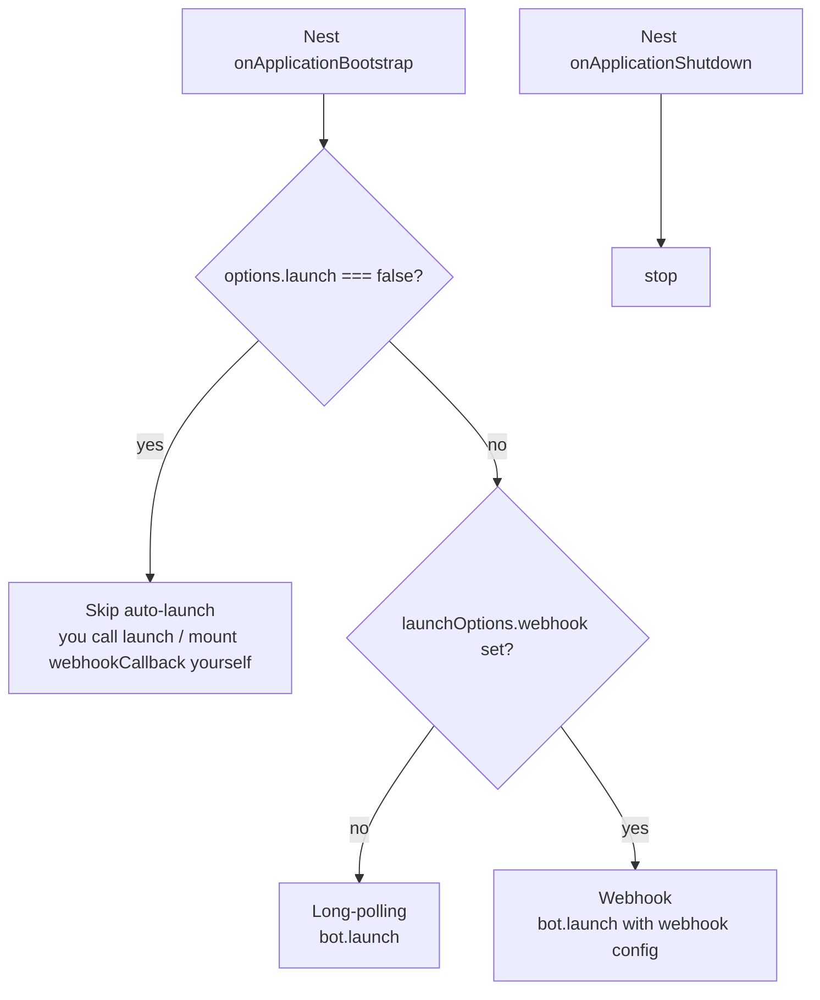

# Bot API Guide

This guide covers the **Bot API** side of `nestjs-telegram` — a "normal bot" created
through [@BotFather](https://t.me/BotFather) and driven by [Telegraf](https://telegraf.js.org/).
It is the half of the library you use to act *as a bot*. (To act as **your own account**
over MTProto, see the client/user-account guide instead.)

Everything described here is backed by these source files:

- `src/lib/bot/telegram-bot.module.ts` — `TelegramBotModule.forRoot` / `forRootAsync`
- `src/lib/bot/telegram-bot.options.ts` — `TelegramBotModuleOptions`
- `src/lib/bot/telegram-bot.service.ts` — `TelegramBotService` (typed facade + lifecycle + handlers)
- `src/lib/bot/telegram-bot.constants.ts` — the `TELEGRAM_BOT` injection token
- `src/lib/bot/keyboard.builder.ts` — `InlineKeyboardBuilder`, `ReplyKeyboardBuilder`, `removeKeyboard`, `forceReply`
- `src/lib/bot/callback-data.codec.ts` — `encodeCallbackData`, `decodeCallbackData`
- `src/lib/bot/message-splitter.ts` — `splitMessageText`
- `src/lib/bot/retry.ts` — `withRetry`, `extractRetryAfterSeconds`
- `src/lib/common/telegram.errors.ts` — `TelegramBotApiError` and friends

All symbols are re-exported from the package root, so every import below resolves from
`'nestjs-telegram'`.

---

## Table of contents

1. [Getting a token from @BotFather](#1-getting-a-token-from-botfather)
2. [Registering the module](#2-registering-the-module)
   - [`forRoot` (synchronous)](#forroot-synchronous)
   - [`forRootAsync` with `ConfigService`](#forrootasync-with-configservice)
   - [`isGlobal`](#isglobal)
3. [Module options reference](#3-module-options-reference)
4. [Polling vs. webhook](#4-polling-vs-webhook)
   - [Long-polling (default)](#long-polling-default)
   - [Webhook (`launch: false` + `webhookCallback`)](#webhook-launch-false--webhookcallback)
5. [Registering handlers](#5-registering-handlers)
6. [Injecting the raw Telegraf instance (`TELEGRAM_BOT`)](#6-injecting-the-raw-telegraf-instance-telegram_bot)
7. [`TelegramBotService` method reference](#7-telegrambotservice-method-reference)
8. [Keyboards](#8-keyboards)
   - [Inline keyboards](#inline-keyboards)
   - [Reply (custom) keyboards](#reply-custom-keyboards)
   - [Removing a keyboard / forcing a reply](#removing-a-keyboard--forcing-a-reply)
9. [Convenience helpers](#9-convenience-helpers)
   - [`downloadFile` / `downloadFileStream`](#downloadfile--downloadfilestream)
   - [Structured callback data (`encodeCallbackData` / `decodeCallbackData`)](#structured-callback-data-encodecallbackdata--decodecallbackdata)
   - [`sendLongMessage` (auto-splitting)](#sendlongmessage-auto-splitting)
   - [`withRetry` (429 back-off)](#withretry-429-back-off)
10. [Error handling with `TelegramBotApiError`](#10-error-handling-with-telegrambotapierror)

---

## 1. Getting a token from @BotFather

A bot token is issued by Telegram's own bot, [@BotFather](https://t.me/BotFather):

1. Open Telegram and start a chat with **@BotFather**.
2. Send `/newbot`.
3. Choose a **display name** (e.g. `My Notifier`) and then a **username** that must end
   in `bot` (e.g. `my_notifier_bot`).
4. BotFather replies with a token shaped like:

   ```
   123456789:AAFooBarBazQuxxxxxxxxxxxxxxxxxxxxxxx
   ```

This token is the value you pass as `token` in [`TelegramBotModuleOptions`](#3-module-options-reference).
Treat it as a secret: keep it in an environment variable (e.g. `BOT_TOKEN`), never in
source control.

> The token is validated **at bootstrap**. If it is empty or blank, the module throws a
> `TelegramConfigError` while constructing the `Telegraf` provider, so misconfiguration
> surfaces immediately rather than as a `401` on your first API call.

Useful follow-up BotFather commands: `/setdescription`, `/setcommands` (or call
`setMyCommands` from code — see [§7](#7-telegrambotservice-method-reference)),
`/setjoingroups`, and `/token` (to revoke and reissue).

---

## 2. Registering the module

`TelegramBotModule` is a dynamic Nest module. It builds a singleton `Telegraf` instance
from your options and exposes the typed `TelegramBotService` facade plus the raw
`TELEGRAM_BOT` token.

### `forRoot` (synchronous)

Use this when the token is available synchronously (e.g. straight from `process.env`).

```ts
import { Module } from '@nestjs/common';
import { TelegramBotModule } from 'nestjs-telegram';

@Module({
  imports: [
    TelegramBotModule.forRoot({
      token: process.env.BOT_TOKEN!,
    }),
  ],
})
export class AppModule {}
```

### `forRootAsync` with `ConfigService`

Recommended for real apps: pull the token from `@nestjs/config` (or any provider) via a
factory. `forRootAsync` accepts the standard `inject` + `useFactory` shape; the factory
returns the same `TelegramBotModuleOptions` object that `forRoot` takes directly.

```ts
import { Module } from '@nestjs/common';
import { ConfigModule, ConfigService } from '@nestjs/config';
import { TelegramBotModule } from 'nestjs-telegram';

@Module({
  imports: [
    ConfigModule.forRoot({ isGlobal: true }),
    TelegramBotModule.forRootAsync({
      inject: [ConfigService],
      useFactory: (config: ConfigService) => ({
        token: config.getOrThrow<string>('BOT_TOKEN'),
      }),
    }),
  ],
})
export class AppModule {}
```

`useClass` and `useExisting` are also supported (they are generated by Nest's
`ConfigurableModuleBuilder`), but `useFactory` covers nearly every case.

### `isGlobal`

Both `forRoot` and `forRootAsync` accept an extra `isGlobal` flag (defaults to `false`).
When `true`, the module is registered in the **global** scope, so `TelegramBotService`
and `TELEGRAM_BOT` can be injected anywhere without re-importing `TelegramBotModule` in
every feature module.

```ts
TelegramBotModule.forRootAsync({
  isGlobal: true, // ← register globally
  inject: [ConfigService],
  useFactory: (config: ConfigService) => ({
    token: config.getOrThrow<string>('BOT_TOKEN'),
  }),
});
```

> `isGlobal` lives alongside the options object on the `forRoot`/`forRootAsync` argument —
> it is *not* a field of `TelegramBotModuleOptions` itself.

---

## 3. Module options reference

`TelegramBotModuleOptions` (from `src/lib/bot/telegram-bot.options.ts`):

| Option          | Type                              | Required | Default          | Description |
| --------------- | --------------------------------- | -------- | ---------------- | ----------- |
| `token`         | `string`                          | **yes**  | —                | Bot API token from @BotFather (`123456:ABC-DEF…`). Throws `TelegramConfigError` at bootstrap if empty/blank. |
| `telegraf`      | `Partial<Telegraf.Options<Context>>` | no    | `undefined`      | Options forwarded verbatim to the `Telegraf` constructor (handler timeout, custom `telegram` agent / test environment, etc.). |
| `launchOptions` | `Telegraf.LaunchOptions`          | no       | `undefined`      | Options forwarded to `bot.launch()`. Omit for long-polling; supply a `webhook` block for webhook mode. No effect when `launch` is `false`. |
| `launch`        | `boolean`                         | no       | `true`           | Whether the module auto-starts the bot on `onApplicationBootstrap` and stops it on shutdown. Set to `false` to take manual control (tests, serverless, self-mounted webhooks). |

A fully-specified example:

```ts
import { TelegramBotModule } from 'nestjs-telegram';

TelegramBotModule.forRoot({
  token: process.env.BOT_TOKEN!,
  telegraf: {
    handlerTimeout: 90_000, // ms a middleware may run before Telegraf bails out
  },
  launch: true,
  launchOptions: {
    dropPendingUpdates: true, // skip updates that piled up while the bot was offline
  },
});
```

---

## 4. Polling vs. webhook

The bot's lifecycle is wired into Nest automatically by `TelegramBotService`:

- On `onApplicationBootstrap` it calls `launch()` — **unless** `launch: false`.
- On `onApplicationShutdown` it calls `stop()`.

The mode is chosen from `launchOptions`: if `launchOptions.webhook` is present the bot
launches in **webhook** mode, otherwise it uses **long-polling**.



> Long-polling's launch promise only resolves when the bot stops, so the service
> intentionally does **not** await it; a failed launch is caught and logged rather than
> crashing the host application's bootstrap.

### Long-polling (default)

The simplest setup — no public URL required. With no `launchOptions` (or
`launchOptions` without a `webhook` block), the bot polls Telegram for updates:

```ts
TelegramBotModule.forRoot({
  token: process.env.BOT_TOKEN!,
  // launch defaults to true; no launchOptions.webhook => long-polling
});
```

### Webhook (`launch: false` + `webhookCallback`)

For production / serverless deployments you usually want Telegram to **push** updates to
an HTTPS endpoint that you mount yourself. The clean pattern is:

1. Disable auto-launch with `launch: false` so the module does **not** start polling.
2. Mount `TelegramBotService.webhookCallback(path)` as middleware on your HTTP server.
3. Tell Telegram where to deliver updates with `setWebhook(url)`.

```ts
// app.module.ts
import { Module } from '@nestjs/common';
import { ConfigModule, ConfigService } from '@nestjs/config';
import { TelegramBotModule } from 'nestjs-telegram';

@Module({
  imports: [
    ConfigModule.forRoot({ isGlobal: true }),
    TelegramBotModule.forRootAsync({
      isGlobal: true,
      inject: [ConfigService],
      useFactory: (config: ConfigService) => ({
        token: config.getOrThrow<string>('BOT_TOKEN'),
        launch: false, // ← do not start long-polling; we mount a webhook instead
      }),
    }),
  ],
})
export class AppModule {}
```

```ts
// main.ts
import { NestFactory } from '@nestjs/core';
import type { NestExpressApplication } from '@nestjs/platform-express';
import { ConfigService } from '@nestjs/config';
import { TelegramBotService } from 'nestjs-telegram';
import { AppModule } from './app.module';

const WEBHOOK_PATH = '/telegram/webhook';

async function bootstrap(): Promise<void> {
  const app = await NestFactory.create<NestExpressApplication>(AppModule);

  const bot = app.get(TelegramBotService);
  const config = app.get(ConfigService);

  // Feed incoming webhook updates from this path to the bot.
  app.use(WEBHOOK_PATH, bot.webhookCallback(WEBHOOK_PATH));

  await app.listen(3000);

  // Register the public HTTPS URL with Telegram (one-time / on deploy).
  const publicUrl = config.getOrThrow<string>('PUBLIC_URL'); // e.g. https://bot.example.com
  await bot.setWebhook(`${publicUrl}${WEBHOOK_PATH}`);
}

void bootstrap();
```

Alternatively, you can let the module launch in webhook mode by supplying
`launchOptions.webhook` and leaving `launch` at its default. Use the
`launch: false` + `webhookCallback` approach when you want full control over the HTTP
server and route (the common case in NestJS).

Related Bot API helpers on the service: `setWebhook`, `deleteWebhook` (revert to
long-polling), and `getWebhookInfo` (inspect current status).

### Webhook (built-in controller)

If you'd rather not wire `webhookCallback` and `setWebhook` by hand, enable the
**built-in webhook controller**: pass a `webhook` option and the module stands up
the `POST {path}` route, verifies Telegram's secret token in constant time, and
(optionally) registers the URL on bootstrap — no `main.ts` changes.

```ts
TelegramBotModule.forRoot({
  token: process.env.BOT_TOKEN!,
  launch: false, // webhook mode — don't also long-poll
  webhook: {
    path: '/telegram/webhook',
    domain: 'https://bot.example.com',
    secretToken: process.env.TELEGRAM_WEBHOOK_SECRET,
    registerOnBootstrap: true,
  },
});
```

See **[WEBHOOK-CONTROLLER.md](./WEBHOOK-CONTROLLER.md)** for the full guide
(options, request flow, multi-bot routing, and security notes).

---

## 5. Registering handlers

`TelegramBotService` exposes thin, fully-typed delegates that forward to the underlying
Telegraf instance. Each one keeps Telegraf's exact signature (they are derived via
`Parameters<Telegraf[...]>`), and the chainable ones return the `Telegraf` instance.

| Method     | Forwards to       | Use for |
| ---------- | ----------------- | ------- |
| `start`    | `Telegraf.start`  | The `/start` command |
| `help`     | `Telegraf.help`   | The `/help` command |
| `command`  | `Telegraf.command`| One or more slash commands |
| `hears`    | `Telegraf.hears`  | Matching incoming text (string / regex) |
| `action`   | `Telegraf.action` | Inline-keyboard callback queries (button presses) |
| `on`       | `Telegraf.on`     | A specific update/message type (e.g. `'text'`, `'photo'`) |
| `use`      | `Telegraf.use`    | Global middleware for every update (exposed as a bound getter) |
| `catch`    | `Telegraf.catch`  | The global error handler when a middleware throws |

A representative registration block — wire these up once, e.g. in `OnModuleInit`:

```ts
import { Injectable, type OnModuleInit } from '@nestjs/common';
import { InlineKeyboardBuilder, TelegramBotService } from 'nestjs-telegram';

@Injectable()
export class BotHandlers implements OnModuleInit {
  public constructor(private readonly bot: TelegramBotService) {}

  public onModuleInit(): void {
    // Global middleware: runs for every update (note: `use` is a getter).
    this.bot.use(async (ctx, next) => {
      const started = Date.now();
      await next();
      console.log(`update ${ctx.updateType} handled in ${Date.now() - started}ms`);
    });

    // /start
    this.bot.start(async (ctx) => {
      const keyboard = new InlineKeyboardBuilder()
        .url('Docs', 'https://core.telegram.org/bots/api')
        .callback('Ping', 'ping')
        .build();
      await ctx.reply('Welcome!', { reply_markup: keyboard });
    });

    // /help
    this.bot.help((ctx) => ctx.reply('Send /start to see the menu.'));

    // /ping command
    this.bot.command('ping', (ctx) => ctx.reply('pong'));

    // Free-text trigger
    this.bot.hears(/^hello/i, (ctx) => ctx.reply('Hi there!'));

    // Inline-keyboard button with callback_data === 'ping'
    this.bot.action('ping', async (ctx) => {
      await ctx.answerCbQuery('pong'); // acknowledge the button press
    });

    // Any plain text message
    this.bot.on('text', (ctx) => ctx.reply(`You said: ${ctx.message.text}`));

    // Global error handler
    this.bot.catch((err, ctx) => {
      console.error(`Handler error on ${ctx.updateType}:`, err);
    });
  }
}
```

> The `ctx` (context) object, `ctx.reply`, `ctx.answerCbQuery`, scenes, sessions, etc. all
> come from Telegraf — `nestjs-telegram` does not re-document them. The library's job is
> the DI wiring, the typed send/admin facade, and the keyboards/errors below.

For lifecycle control beyond auto-launch, the service also exposes `launch()` and
`stop(reason?)` directly (both are idempotent).

---

## 6. Injecting the raw Telegraf instance (`TELEGRAM_BOT`)

Anything the facade does not surface is still reachable. There are two escape hatches:

- `TelegramBotService.instance` — the raw `Telegraf` (for scenes, custom middleware, etc.).
- `TelegramBotService.telegram` — the raw Telegraf `Telegram` client (the entire Bot API).

If you prefer to inject the `Telegraf` directly, use the exported `TELEGRAM_BOT` token:

```ts
import { Inject, Injectable } from '@nestjs/common';
import { TELEGRAM_BOT } from 'nestjs-telegram';
import { Telegraf } from 'telegraf';

@Injectable()
export class AdvancedBotService {
  public constructor(@Inject(TELEGRAM_BOT) private readonly bot: Telegraf) {}

  public registerScene(): void {
    // Full Telegraf surface available here.
    this.bot.on('inline_query', async (ctx) => {
      await ctx.answerInlineQuery([]);
    });
  }
}
```

`TELEGRAM_BOT` resolves to the same singleton `Telegraf` instance that backs
`TelegramBotService`, and is exported by `TelegramBotModule` (so it is injectable
wherever the module is imported, or anywhere if `isGlobal: true`).

---

## 7. `TelegramBotService` method reference

The facade wraps the most common Bot API calls so that **every failure is normalized into
a `TelegramBotApiError`** (see [§10](#10-error-handling-with-telegrambotapierror)). Each
method keeps Telegraf's own argument and return types, so they never drift from the
installed Telegraf version.

> Anything not listed here is reachable via `bot.telegram.<method>(…)` (the raw `Telegram`
> client) or `bot.instance` (the raw `Telegraf`). Those raw calls are **not** wrapped in
> `TelegramBotApiError`.

| Category            | Method                    | Purpose |
| ------------------- | ------------------------- | ------- |
| **Send**            | `sendMessage`             | Send a text message |
|                     | `sendPhoto`               | Send a photo |
|                     | `sendDocument`            | Send a general file/document |
|                     | `sendVideo`               | Send a video |
|                     | `sendAudio`               | Send an audio file |
|                     | `sendMediaGroup`          | Send an album (media group) |
|                     | `sendLocation`            | Send a map point |
|                     | `sendChatAction`          | Show a "typing"/"upload" indicator |
|                     | `forwardMessage`          | Forward a message (with header) |
|                     | `copyMessage`             | Copy a message (no "forwarded from") |
| **Polls / stickers**| `sendPoll`                | Send a native poll or quiz |
|                     | `stopPoll`                | Stop a poll and read its final results |
|                     | `sendSticker`             | Send a sticker |
|                     | `setMessageReaction`      | Set (or clear) emoji reactions on a message |
| **Edit / delete**   | `editMessageText`         | Edit a message's text |
|                     | `editMessageReplyMarkup`  | Edit a message's inline keyboard |
|                     | `deleteMessage`           | Delete a message |
| **Callbacks**       | `answerCbQuery`           | Answer an inline-button callback query |
| **Chat / admin**    | `getMe`                   | Bot's own account info |
|                     | `getChat`                 | Up-to-date chat info |
|                     | `getChatMembersCount`     | Number of members in a chat |
|                     | `banChatMember`           | Ban a user from a group/channel |
|                     | `pinChatMessage`          | Pin a message |
| **Forum topics**    | `createForumTopic`        | Create a topic in a forum supergroup |
|                     | `editForumTopic`          | Edit a topic's name/icon |
|                     | `closeForumTopic`         | Close an open topic |
|                     | `reopenForumTopic`        | Reopen a closed topic |
|                     | `deleteForumTopic`        | Delete a topic and its messages |
| **Payments**        | `sendInvoice`             | Send an invoice to a chat |
|                     | `createInvoiceLink`       | Create a shareable invoice link |
|                     | `answerShippingQuery`     | Reply with shipping options for a flexible invoice |
|                     | `answerPreCheckoutQuery`  | Confirm/reject a pre-checkout query |
| **Commands**        | `setMyCommands`           | Set the bot's command list (shown in the UI) |
|                     | `getMyCommands`           | Read the current command list |
| **Bot profile**     | `setChatMenuButton` / `getChatMenuButton` | Set / read the bot's menu button |
|                     | `setMyDescription` / `getMyDescription` | Set / read the bot's description |
|                     | `setMyShortDescription` / `getMyShortDescription` | Set / read the short description |
| **Files**           | `getFile`                 | Resolve a `file_id` to a `File` object |
|                     | `getFileLink`             | Resolve a `file_id` to a download `URL` |
|                     | `downloadFile`            | Download a file's bytes into a `Buffer` (see [§9](#9-convenience-helpers)) |
|                     | `downloadFileStream`      | Download a file as a streaming body |
| **Webhook admin**   | `setWebhook`              | Register the webhook URL with Telegram |
|                     | `deleteWebhook`           | Remove the webhook (revert to long-polling) |
|                     | `getWebhookInfo`          | Inspect current webhook status |
|                     | `webhookCallback`         | HTTP middleware that feeds webhook updates to the bot |
| **Helpers**         | `sendLongMessage`         | Auto-split text over 4096 chars and send each part |
|                     | `withRetry`               | Run a call, retrying on `429` per `retry_after` |
|                     | `encodeCallbackData` / `decodeCallbackData` | 64-byte-safe structured callback data |
| **Lifecycle**       | `launch` / `stop`         | Start / stop the bot manually (idempotent) |
| **Raw accessors**   | `instance` / `telegram`   | Raw `Telegraf` / raw `Telegram` client |

> **Payments.** The invoice/checkout methods above pair with the
> `@PreCheckoutQuery` / `@ShippingQuery` / `@SuccessfulPayment` update decorators.
> See the end-to-end guide in [PAYMENTS.md](./PAYMENTS.md).

A few runnable examples:

```ts
import { Injectable } from '@nestjs/common';
import { PARSE_MODES, TelegramBotService } from 'nestjs-telegram';

@Injectable()
export class NotificationsService {
  public constructor(private readonly bot: TelegramBotService) {}

  // Send formatted text (ParseMode is re-exported from the library).
  public async alert(chatId: number, html: string): Promise<void> {
    await this.bot.sendMessage(chatId, html, { parse_mode: PARSE_MODES.HTML });
  }

  // Edit a message in place.
  public async update(chatId: number, messageId: number, text: string): Promise<void> {
    await this.bot.editMessageText(chatId, messageId, undefined, text);
  }

  // Publish the command list shown in the Telegram client.
  public async publishCommands(): Promise<void> {
    await this.bot.setMyCommands([
      { command: 'start', description: 'Show the menu' },
      { command: 'help', description: 'How to use this bot' },
      { command: 'ping', description: 'Health check' },
    ]);
  }

  // Reach a method the facade does not wrap, via the raw Telegram client.
  public async setTitle(chatId: number, title: string): Promise<void> {
    await this.bot.telegram.setChatTitle(chatId, title);
  }
}
```

---

## 8. Keyboards

`keyboard.builder.ts` provides fluent builders and one-shot helpers that emit plain
`reply_markup` objects matching the Bot API JSON schema. They are directly assignable to
the `extra` argument of any send method (facade *or* raw Telegraf), so you can drop the
result of `.build()` straight into `{ reply_markup: … }`.

### Inline keyboards

`InlineKeyboardBuilder` accumulates buttons into the current row; call `.row()` to start a
new row and `.build()` to snapshot the immutable markup (empty rows are dropped).

Available button helpers:

- `.url(text, url)` — open a URL
- `.callback(text, callbackData)` — send a `callback_data` payload (matched by `action`).
  Throws a `RangeError` if `callbackData` exceeds Telegram's 64-byte limit.
- `.webApp(text, url)` — open a Web App (HTTPS URL)
- `.button(button)` — append an arbitrary fully-formed inline button
- `.row()` / `.build()`

```ts
import { InlineKeyboardBuilder, TelegramBotService } from 'nestjs-telegram';

const markup = new InlineKeyboardBuilder()
  .url('Docs', 'https://core.telegram.org/bots/api')
  .callback('Ping', 'ping')
  .row()
  .callback('Cancel', 'cancel')
  .build();

await bot.sendMessage(chatId, 'Choose:', { reply_markup: markup });
```

This produces two rows: `[Docs] [Ping]` on the first, `[Cancel]` on the second. Wire the
buttons up with `bot.action('ping', …)` and `bot.action('cancel', …)`.

### Reply (custom) keyboards

`ReplyKeyboardBuilder` mirrors the inline builder but emits a custom keyboard shown under
the input field. Button helpers:

- `.text(label)` — a plain-text button (its label is sent as a message when pressed)
- `.requestContact(label)` — ask the user to share their contact
- `.requestLocation(label)` — ask the user to share their location
- `.row()` — start a new row

Markup-level flags:

- `.resize(value = true)` — resize the keyboard to fit the buttons
- `.oneTime(value = true)` — hide the keyboard after a single use
- `.placeholder(text)` — placeholder shown in the empty input field

```ts
import { ReplyKeyboardBuilder } from 'nestjs-telegram';

const markup = new ReplyKeyboardBuilder()
  .text('Menu')
  .text('Settings')
  .row()
  .requestContact('Share contact')
  .requestLocation('Share location')
  .resize()
  .oneTime()
  .placeholder('Pick an option…')
  .build();

await bot.sendMessage(chatId, 'What next?', { reply_markup: markup });
```

### Removing a keyboard / forcing a reply

Two one-shot helpers cover the remaining markup cases:

```ts
import { removeKeyboard, forceReply } from 'nestjs-telegram';

// Hide whatever custom keyboard is currently shown.
await bot.sendMessage(chatId, 'Done.', { reply_markup: removeKeyboard() });

// Same, but only for users specifically targeted by the message.
await bot.sendMessage(chatId, 'Done.', { reply_markup: removeKeyboard(true) });

// Pop the reply UI immediately, with an input placeholder.
await bot.sendMessage(chatId, 'Your name?', {
  reply_markup: forceReply({ inputFieldPlaceholder: 'Type your name', selective: true }),
});
```

---

## 9. Convenience helpers

Beyond the thin Bot API delegates, the facade adds a handful of higher-level
helpers that remove repetitive, error-prone boilerplate. The pure ones
(`encodeCallbackData`/`decodeCallbackData`, `splitMessageText`, `withRetry`) are
also exported as standalone functions from the package root, so you can use them
without injecting the service.

### `downloadFile` / `downloadFileStream`

Resolving a `file_id` to its CDN URL and fetching the bytes is a two-step dance;
these helpers do both. `downloadFile` buffers the whole file in memory; prefer
`downloadFileStream` for large files. Both wrap failures (including a non-2xx
HTTP response) in a `TelegramBotApiError`.

```ts
import { createWriteStream } from 'node:fs';
import { Readable } from 'node:stream';
import { pipeline } from 'node:stream/promises';

// Buffered:
const buf = await bot.downloadFile(ctx.message.document.file_id);

// Streamed (no full-file buffering):
const stream = await bot.downloadFileStream(fileId);
await pipeline(Readable.fromWeb(stream), createWriteStream('out.bin'));
```

### Structured callback data (`encodeCallbackData` / `decodeCallbackData`)

Telegram caps inline-button `callback_data` at **64 bytes**. Hand-building
`action:id` strings is easy to overflow (and you only find out as an opaque
`400` at send time). The codec JSON-encodes a typed payload, validates the byte
budget up-front (throwing a `RangeError` if exceeded), and decodes it back.

```ts
type Cb = { a: 'page'; n: number };

const data = bot.encodeCallbackData<Cb>({ a: 'page', n: 3 }); // ≤ 64 bytes, or throws
const markup = new InlineKeyboardBuilder().callback('Next', data).build();

// ...inside the matching `action` handler:
bot.action(/.*/, async (ctx) => {
  const { n } = bot.decodeCallbackData<Cb>(ctx.match.input);
  // ...
});
```

### Typed callback-action router (`@CallbackAction` / `@CallbackPayload`)

The codec above tells you *whether* a payload fits 64 bytes, but you still have to
decode and `switch` on the action in every `action` handler. The **callback-action
router** layers a tiny envelope — `{ a: <key>, d?: <payload> }` — over the codec so
each handler claims one action **key** and receives its decoded (optionally
validated) payload directly.

Build the button data with `encodeCallbackAction(key, payload?)` (it reuses the
same 64-byte check, and omits `d` for key-only actions):

```ts
import { encodeCallbackAction, InlineKeyboardBuilder } from 'nestjs-telegram';

const markup = new InlineKeyboardBuilder()
  .callback('Buy', encodeCallbackAction('buy', { id: 42 })) // {"a":"buy","d":{"id":42}}
  .callback('Cancel', encodeCallbackAction('cancel'))       // {"a":"cancel"}
  .build();
await bot.sendMessage(chatId, 'Confirm?', { reply_markup: markup });
```

Handle each key with `@CallbackAction(key, schema?)` on a `@TelegramUpdate`
provider, and inject the payload with `@CallbackPayload()`:

```ts
import { Context } from 'telegraf';
import { CallbackAction, CallbackPayload, Ctx, TelegramUpdate } from 'nestjs-telegram';

type Buy = { id: number };

@TelegramUpdate()
export class CheckoutUpdate {
  // `schema` validates the decoded payload; a throw is routed to your filters.
  @CallbackAction('buy', (v): Buy => {
    if (typeof v === 'object' && v !== null && typeof (v as Buy).id === 'number')
      return v as Buy;
    throw new Error('invalid buy payload');
  })
  onBuy(@CallbackPayload() payload: Buy, @Ctx() ctx: Context) {
    return ctx.answerCbQuery(`Buying #${payload.id}`);
  }

  @CallbackAction('cancel') // key-only; no payload
  onCancel(@Ctx() ctx: Context) {
    return ctx.answerCbQuery('Cancelled');
  }
}
```

Notes:

- **Routing is by decoded key.** The router registers a `Telegraf.action`
  predicate per handler; the matching handler runs through the same
  guards/interceptors/filters as any other update.
- **Stray callbacks are ignored, not fatal.** Unknown keys, oversized, or legacy
  (`action:id`) data simply don't match any `@CallbackAction`, so no handler fires
  and nothing throws.
- **`schema` is optional and library-agnostic.** It is just `(value: unknown) => T`
  — pass a hand-written guard or wrap a schema library, e.g.
  `@CallbackAction('buy', (v) => buySchema.parse(v))` for Zod. Without a schema the
  payload is injected as `unknown`.
- **Security:** as with the raw codec, the payload is **not authenticated** —
  re-derive the acting user from `ctx.from` and re-check permissions server-side.
- **Scenes:** declare `@CallbackAction` on a top-level provider, not inside a
  `@Scene`/`@WizardScene` (use `@Action` + `decodeCallbackAction` there).

### `sendLongMessage` (auto-splitting)

Sends text of any length as one or more messages, splitting on line boundaries so
no part exceeds Telegram's 4096-character limit. Parts are sent sequentially to
preserve order; the same `extra` is applied to each part. Empty text sends
nothing.

```ts
const parts = await bot.sendLongMessage(chatId, veryLongReport);
// parts.length === number of messages actually sent
```

### `withRetry` (429 back-off)

Wraps any async Bot API call and retries it when Telegram returns
`429 Too Many Requests`, waiting exactly the `retry_after` interval it reports.
Errors **without** a `retry_after` propagate immediately — it never retries
arbitrary failures.

```ts
await bot.withRetry(() => bot.sendMessage(chatId, text), {
  retries: 5,          // max retries after the first attempt (default 2)
  maxDelayMs: 10_000,  // cap any single back-off wait
  onRetry: ({ attempt, delayMs }) =>
    console.warn(`rate-limited; retry ${attempt} in ${delayMs}ms`),
});
```

The `retry_after` value is also surfaced on the wrapped error as
`TelegramBotApiError.retryAfterSeconds` (see [§10](#10-error-handling-with-telegrambotapierror)),
so you can implement custom back-off too.

---

## 10. Error handling with `TelegramBotApiError`

Every Bot API call made **through the `TelegramBotService` facade** that fails is wrapped
in a `TelegramBotApiError`. It carries:

| Field        | Type                  | Meaning |
| ------------ | --------------------- | ------- |
| `kind`       | `'bot-api'`           | Stable discriminator (from the shared `TelegramError` hierarchy) |
| `statusCode` | `number \| undefined` | Telegram's numeric error code when known (`400`, `403`, `429`, …) |
| `method`     | `string \| undefined` | The Bot API method that failed (e.g. `'sendMessage'`) |
| `retryAfterSeconds` | `number \| undefined` | Seconds to wait before retrying, present only on a `429` (consumed by [`withRetry`](#withretry-429-back-off)) |
| `message`    | `string`              | Human-readable description, prefixed with the failing method |
| `cause`      | `unknown`             | The original underlying error (never lost) |

`TelegramBotApiError` extends the abstract `TelegramError` base shared by the whole
library, so you can either catch the specific class with `instanceof` or narrow any caught
value with the `isTelegramError` type guard and branch on `kind`.

```ts
import { Injectable } from '@nestjs/common';
import {
  TelegramBotApiError,
  TelegramBotService,
  isTelegramError,
} from 'nestjs-telegram';

@Injectable()
export class SafeSender {
  public constructor(private readonly bot: TelegramBotService) {}

  public async trySend(chatId: number, text: string): Promise<boolean> {
    try {
      await this.bot.sendMessage(chatId, text);
      return true;
    } catch (error) {
      if (error instanceof TelegramBotApiError) {
        // Telegram returns 403 when the user has blocked the bot, 429 for rate limits.
        if (error.statusCode === 403) {
          console.warn(`User ${chatId} has blocked the bot; skipping.`);
          return false;
        }
        console.error(`Bot API ${error.method} failed (${error.statusCode}):`, error.message);
        return false;
      }
      throw error; // not a Bot API error — rethrow
    }
  }
}
```

Catching any library error generically:

```ts
try {
  await bot.sendMessage(chatId, text);
} catch (error) {
  if (isTelegramError(error)) {
    // error.kind is one of: 'config' | 'bot-api' | 'client' | 'auth' | 'session'
    console.error(`[telegram:${error.kind}] ${error.message}`);
  } else {
    throw error;
  }
}
```

> **Note:** errors from *raw* calls (`bot.telegram.*`, `bot.instance.*`) and from inside
> Telegraf handlers are **not** wrapped — those surface as Telegraf's own error objects.
> Use `bot.catch(...)` (see [§5](#5-registering-handlers)) to handle errors thrown inside
> middleware/handlers.
