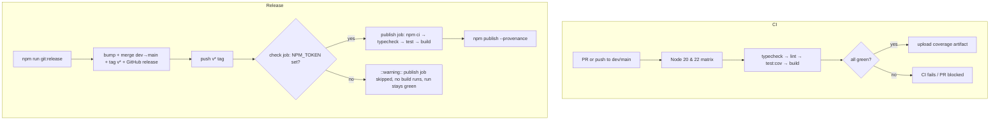

# CI & Release Automation

`telenest` ships two GitHub Actions workflows under `.github/workflows`:
a **CI** workflow that gates every pull request and integration-branch push, and
a tag-driven **Release (npm publish)** workflow that builds, verifies, and
publishes the package to npm when a `v*` tag is pushed. The release workflow is
designed to be a **no-op-with-a-warning** until an `NPM_TOKEN` secret is
configured, matching this repository's "GitHub-only release unless a token is
supplied" policy.

## Table of Contents

- [Architecture Overview](#architecture-overview)
- [File Structure](#file-structure)
- [Environment Variables & Secrets](#environment-variables--secrets)
- [CI Workflow](#ci-workflow)
  - [Triggers](#triggers)
  - [Gates](#gates)
  - [The `format:check` advisory step](#the-formatcheck-advisory-step)
  - [Coverage artifact](#coverage-artifact)
- [Release Workflow](#release-workflow)
  - [Trigger](#trigger)
  - [The NPM_TOKEN guard](#the-npm_token-guard)
  - [Relationship to the local release script](#relationship-to-the-local-release-script)
- [Flow Diagram](#flow-diagram)
- [Divergences from issue #7](#divergences-from-issue-7)
- [Security Notes](#security-notes)
- [How To Extend](#how-to-extend)

## Architecture Overview

| Concern             | Workflow                      | Trigger                          | Outcome                                                        |
| ------------------- | ----------------------------- | -------------------------------- | ------------------------------------------------------------- |
| Regression gating   | `ci.yml`                      | PRs + pushes to `dev` / `main`   | typecheck + lint + test + build across Node 20 & 22           |
| Publishing          | `release.yml`                 | push of a `v*` tag               | rebuild + verify, then `npm publish` **iff** `NPM_TOKEN` set  |

The two workflows are intentionally independent. CI never publishes; the release
workflow re-runs the same gates before publishing so a tag can never ship a
build that would have failed CI.

## File Structure

```text
.github/
  workflows/
    ci.yml        # PR/push gate: Node 20 & 22 matrix, typecheck/lint/test/build
    release.yml   # v* tag → guarded `npm publish --provenance`
README.md         # CI + License + Node status badges (top of file)
scripts/
  release.mts     # interactive local release: bumps version, merges dev→main,
                  # tags, and creates the GitHub release (pushes the v* tag that
                  # release.yml then reacts to)
```

## Environment Variables & Secrets

| Name        | Used by      | Required?                  | Purpose                                                                 |
| ----------- | ------------ | -------------------------- | ----------------------------------------------------------------------- |
| `NPM_TOKEN` | `release.yml`| Optional (guarded)         | npm automation token with publish rights. **Absent → publish skipped with a warning.** |

`NPM_TOKEN` is read only inside the release workflow, mapped to `NODE_AUTH_TOKEN`
for the publish step. It is never echoed or logged.

## CI Workflow

### Triggers

- `pull_request` targeting `dev` or `main`.
- `push` to `dev` or `main`.

A `concurrency` group cancels superseded runs on the same ref, so only the latest
commit of a branch/PR is tested.

### Gates

Each matrix entry (Node `20.x` and `22.x`, `fail-fast: false`) runs, in order:

1. `npm ci`
2. `npm run typecheck` — strict TypeScript, the primary gate
3. `npm run lint` — ESLint
4. `npm run test:cov` — Jest with coverage
5. `npm run build` — library build to `dist/`

All five must pass for the run to be green. To make CI a **required** check,
enable it in the branch-protection settings for `dev` (and `main`).

### The `format:check` advisory step

The repository's baseline is **not** Prettier-clean (~98 files differ from
Prettier's output). `npm run format:check` therefore runs with
`continue-on-error: true` — it surfaces style drift in the run logs but **never
fails the build**. If it were a hard gate, every PR would be red on day one.
Once the codebase is formatted, flip it to a blocking step (drop
`continue-on-error`).

### Coverage artifact

Jest emits `coverage/lcov.info`; the workflow uploads it as a build artifact
(`coverage`) for the Node `22.x` entry only, to avoid duplicating the upload
across matrix versions. This keeps coverage inspectable without requiring an
external service (e.g. Codecov) or any token — appropriate for a private repo.

## Release Workflow

### Trigger

`push` of a tag matching `v*` (for example `v1.2.0`). In practice the tag is
created by `npm run git:release` (see [scripts/release.mts](../scripts/release.mts)).

### The NPM_TOKEN guard

The token is checked **first**, in a tiny standalone `check` job that does **no
checkout and no install** — so a tokenless tag spends a few seconds, not minutes
of runner time on an install/build/test it would only throw away. Because the
GitHub Actions `secrets` context cannot be referenced directly in a job-level
`if:`, the `check` job maps the secret to an env var and exposes a boolean job
**output** (`has_token`) that the `publish` job gates on via `needs`:

- **Token present** → the `publish` job runs (build + verify + `npm publish`).
- **Token absent** → the `check` job emits a `::warning::` annotation and the
  `publish` job is **skipped entirely** (shown as skipped in the UI). The run
  still succeeds (green), so tagging a release without a token is a harmless,
  near-instant no-op.

This is the behavior requested for this repository: **no token → no npm release,
just a warning.**

The publish command defaults to `npm publish --provenance --access public`, but
the args are overridable via an optional `NPM_PUBLISH_ARGS` **repository
variable** (Settings → Secrets and variables → Actions → Variables). Set it to,
say, `--access public` to publish without provenance — useful because
`--provenance` publishes to the public registry and requires a public package,
which may not suit every future publish mode. No workflow edit needed.

### Relationship to the local release script

`scripts/release.mts` already creates the **GitHub release** and pushes the
`v*` tag. The release workflow therefore deliberately does **not** create a
GitHub release (that would duplicate it) — it is scoped to the npm publish step
only. The division of labor:

| Step                         | Owner                  |
| ---------------------------- | ---------------------- |
| Version bump, `dev`→`main`   | `scripts/release.mts`  |
| Tag + GitHub release         | `scripts/release.mts`  |
| npm publish (if token set)   | `release.yml`          |

## Flow Diagram



## Divergences from issue #7

The issue body was treated as a hypothesis and re-derived against the live repo.
Where the implementation differs:

- **`format:check` is advisory, not a hard gate.** The issue asked CI to call
  `npm run format:check`, but the baseline is not Prettier-clean, so a blocking
  step would make every PR red. It runs with `continue-on-error: true` instead.
- **Coverage is uploaded as a build artifact, not to Codecov.** The repo is
  private; an artifact avoids requiring an external service or token.
- **The npm publish is guarded by `NPM_TOKEN` presence.** Without the secret the
  publish is skipped with a warning rather than failing — per the repository's
  GitHub-only release policy and the explicit request for this change.
- **No GitHub release is created by `release.yml`.** `scripts/release.mts`
  already owns the GitHub release + tag, so the workflow only adds npm publish.

## Security Notes

- `NPM_TOKEN` is the only secret. It is exposed only to the publish step (as
  `NODE_AUTH_TOKEN`) and the detection step (to test for presence). It is never
  printed.
- The release workflow requests `id-token: write` solely so `npm publish
  --provenance` can mint a signed provenance attestation via OIDC; `contents`
  stays read-only.
- CI requests only `contents: read`.
- Workflows pin actions by major version (`@v4`); bump deliberately.

## How To Extend

- **Add a Node version:** append to `matrix.node-version` in `ci.yml`.
- **Make CI required:** enable the `CI` check in branch protection for `dev`.
- **Enforce formatting:** once the codebase is Prettier-clean, remove
  `continue-on-error: true` from the format-check step.
- **Enable npm publishing:** add an `NPM_TOKEN` repository secret (Settings →
  Secrets and variables → Actions). No workflow change is needed — the guard
  flips on automatically.
- **Change the publish mode:** set the `NPM_PUBLISH_ARGS` repository variable
  (e.g. `--access public` to drop provenance). Defaults to
  `--provenance --access public`.
- **Publish a GitHub release from CI instead of locally:** add a `gh release
  create` (or `softprops/action-gh-release`) step to `release.yml` and remove the
  release-creation step from `scripts/release.mts` to keep a single owner.
