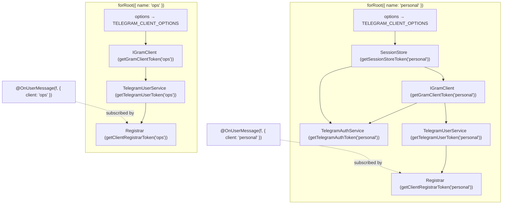

# Multiple User Accounts

Run **more than one MTProto user account** in a single NestJS application with
`nestjs-telegram` — for example a personal account and an ops account — each with
its own API credentials, **session**, login flow, and inbound-message handlers.
Register each account under a `name`, inject its services with
`@InjectTelegramUser(name)` / `@InjectTelegramAuth(name)`, and scope
`@OnUserMessage` handlers to it with `@OnUserMessage(filter, { client: name })`.
Calling `forRoot`/`forRootAsync` with no `name` keeps the original single-account
behaviour exactly — this feature is purely additive and backward compatible.

> **User-account (MTProto) side only.** This concerns `TelegramClientModule`
> (`apiId`/`apiHash`, the GramJS client). It is the user-account analogue of the
> multiple-named-**bots** feature for the Bot API side — see
> [MULTIPLE-BOTS.md](./MULTIPLE-BOTS.md).

---

## Table of contents

- [When do I need this?](#when-do-i-need-this)
- [Architecture overview](#architecture-overview)
- [File structure](#file-structure)
- [Quick start](#quick-start)
- [Registering accounts](#registering-accounts)
- [Injecting an account](#injecting-an-account)
- [Scoping inbound handlers to an account](#scoping-inbound-handlers-to-an-account)
- [Token helpers](#token-helpers)
- [Sessions are per account](#sessions-are-per-account)
- [How isolation works](#how-isolation-works)
- [Lifecycle](#lifecycle)
- [Behaviour notes & edge cases](#behaviour-notes--edge-cases)
- [Environment variables](#environment-variables)
- [Security notes](#security-notes)
- [How to extend](#how-to-extend)

---

## When do I need this?

Most apps drive a single account — keep using `TelegramClientModule.forRoot({…})`
and inject `TelegramUserService` / `TelegramAuthService` directly; nothing changes.
Reach for named accounts when one process must control **several independent user
accounts**, each with its own login and session (e.g. a `personal` account and an
`ops` account). Each account then needs its own client connection, session
storage, and handler set — without colliding on dependency-injection tokens.

## Architecture overview

Each `TelegramClientModule.forRoot()` / `forRootAsync()` call registers **one**
account. The registration is an isolated Nest module instance carrying that
account's options, and it contributes per-account providers, each under a
**name-derived token**:

1. **`SessionStore`** — the account's configured store (or `undefined`).
2. **`IGramClient`** — built from the account's options and connected at bootstrap.
3. **`TelegramAuthService`** — its login orchestrator (persists to its own store).
4. **`TelegramUserService`** — its "act as the account" facade + `updates$` source.
5. **`TelegramClientLifecycle`** — disconnects its client on shutdown (internal).
6. **`TelegramUserUpdatesRegistrar`** — subscribes the account's `@OnUserMessage`
   handlers to its `updates$` (internal).

The **default** (unnamed) account keeps its original, stable tokens — the
`TELEGRAM_GRAM_CLIENT` / `TELEGRAM_SESSION_STORE` symbols and the
`TelegramAuthService` / `TelegramUserService` classes — so existing code is
untouched. Named accounts get distinct string tokens derived from the name,
computed by the helpers in `telegram-client.tokens.ts`.



Because each registration is its own module instance with its own
`TELEGRAM_CLIENT_OPTIONS`, two accounts never share configuration or session;
because every externally visible provider uses a name-derived token, two accounts
never collide.

## File structure

```text
src/lib/client/
  telegram-client.constants.ts        # TELEGRAM_GRAM_CLIENT/SESSION_STORE + DEFAULT_CLIENT_NAME
  telegram-client.tokens.ts           # get*Token helpers + InjectTelegramUser/InjectTelegramAuth
  telegram-client.module.ts           # name-aware forRoot/forRootAsync; per-account providers
  telegram-client.factory.ts          # createConnectedGramClient (one call per account)
  telegram-auth.service.ts            # login orchestrator (one instance per account)
  telegram-user.service.ts            # account operations + updates$ (one per account)
  telegram-client.lifecycle.ts        # disconnects an account's client on shutdown
  updates/
    on-user-message.decorator.ts      # @OnUserMessage(filter, { client }) records target account
    on-user-message.types.ts          # OnUserMessageOptions { client? }
    telegram-user-updates.registrar.ts# one registrar per account; subscribes only its name
```

## Quick start

```ts
import { Injectable, Module } from '@nestjs/common';
import {
  TelegramClientModule,
  TelegramUserService,
  TelegramAuthService,
  FileSessionStore,
  OnUserMessage,
  InjectTelegramUser,
  type GramMessage,
  type GramUserMessageContext,
} from 'nestjs-telegram';

// Inbound handler for the `ops` account only; replies through `ops`.
@Injectable()
export class OpsAutoReply {
  @OnUserMessage({ incoming: true, pattern: /^ping$/i }, { client: 'ops' })
  async onPing(_message: GramMessage, ctx: GramUserMessageContext) {
    await ctx.reply('pong');
  }
}

// A service that acts as the `personal` account.
@Injectable()
export class Notifier {
  constructor(@InjectTelegramUser('personal') private readonly personal: TelegramUserService) {}
  note(text: string) {
    return this.personal.sendToSelf(text);
  }
}

@Module({
  imports: [
    TelegramClientModule.forRoot({
      name: 'personal',
      apiId: Number(process.env.TG_API_ID),
      apiHash: process.env.TG_API_HASH!,
      sessionStore: new FileSessionStore('./.personal.session'),
    }),
    TelegramClientModule.forRoot({
      name: 'ops',
      apiId: Number(process.env.TG_API_ID),
      apiHash: process.env.TG_API_HASH!,
      sessionStore: new FileSessionStore('./.ops.session'),
    }),
  ],
  providers: [OpsAutoReply, Notifier],
})
export class AppModule {}
```

## Registering accounts

Pass `name` to register one of several accounts; omit it for the single default
account. `name` is an *extra* (a sibling of `isGlobal`), **not** part of the async
factory result — it must be known synchronously to compute the per-account tokens,
so for `forRootAsync` it sits next to `useFactory`, not inside what the factory
returns.

```ts
// Synchronous
TelegramClientModule.forRoot({ name: 'personal', apiId, apiHash, sessionStore });

// Asynchronous — `name` is alongside the factory, not inside its result
TelegramClientModule.forRootAsync({
  name: 'ops',
  inject: [ConfigService],
  useFactory: (c: ConfigService) => ({
    apiId: Number(c.getOrThrow('TG_API_ID')),
    apiHash: c.getOrThrow('TG_API_HASH'),
    sessionStore: new FileSessionStore('./.ops.session'),
  }),
});
```

Each registered account **must use a distinct name**.

## Injecting an account

The two services consumers use are injected by name:

```ts
constructor(
  @InjectTelegramUser('personal') private readonly personalUser: TelegramUserService,
  @InjectTelegramAuth('personal') private readonly personalAuth: TelegramAuthService,
  @InjectTelegramUser() private readonly defaultUser: TelegramUserService, // default account
) {}
```

Need the raw `IGramClient` for an account? Inject it by token:
`@Inject(getGramClientToken('personal')) client: IGramClient`.

## Scoping inbound handlers to an account

`@OnUserMessage(filter, { client: name })` records which account a handler listens
to. Each account's registrar subscribes **only** the handlers whose target name
matches, and the handler's `ctx.reply(...)` goes out through that same account.
Omitting `{ client }` (or the whole second argument) targets the default account —
unchanged behaviour. The message-matching `filter` is identical to the
single-account system; see [USER-CLIENT-MTPROTO.md](./USER-CLIENT-MTPROTO.md).

```ts
@OnUserMessage({ incoming: true }, { client: 'ops' })
onOps(message: GramMessage, ctx: GramUserMessageContext) { /* ops account only */ }
```

## Token helpers

| Helper | Returns (default account) | Returns (named account) |
| --- | --- | --- |
| `getTelegramUserToken(name?)` | the `TelegramUserService` class | `NESTJS_TELEGRAM_USER_SERVICE:<name>` |
| `getTelegramAuthToken(name?)` | the `TelegramAuthService` class | `NESTJS_TELEGRAM_AUTH_SERVICE:<name>` |
| `getGramClientToken(name?)` | the `TELEGRAM_GRAM_CLIENT` symbol | `NESTJS_TELEGRAM_GRAM_CLIENT:<name>` |
| `getSessionStoreToken(name?)` | the `TELEGRAM_SESSION_STORE` symbol | `NESTJS_TELEGRAM_SESSION_STORE:<name>` |
| `InjectTelegramUser(name?)` | `@Inject(getTelegramUserToken(name))` | — |
| `InjectTelegramAuth(name?)` | `@Inject(getTelegramAuthToken(name))` | — |

## Sessions are per account

A string session authenticates **one** account, so each account needs its **own**
session store — never point two accounts at the same `FileSessionStore` path or
share one store instance, or they will overwrite each other's session. Each
account's `TelegramAuthService` loads from and persists to only its own store, and
each `IGramClient` resolves its initial session from its own account's options/store.

## How isolation works

NestJS keys a dynamic module by a hash of its metadata, so two `forRoot` calls with
different names (hence different providers and options) become **separate module
instances**. Each instance provides its own `TELEGRAM_CLIENT_OPTIONS` (its token
never leaks across accounts) and its client/store/services/lifecycle/registrar
under name-derived tokens. Discovery is global, so every account's registrar *sees*
every `@OnUserMessage` handler — but each subscribes only the ones whose `{ client }`
matches its own name.

## Lifecycle

There is **no central registry** coordinating accounts, and none is needed: each
account's `TelegramUserService` (subscribe), `TelegramUserUpdatesRegistrar`
(subscribe handlers), and `TelegramClientLifecycle` (disconnect) are independent
providers implementing the Nest lifecycle hooks, so every account connects,
subscribes, and disconnects on its own. Set `autoConnect: false` per account to
connect lazily/manually (e.g. tests, CLI logins). Connecting or disconnecting one
account never touches another.

## Behaviour notes & edge cases

- **Backward compatible.** No `name` ⇒ the default account under the legacy tokens.
  Existing single-account apps need no changes.
- **Names must be unique** across registrations (they map 1:1 to DI tokens).
- **`'default'` is reserved** — it is the default account's own name. Passing
  `name: 'default'` targets the default account (and would collide with an unnamed
  `forRoot()`), not a separate one; pick any other name for an additional account.
- **A handler with no matching account is never subscribed.**
  `@OnUserMessage(f, { client: 'x' })` with no account named `x` simply subscribes
  nowhere.
- **The umbrella `TelegramModule.forRoot`** configures a single default account.
  For multiple accounts, import `TelegramClientModule` directly (once per account).

## Environment variables

This feature reads no environment variables itself. Supply each account its own
`apiId` / `apiHash` and session store through its `forRoot`/`forRootAsync` options.
`apiId`/`apiHash` may be shared across accounts (they identify the *application*),
but **sessions must not be** (they identify the *account*).

## Security notes

- **One session per account, never shared or logged.** Sessions grant full access
  to an account — store each in its own location (ideally encrypted at rest) and
  never log session strings.
- **Handlers are account-scoped, not auth-scoped.** Scoping decides *which account*
  serves a handler, not *who* may trigger it — still validate inbound text and
  authorize sensitive actions yourself.

## How to extend

- **More than two accounts:** add another `forRoot`/`forRootAsync` with a new
  `name` — the wiring scales with no extra code.
- **Operate several accounts together:** inject each with `@InjectTelegramUser(name)`
  and fan out; there is intentionally no implicit "all accounts" provider, so the
  set you act on is always explicit.
- **A future `@InjectTelegramUsers()` (all accounts):** would add an aggregate
  provider built from the registered names; the per-name tokens above are the
  building blocks.
```
