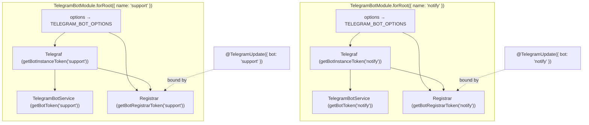

# Multiple Named Bots

Run **more than one Bot API bot** in a single NestJS application with
`telenest` — a notifications bot and a support bot side by side, for
example — each with its own token, lifecycle, and handlers, and **no
`nestjs-telegraf`**. Register each bot under a `name`, inject its typed facade
with `@InjectBot(name)`, and scope decorator-based handlers to it with
`@TelegramUpdate({ bot: name })`. Calling `forRoot`/`forRootAsync` with no `name`
keeps the original single-bot behaviour exactly — this feature is purely
additive and backward compatible.

> **Bot API only.** This concerns the Bot API side (`TelegramBotModule`, BotFather
> tokens). The MTProto user-account module (`TelegramClientModule`) is a separate
> single-account client and is unaffected.

---

## Table of contents

- [When do I need this?](#when-do-i-need-this)
- [Architecture overview](#architecture-overview)
- [File structure](#file-structure)
- [Quick start](#quick-start)
- [Registering bots](#registering-bots)
- [Injecting a bot](#injecting-a-bot)
- [Scoping handlers to a bot](#scoping-handlers-to-a-bot)
- [Token helpers](#token-helpers)
- [How isolation works](#how-isolation-works)
- [Lifecycle](#lifecycle)
- [Behaviour notes & edge cases](#behaviour-notes--edge-cases)
- [Environment variables](#environment-variables)
- [Security notes](#security-notes)
- [How to extend](#how-to-extend)

---

## When do I need this?

Most apps run a single bot — keep using `TelegramBotModule.forRoot({ token })`
and inject `TelegramBotService` directly; nothing changes. Reach for named bots
when one process must drive **several independent bots** (distinct BotFather
tokens), e.g. a `notify` bot for outbound alerts and a `support` bot with its own
command handlers. Each bot then needs its own token, its own launch/stop, and its
own handler set — without colliding on dependency-injection tokens.

## Architecture overview

Each `TelegramBotModule.forRoot()` / `forRootAsync()` call registers **one** bot.
The registration is an isolated Nest module instance carrying that bot's options,
and it contributes three providers, each under a **per-name token**:

1. **Raw `Telegraf` instance** — built from this registration's options.
2. **`TelegramBotService` facade** — the typed wrapper over that instance, which
   manages its own launch/stop via the Nest lifecycle.
3. **`TelegramBotUpdatesRegistrar`** — a discovery-based registrar that, at
   bootstrap, binds the `@TelegramUpdate` providers **targeting this bot's name**
   onto this bot's `Telegraf`.

The **default** (unnamed) bot keeps its original, stable tokens — the
`TELEGRAM_BOT` symbol for the instance and the `TelegramBotService` class for the
facade — so existing code and `@Inject(TELEGRAM_BOT)` / `TelegramBotService`
injections are untouched. Named bots get distinct string tokens derived from the
name, computed by the helpers in `telegram-bot.tokens.ts`.



Because each registration is its own module instance with its own
`TELEGRAM_BOT_OPTIONS`, two bots never share configuration; because every
externally visible provider uses a name-derived token, two bots never collide.

## File structure

```text
src/lib/bot/
  telegram-bot.constants.ts          # TELEGRAM_BOT symbol + DEFAULT_BOT_NAME
  telegram-bot.tokens.ts             # getBotToken / getBotInstanceToken /
                                     #   getBotRegistrarToken / InjectBot
  telegram-bot.module.ts             # name-aware forRoot/forRootAsync; per-bot providers
  telegram-bot.service.ts            # the typed facade (one instance per bot)
  telegram-bot.factory.ts            # createTelegrafInstance (one call per bot)
  updates/
    telegram-update.decorator.ts     # @TelegramUpdate({ bot }) records the target bot
    telegram-update.types.ts         # TELEGRAM_UPDATE_BOT_METADATA key
    telegram-bot-updates.registrar.ts# one registrar per bot; binds only its name
```

## Quick start

```ts
import { Injectable, Module } from '@nestjs/common';
import type { Context } from 'telegraf';
import {
  TelegramBotModule,
  TelegramBotService,
  TelegramUpdate,
  Command,
  Ctx,
  InjectBot,
} from 'telenest';

// Handlers for the `support` bot only.
@TelegramUpdate({ bot: 'support' })
@Injectable()
export class SupportUpdate {
  @Command('ticket')
  async onTicket(@Ctx() ctx: Context) {
    await ctx.reply('Support ticket opened.');
  }
}

// A service that pushes alerts through the `notify` bot.
@Injectable()
export class AlertService {
  constructor(@InjectBot('notify') private readonly notify: TelegramBotService) {}

  alert(chatId: number, text: string) {
    return this.notify.sendMessage(chatId, text);
  }
}

@Module({
  imports: [
    TelegramBotModule.forRoot({ name: 'notify', token: process.env.NOTIFY_BOT_TOKEN! }),
    TelegramBotModule.forRoot({ name: 'support', token: process.env.SUPPORT_BOT_TOKEN! }),
  ],
  providers: [SupportUpdate, AlertService],
})
export class AppModule {}
```

## Registering bots

Pass `name` to register one of several bots; omit it for the single default bot.
`name` is an *extra* (a sibling of `isGlobal`), **not** part of the async factory
result — it must be known synchronously to compute the per-bot tokens, so for
`forRootAsync` it sits next to `useFactory`, not inside what the factory returns.

```ts
// Synchronous
TelegramBotModule.forRoot({ name: 'notify', token: NOTIFY });

// Asynchronous — `name` is alongside the factory, not inside its result
TelegramBotModule.forRootAsync({
  name: 'support',
  inject: [ConfigService],
  useFactory: (c: ConfigService) => ({ token: c.getOrThrow('SUPPORT_BOT_TOKEN') }),
});
```

Each registered bot **must use a distinct name**. Registering two bots under the
same name re-declares the same DI tokens and is unsupported.

## Injecting a bot

`@InjectBot(name)` injects a bot's **`TelegramBotService` facade** (the typed
wrapper — not the raw `Telegraf`). Omit the name for the default bot, where it is
equivalent to injecting `TelegramBotService` directly.

```ts
constructor(
  @InjectBot('notify') private readonly notify: TelegramBotService,
  @InjectBot('support') private readonly support: TelegramBotService,
  @InjectBot() private readonly defaultBot: TelegramBotService, // default bot
) {}
```

Need the raw `Telegraf` for a named bot (custom middleware, scenes)? Either reach
through the facade (`this.notify.instance`) or inject it by token:
`@Inject(getBotInstanceToken('notify')) bot: Telegraf`.

## Scoping handlers to a bot

`@TelegramUpdate({ bot: name })` records which bot a provider's handlers belong
to. Each bot's registrar binds **only** the providers whose target name matches,
so a handler is wired onto exactly one bot. Omitting `{ bot }` targets the default
bot (unchanged behaviour). The method/parameter decorators (`@Command`, `@On`,
`@Ctx`, …) are identical to the single-bot system — see
[BOT-UPDATE-DECORATORS.md](./BOT-UPDATE-DECORATORS.md).

```ts
@TelegramUpdate({ bot: 'notify' })
export class NotifyUpdate {
  @Command('status') onStatus(@Ctx() ctx: Context) { /* runs on `notify` only */ }
}
```

## Token helpers

| Helper | Returns (default bot) | Returns (named bot) |
| --- | --- | --- |
| `getBotToken(name?)` | the `TelegramBotService` class | `NESTJS_TELEGRAM_BOT_SERVICE:<name>` |
| `getBotInstanceToken(name?)` | the `TELEGRAM_BOT` symbol | `NESTJS_TELEGRAM_BOT_INSTANCE:<name>` |
| `InjectBot(name?)` | `@Inject(getBotToken(name))` | `@Inject(getBotToken(name))` |

`getBotToken` is the token the facade is registered (and exported) under;
`@InjectBot` is sugar over it. The raw instance token (`getBotInstanceToken`) is
the lower-level escape hatch beneath the facade.

## How isolation works

NestJS keys a dynamic module by a hash of its metadata, so two `forRoot` calls
with different names (hence different providers and options) become **separate
module instances**. Each instance:

- provides its own `TELEGRAM_BOT_OPTIONS` (its token never leaks across bots), and
- provides its instance/facade/registrar under name-derived tokens.

Discovery is global, so every bot's registrar *sees* every `@TelegramUpdate`
provider — but each binds only the ones whose `{ bot }` matches its own name. That
filter is what guarantees a handler is never bound onto more than one bot.

## Lifecycle

There is **no central "registry" object** coordinating the bots, and none is
needed: each bot's `TelegramBotService` is an independent provider implementing
`onApplicationBootstrap` / `onApplicationShutdown` / `onModuleDestroy`, so NestJS
launches and stops **every** registered bot on its own. Disable a single bot's
auto-launch with `launch: false` on its options (e.g. for webhook mode or tests),
exactly as with one bot. Launching or stopping one bot never touches another.

## Behaviour notes & edge cases

- **Backward compatible.** No `name` ⇒ the default bot under the legacy tokens
  (`TELEGRAM_BOT`, `TelegramBotService`). Existing single-bot apps need no changes.
- **Names must be unique** across registrations (they map 1:1 to DI tokens).
- **`'default'` is reserved** — it is the default bot's own name. Passing
  `name: 'default'` targets the default bot (and would collide with an unnamed
  `forRoot()`), not a separate one; pick any other name for an additional bot.
- **A handler with no matching bot is never bound.** `@TelegramUpdate({ bot: 'x' })`
  with no bot registered as `x` simply binds nowhere (and logs nothing for `x`).
- **Singleton scope**, like the single-bot registrar: request-scoped handler
  providers have no bootstrap instance and are skipped.
- **The umbrella `TelegramModule.forRoot`** configures a single default bot. For
  multiple bots, import `TelegramBotModule` directly (once per bot).

## Environment variables

This feature reads no environment variables itself. Supply each bot its own token
through its `forRoot`/`forRootAsync` options — conventionally one variable per bot
(e.g. `NOTIFY_BOT_TOKEN`, `SUPPORT_BOT_TOKEN`).

## Security notes

- **One token per bot, never logged.** Each bot holds its own BotFather token in
  its module options; tokens are never logged. Keep them in per-bot env vars.
- **Handlers are bot-scoped, not auth-scoped.** Scoping decides *which bot* serves
  a handler, not *who* may invoke it — still validate `@MessageText()` /
  `@CallbackData()` and authorize sensitive commands yourself.

## How to extend

- **More than two bots:** add another `forRoot`/`forRootAsync` with a new `name` —
  the wiring scales with no extra code.
- **Broadcast to several bots:** inject each facade with `@InjectBot(name)` in a
  service and fan out; there is intentionally no implicit "all bots" provider, so
  the set you act on is always explicit.
- **A future `@InjectBots()` (all bots):** would add an aggregate provider built
  from the registered names; the per-name tokens above are the building blocks.
```
