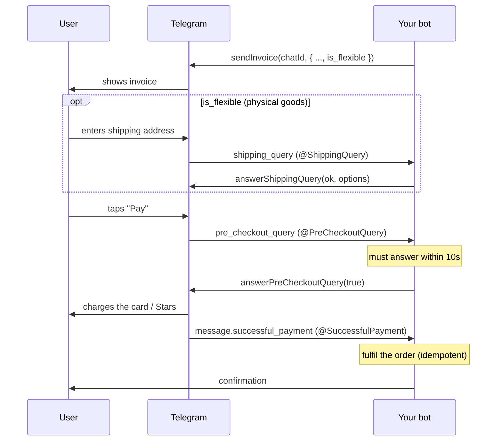

# Telegram Payments

First-class support for the Telegram **Payments** checkout flow on the Bot API
side. A bot collects money *from its users* — this does **not** require the bot
operator to hold any paid Telegram tier, so it is in scope for `nestjs-telegram`.
The library wraps both directions of the flow: the **outbound** calls on
`TelegramBotService` (`sendInvoice`, `createInvoiceLink`, `answerShippingQuery`,
`answerPreCheckoutQuery`) and the **inbound** updates as typed decorators
(`@ShippingQuery`, `@PreCheckoutQuery`, `@SuccessfulPayment`) with parameter
decorators that inject each payload.

> **Prerequisite — set a payment provider in @BotFather.** Open
> `/mybots → <your bot> → Payments` and connect a provider to obtain a
> **provider token**. Without it, `sendInvoice` is rejected. Invoices priced in
> **`XTR`** (Telegram Stars) are the exception: they use an *empty* provider
> token and never raise a `shipping_query`.

This page builds on [BOT-UPDATE-DECORATORS.md](./BOT-UPDATE-DECORATORS.md); read
that first for the registrar/dispatch mechanics the payment decorators share. For
the raw outbound method signatures see [BOT-API.md](./BOT-API.md).

---

## Table of contents

- [Architecture overview](#architecture-overview)
- [File structure](#file-structure)
- [The checkout flow](#the-checkout-flow)
- [Quick start](#quick-start)
- [Outbound methods (`TelegramBotService`)](#outbound-methods-telegrambotservice)
- [Inbound decorators](#inbound-decorators)
- [Scenes](#scenes)
- [Telegram Stars (XTR)](#telegram-stars-xtr)
- [Environment variables](#environment-variables)
- [Security notes](#security-notes)
- [How to extend](#how-to-extend)

---

## Architecture overview

Payments reuse the existing update-decorator machinery — there is no separate
subsystem. Outbound calls go through the same `TelegramBotService.exec()` wrapper
as every other Bot API method (so failures surface as `TelegramBotApiError`), and
the inbound updates are ordinary `UpdateBinding`s discovered and bound by the
registrar:

| Update | Telegram delivers | Bound via | Inject with |
| --- | --- | --- | --- |
| `shipping_query` | flexible invoices only, after the user enters an address | `bot.on('shipping_query')` | `@ShippingData()` |
| `pre_checkout_query` | always, just before charging | `bot.on('pre_checkout_query')` | `@PreCheckoutData()` |
| `successful_payment` | after the charge clears | `bot.on(message('successful_payment'))` | `@SuccessfulPaymentData()` |

`pre_checkout_query` and `shipping_query` are **top-level update types**;
`successful_payment` is a **message subtype**, so it is matched with Telegraf's
`message('successful_payment')` filter — the non-deprecated path that survives
Telegraf v5.

---

## File structure

```text
src/lib/bot/
  telegram-bot.service.ts            # sendInvoice / createInvoiceLink /
                                     #   answerShippingQuery / answerPreCheckoutQuery
  updates/
    telegram-update.decorator.ts     # @PreCheckoutQuery / @ShippingQuery / @SuccessfulPayment
    param.decorators.ts              # @PreCheckoutData / @ShippingData / @SuccessfulPaymentData
    telegram-update.types.ts         # BOT_UPDATE_KINDS / PARAM_KINDS entries (as-const, no enum)
    argument-resolver.ts             # extracts each payload off the Context
    telegram-bot-updates.registrar.ts# binds the payment updates onto Telegraf
  scenes/scene.builder.ts            # @SuccessfulPayment supported in scenes; the
                                     #   chatless queries are rejected there
examples/payments.example.ts         # end-to-end paid "Pro plan" bot (type-checked)
```

---

## The checkout flow



Step by step:

1. **Send the invoice** with `sendInvoice` (to a chat) or `createInvoiceLink` (a
   shareable URL). Set `is_flexible: true` only when you need a shipping address.
2. **Shipping** — *flexible invoices only*. Telegram sends a `shipping_query`;
   reply with `answerShippingQuery(ok, options, errorMessage)`.
3. **Pre-checkout** — Telegram **always** sends a `pre_checkout_query` before
   charging. Validate the order is still fulfillable and call
   `answerPreCheckoutQuery(true)` **within 10 seconds**, or pass `false` + a
   user-facing message to abort.
4. **Fulfil** — after the charge clears, Telegram delivers a
   `successful_payment` service message. This is the only point where money has
   moved; grant access here, idempotently keyed on `invoice_payload`.

---

## Quick start

A minimal paid "Pro plan" purchase. The full, type-checked version lives in
[`examples/payments.example.ts`](../examples/payments.example.ts).

```ts
import { Injectable } from '@nestjs/common';
import type { Context } from 'telegraf';
import type {
  PreCheckoutQuery,
  SuccessfulPayment,
} from 'telegraf/types';
import {
  Command,
  Ctx,
  PreCheckoutData,
  PreCheckoutQuery as OnPreCheckoutQuery,
  SuccessfulPayment as OnSuccessfulPayment,
  SuccessfulPaymentData,
  TelegramBotService,
  TelegramUpdate,
} from 'nestjs-telegram';

const PAYLOAD = 'pro-plan-monthly';

@TelegramUpdate()
@Injectable()
export class PaymentsUpdate {
  constructor(private readonly bot: TelegramBotService) {}

  @Command('buy')
  async onBuy(@Ctx() ctx: Context) {
    if (ctx.chat?.id === undefined) return;
    await this.bot.sendInvoice(ctx.chat.id, {
      title: 'Pro plan',
      description: 'One month of Pro features.',
      payload: PAYLOAD,
      provider_token: process.env.PAYMENT_PROVIDER_TOKEN!,
      currency: 'USD',
      prices: [{ label: 'Pro plan (1 month)', amount: 999 }], // cents → $9.99
    });
  }

  @OnPreCheckoutQuery()
  async onPreCheckout(
    @PreCheckoutData() query: PreCheckoutQuery | undefined,
    @Ctx() ctx: Context,
  ) {
    const ok = query?.invoice_payload === PAYLOAD;
    await ctx.answerPreCheckoutQuery(ok, ok ? undefined : 'No longer available.');
  }

  @OnSuccessfulPayment()
  async onPaid(
    @SuccessfulPaymentData() payment: SuccessfulPayment | undefined,
    @Ctx() ctx: Context,
  ) {
    if (payment?.invoice_payload !== PAYLOAD) return;
    // grantProAccess(ctx.from?.id) — your own idempotent fulfilment.
    await ctx.reply('Thanks! Your Pro plan is now active. 🎉');
  }
}
```

---

## Outbound methods (`TelegramBotService`)

| Method | Purpose |
| --- | --- |
| `sendInvoice(chatId, invoice, extra?)` | Send an invoice message to a chat. |
| `createInvoiceLink(invoice)` | Create a shareable invoice URL (not tied to a chat). |
| `answerShippingQuery(id, ok, options, errorMessage)` | Reply to a `shipping_query` with options, or reject it. |
| `answerPreCheckoutQuery(id, ok, errorMessage?)` | Approve/reject the final confirmation (≤ 10s). |

Each forwards its arguments verbatim to Telegraf and wraps any failure in
`TelegramBotApiError`. The `id` arguments come straight off the injected payload
(`query.id`); inside a handler you can also use the `ctx.answer*` shorthands,
which fill the id in for you (as the example does).

> **Amounts** are integers in the **smallest unit** of the currency (e.g. cents),
> except for currencies with no decimals. `999` USD = `$9.99`.

---

## Inbound decorators

**Handler decorators** (declare on a `@TelegramUpdate()` provider):

| Decorator | Fires on |
| --- | --- |
| `@ShippingQuery()` | `shipping_query` (flexible invoices only) |
| `@PreCheckoutQuery()` | `pre_checkout_query` (always, before charge) |
| `@SuccessfulPayment()` | `successful_payment` (after charge clears) |

**Parameter decorators** (inject the payload, or `undefined` off a non-matching
update):

| Decorator | Injects | Type (`telegraf/types`) |
| --- | --- | --- |
| `@ShippingData()` | `ctx.shippingQuery` | `ShippingQuery \| undefined` |
| `@PreCheckoutData()` | `ctx.preCheckoutQuery` | `PreCheckoutQuery \| undefined` |
| `@SuccessfulPaymentData()` | `ctx.message.successful_payment` | `SuccessfulPayment \| undefined` |

All three handlers are **terminal** (they do not call `next`), exactly like the
other `bot.on(...)`-backed handlers.

---

## Scenes

`@SuccessfulPayment` **is supported inside a scene** — the update is a chat-bound
service message, so the scene `Stage` can route it to an active scene.

`@PreCheckoutQuery` and `@ShippingQuery` are **rejected inside a scene** (with a
`TelegramConfigError` at bootstrap): those queries carry no chat, so — like inline
updates — they never reach a chat-keyed scene. Declare them on a top-level
`@TelegramUpdate` provider instead.

---

## Telegram Stars (XTR)

To charge in **Telegram Stars**, price the invoice in the `XTR` currency with an
**empty** provider token:

```ts
await bot.sendInvoice(chatId, {
  title: 'Pro plan',
  description: 'One month of Pro features.',
  payload: 'pro-plan-monthly',
  provider_token: '',                         // Stars: no provider
  currency: 'XTR',
  prices: [{ label: 'Pro plan', amount: 100 }], // 100 Stars
});
```

Stars invoices never raise a `shipping_query`; the `pre_checkout` →
`successful_payment` steps are unchanged. The Stars **refund/transaction** APIs
(`refundStarPayment`, `getStarTransactions`) and **paid media** are tracked
separately in [#87](https://github.com/Aborii/nestjs-telegram/issues/87) — they
require Bot API methods not present in the pinned Telegraf version.

---

## Environment variables

These are used by [`examples/payments.example.ts`](../examples/payments.example.ts);
the library reads no payment-specific env vars itself.

| Variable | Purpose |
| --- | --- |
| `BOT_TOKEN` | The bot's API token (from @BotFather). |
| `PAYMENT_PROVIDER_TOKEN` | The payment provider token (from @BotFather → Payments). Leave empty for Stars-only invoices. |

---

## Security notes

- **Never log the charge ids.** `successful_payment.telegram_payment_charge_id`
  and `provider_payment_charge_id` are sensitive (they are the handle for
  refunds) — treat them like secrets. Likewise never log the `provider_token`.
- **Validate at pre-checkout, fulfil at success.** Re-check the order is still
  valid in `@PreCheckoutQuery` (price, stock, eligibility) before approving; only
  grant value in `@SuccessfulPayment`, never earlier.
- **Make fulfilment idempotent.** Key it on `invoice_payload` (and/or the charge
  id) so a redelivered update can't double-grant.
- **Don't trust amounts from the client.** Compare `total_amount`/`currency` on
  the pre-checkout query against what you invoiced before approving.

---

## How to extend

- **Digital goods** — drop `is_flexible`; no `shipping_query` will fire, so you
  only need `@PreCheckoutQuery` + `@SuccessfulPayment`.
- **Shareable links** — swap `sendInvoice` for `createInvoiceLink` to sell
  outside a single chat; the inbound handlers are identical.
- **Multiple bots** — scope the provider with `@TelegramUpdate({ bot: 'shop' })`
  (see [MULTIPLE-BOTS.md](./MULTIPLE-BOTS.md)).
- **Stars refunds / paid media** — follow
  [#87](https://github.com/Aborii/nestjs-telegram/issues/87).
- **Testing** — drive the handlers with `createMockBotContext` and assert the
  `answer*` calls; see [TESTING.md](./TESTING.md).
