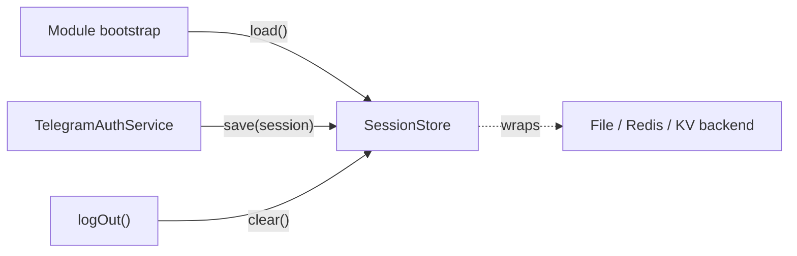

# Session Stores

The MTProto **string session** encodes the auth keys that let the client
reconnect without re-running the phone/code/2FA flow. **It is as sensitive as a
password.** A `SessionStore` is the pluggable contract the library uses to load
that session on boot and persist it after login. This document covers every
built-in store, including the Redis, generic key/value, and encrypted-at-rest
implementations.

## Table of Contents

- [Architecture Overview](#architecture-overview)
- [File Structure](#file-structure)
- [The `SessionStore` contract](#the-sessionstore-contract)
- [Built-in stores](#built-in-stores)
  - [`InMemorySessionStore`](#inmemorysessionstore)
  - [`FileSessionStore`](#filesessionstore)
  - [`RedisSessionStore`](#redissessionstore)
  - [`KeyValueSessionStore`](#keyvaluesessionstore)
  - [`EncryptedSessionStore`](#encryptedsessionstore)
- [Composing stores](#composing-stores)
- [Environment Variables](#environment-variables)
- [Security Notes](#security-notes)
- [How To Extend](#how-to-extend)

## Architecture Overview

The library wires the configured store both ways:



Stores are **composable**: `EncryptedSessionStore` is a decorator that wraps any
other store, adding AES-256-GCM at rest without the inner store knowing.

## File Structure

```text
src/lib/client/session/
  session-store.interface.ts     # SessionStore contract (load/save/clear)
  memory-session-store.ts        # InMemorySessionStore  — volatile
  file-session-store.ts          # FileSessionStore       — 0o600 file
  redis-session-store.ts         # RedisSessionStore      — injected redis client
  key-value-session-store.ts     # KeyValueSessionStore   — any async get/set/delete
  encrypted-session-store.ts     # EncryptedSessionStore  — AES-256-GCM decorator
```

## The `SessionStore` contract

All methods may be sync or async (the library always awaits them):

```ts
interface SessionStore {
  /** Load the persisted session, or `undefined` when none is stored. */
  load(): Awaitable<string | undefined>;
  /** Persist the session, overwriting any previous value. */
  save(session: string): Awaitable<void>;
  /** Remove any persisted session (used on logout). */
  clear(): Awaitable<void>;
}
```

Implementations wrap any storage failure in `TelegramSessionError` so callers
can catch the library's single error base type.

## Built-in stores

### `InMemorySessionStore`

Volatile, process-local. Lost on restart — useful for tests and short-lived
processes. Optionally seeded from an env var.

```ts
import { InMemorySessionStore } from 'nestjs-telegram';
const store = new InMemorySessionStore(process.env.TG_SESSION);
```

### `FileSessionStore`

Durable, file-backed. Writes the session atomically (temp file + rename) with
`0o600` permissions on POSIX systems.

```ts
import { FileSessionStore } from 'nestjs-telegram';
const store = new FileSessionStore('./.telegram.session');
```

### `RedisSessionStore`

Stores the session under a single Redis key via an **injected** client. The
library takes no hard dependency on `redis`/`ioredis`; the store only requires a
minimal `MinimalRedisClient` (`get` / `set` / `del`), so `node-redis`, `ioredis`,
or a test fake all work.

```ts
import { createClient } from 'redis';
import { RedisSessionStore } from 'nestjs-telegram';

const redis = createClient();
await redis.connect();
const store = new RedisSessionStore(redis, 'tg:session');
```

| Constructor param | Type                 | Default                       | Notes                            |
| ----------------- | -------------------- | ----------------------------- | -------------------------------- |
| `client`          | `MinimalRedisClient` | —                             | A connected client (`get/set/del`). |
| `key`             | `string`             | `nestjs-telegram:session`     | Redis key the session lives under. |

A missing key or empty value reads back as `undefined`. Failures surface as
`TelegramSessionError`.

### `KeyValueSessionStore`

A generic adapter over any async `get`/`set`/`delete` backend — a database DAO,
[Keyv](https://keyv.org), a blob store. Keyv's method signatures match the
`AsyncKeyValueStore` contract directly.

```ts
import Keyv from 'keyv';
import { KeyValueSessionStore } from 'nestjs-telegram';

const store = new KeyValueSessionStore(new Keyv('postgres://…'), 'tg:session');
```

| Constructor param | Type                 | Default                       | Notes                              |
| ----------------- | -------------------- | ----------------------------- | ---------------------------------- |
| `store`           | `AsyncKeyValueStore` | —                             | Backend exposing `get/set/delete`. |
| `key`             | `string`             | `nestjs-telegram:session`     | Key the session lives under.       |

### `EncryptedSessionStore`

A **decorator** that encrypts the session with AES-256-GCM before delegating to
any inner store, and decrypts (with integrity verification) on the way back out.
Because GCM authenticates the ciphertext, a tampered payload or a wrong secret
**fails closed** with `TelegramSessionError` rather than returning corrupt data.

```ts
import { EncryptedSessionStore, RedisSessionStore } from 'nestjs-telegram';

const store = new EncryptedSessionStore(
  new RedisSessionStore(redis, 'tg:session'),
  process.env.TG_SESSION_KEY!,
);
```

| Constructor param | Type               | Notes                                                    |
| ----------------- | ------------------ | -------------------------------------------------------- |
| `inner`           | `SessionStore`     | The store that persists the encrypted payload.           |
| `secret`          | `string \| Buffer` | Encryption secret; stretched to a 256-bit key via scrypt. |

**Encryption format.** Each saved value is
`tgenc1:` + `base64(iv ‖ authTag ‖ ciphertext)`, where the IV is a fresh random
96-bit value per `save` (so re-encrypting the same session yields a different
ciphertext) and the auth tag is 128-bit. The 256-bit content key is derived from
`secret` with `scrypt` over a fixed library salt, so the same secret always
decrypts prior writes.

## Composing stores

`EncryptedSessionStore` wraps **any** other store, so encryption stacks on top of
whichever backend you chose:

```ts
new EncryptedSessionStore(new FileSessionStore('./.telegram.session'), key);
new EncryptedSessionStore(new RedisSessionStore(redis), key);
new EncryptedSessionStore(new KeyValueSessionStore(keyv), key);
```

## Environment Variables

The stores themselves read **no** env vars — secrets and connection details are
injected by the caller. Conventionally you source them from the environment:

| Variable          | Used for                                                  |
| ----------------- | -------------------------------------------------------- |
| `TG_SESSION`      | Optional seed session for `InMemorySessionStore`.        |
| `TG_SESSION_KEY`  | The `EncryptedSessionStore` secret (high-entropy value). |

## Security Notes

- The session is a **live account credential** — treat every store as holding a
  password. Keep file stores out of version control and off shared volumes.
- Plaintext backends (file, Redis, most KV stores) expose the credential if the
  medium is compromised. Wrap them in `EncryptedSessionStore` when at-rest
  protection matters (clustered/serverless deployments, shared infrastructure).
- Supply a **high-entropy** `TG_SESSION_KEY` (e.g. 32 random bytes, base64/hex).
  A weak secret weakens the encryption regardless of the algorithm.
- The encrypted store **fails closed**: tampering or a wrong key raises
  `TelegramSessionError` instead of returning a usable session.
- Never log session strings or the encryption secret.

## How To Extend

Implement the three `SessionStore` methods against your backend and wrap storage
failures in `TelegramSessionError`. For most async backends, prefer
`KeyValueSessionStore` over a bespoke class:

```ts
import { TelegramSessionError, type SessionStore } from 'nestjs-telegram';

export class MyStore implements SessionStore {
  async load(): Promise<string | undefined> {
    try {
      /* read */ return undefined;
    } catch (error) {
      throw new TelegramSessionError('Failed to read session.', error);
    }
  }
  async save(session: string): Promise<void> {
    /* write, wrapping errors */
  }
  async clear(): Promise<void> {
    /* delete, wrapping errors */
  }
}
```
