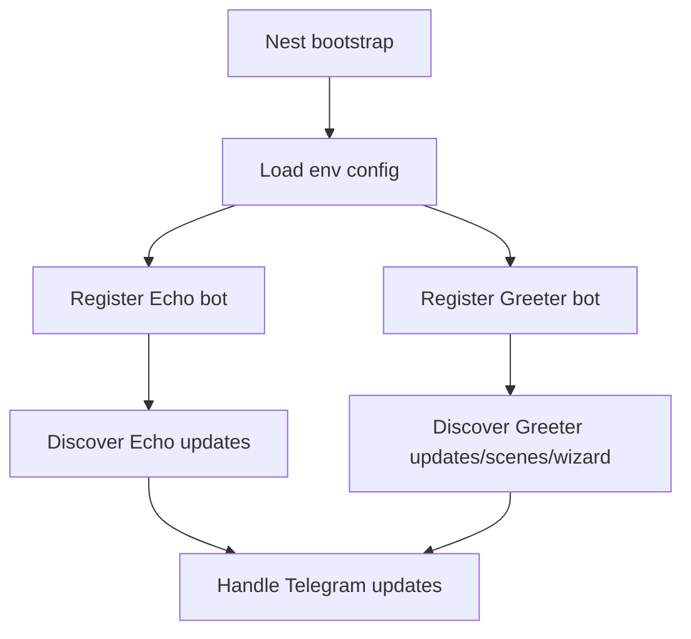

# Telegram Bot Platform

> **⚠️ This document describes the bundled _demo app_ (`src/bots/`), not the published library.**
> The demo is a runnable example built on `nestjs-telegraf` and is **excluded from
> the npm package**. For the library's own bot platform — `TelegramBotModule`,
> `TelegramBotService`, the `@TelegramUpdate` decorator system, guards/filters, the
> webhook controller, and Mini Apps — see
> [BOT-API.md](https://github.com/Aborii/telenest/blob/main/docs/BOT-API.md),
> [BOT-UPDATE-DECORATORS.md](https://github.com/Aborii/telenest/blob/main/docs/BOT-UPDATE-DECORATORS.md),
> and [WEBHOOK-CONTROLLER.md](https://github.com/Aborii/telenest/blob/main/docs/WEBHOOK-CONTROLLER.md).

This document covers the bundled demo application that runs multiple Telegraf bots in one process. It mirrors the architecture and ergonomics of `nestjs-telegraf` examples while adding stricter config validation, better module boundaries, and extension-ready conventions.

---

## Table of Contents

- [Architecture Overview](#architecture-overview)
- [File Structure](#file-structure)
- [Environment Variables](#environment-variables)
- [Flow Diagrams / Step-by-Step](#flow-diagrams--step-by-step)
- [HTTP API Reference](#http-api-reference)
- [Security Notes](#security-notes)
- [How To Extend](#how-to-extend)

## Architecture Overview

The system is composed of one NestJS application root and two bot feature modules:

- Echo bot module: command and message handlers.
- Greeter bot module: update handlers, scene, and wizard.
- Shared config utilities: parse env vars and generate launch options.

Both bots are registered through `TelegrafModule.forRootAsync`, with `include` scoping to avoid accidental handler collisions.

## File Structure

```text
src/
  app.module.ts
  main.ts
  app.constants.ts
  common/
    config/
      env.config.ts
      env.validation.ts
  bots/
    echo/
      echo.module.ts
      echo.update.ts
      echo.service.ts
      echo.constants.ts
    greeter/
      greeter.module.ts
      greeter.update.ts
      greeter.constants.ts
      interfaces/greeter-context.interface.ts
      middleware/session.middleware.ts
      scenes/random-number.scene.ts
      wizard/profile.wizard.ts
```

## Environment Variables

| Variable | Required | Description |
| --- | --- | --- |
| `ECHO_BOT_TOKEN` | Yes | Telegram bot token used by echo bot |
| `GREETER_BOT_TOKEN` | Yes | Telegram bot token used by greeter bot |
| `ECHO_BOT_WEBHOOK_DOMAIN` | No | Webhook domain for echo bot |
| `ECHO_BOT_WEBHOOK_PATH` | No | Webhook path for echo bot |
| `GREETER_BOT_WEBHOOK_DOMAIN` | No | Webhook domain for greeter bot |
| `GREETER_BOT_WEBHOOK_PATH` | No | Webhook path for greeter bot |

## Flow Diagrams / Step-by-Step

1. Application starts and loads environment config.
2. `AppModule` registers two `TelegrafModule.forRootAsync` instances.
3. `nestjs-telegraf` discovers `@Update` handlers only in included modules.
4. Greeter module mounts session middleware, scenes, and wizard handlers.
5. Telegraf receives update and dispatches to matching decorators.



## HTTP API Reference

No HTTP controller endpoints are required for polling mode.

If webhook mode is enabled via environment variables, Telegraf internally configures Telegram webhook routes.

## Security Notes

- Bot tokens are read from environment variables only.
- Update handlers avoid unsafe casts and rely on strict TypeScript.
- Scope isolation through `include` reduces accidental cross-module handler registration.

## How To Extend

1. Add a new bot module under `src/bots/<name>`.
2. Register another `TelegrafModule.forRootAsync` in `AppModule`.
3. Limit update scanning to the new module via `include`.
4. Add custom decorators, guards, or interceptors as needed.
5. Update this document when architecture changes.
