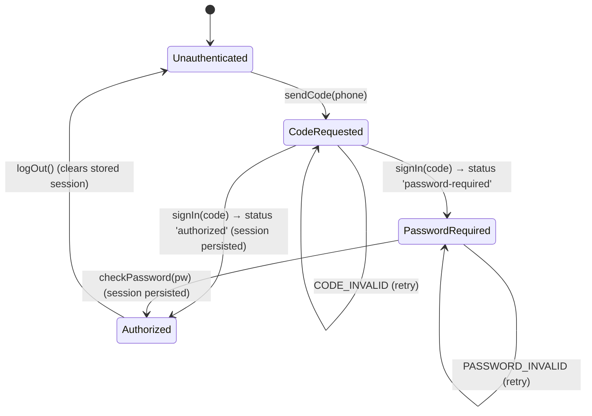

# Telegram Module

`nestjs-telegram` is a fully-typed NestJS library that wraps **two** distinct Telegram APIs behind one cohesive, dependency-injected surface: the **Bot API** (via [Telegraf](https://telegraf.js.org/)) for running a "normal" `@BotFather` bot, and the **MTProto user-account client** (via [GramJS](https://gram.js.org/) — the `telegram` package) for signing in *as your own account* and controlling it from your application. The two capabilities are independent feature modules (`TelegramBotModule` and `TelegramClientModule`) that share a common typed-error and scalar-type layer, can be configured synchronously or asynchronously through Nest's `ConfigurableModuleBuilder`, and can be composed together with a single call via the umbrella `TelegramModule`.

---

## Table of Contents

- [Architecture Overview](#architecture-overview)
  - [The three layers](#the-three-layers)
  - [The `IGramClient` abstraction boundary](#the-igramclient-abstraction-boundary)
  - [The `ConfigurableModuleBuilder` `forRoot` / `forRootAsync` pattern](#the-configurablemodulebuilder-forroot--forrootasync-pattern)
  - [The umbrella `TelegramModule`](#the-umbrella-telegrammodule)
  - [`peerDependencies` design](#peerdependencies-design)
- [File Structure](#file-structure)
- [Environment Variables](#environment-variables)
- [Flow Diagrams](#flow-diagrams)
  - [Module / DI composition](#module--di-composition)
  - [MTProto sign-in state machine](#mtproto-sign-in-state-machine)
- [Security Notes](#security-notes)
- [How To Extend](#how-to-extend)

---

## Architecture Overview

The library is organized as a shared `common` layer plus two independent feature modules. Everything a consumer needs is re-exported from the public barrel `src/index.ts` (which re-exports `src/lib`), so a single import path covers both APIs:

```ts
import {
  TelegramModule,
  TelegramBotModule,
  TelegramClientModule,
  TelegramBotService,
  TelegramAuthService,
  TelegramUserService,
} from 'nestjs-telegram';
```

### The three layers

1. **`common` — shared, dependency-free primitives** (`src/lib/common`).
   This layer imports neither Telegraf nor GramJS, so it is safe to reference from anywhere (services, options, consumers, and even unit tests).

   - **`telegram.errors.ts`** — a typed error hierarchy. Every failure the library surfaces is an instance of the abstract base `TelegramError`, which carries a stable `kind` discriminator (`TELEGRAM_ERROR_KINDS`) and a preserved `cause`. The concrete subclasses are:

     | Class | `kind` | Notable fields |
     | --- | --- | --- |
     | `TelegramConfigError` | `'config'` | — (invalid/missing module options) |
     | `TelegramBotApiError` | `'bot-api'` | `statusCode?`, `method?` |
     | `TelegramClientError` | `'client'` | `operation?` |
     | `TelegramAuthError` | `'auth'` | `code: TelegramAuthErrorCode`, `retryAfterSeconds?` |
     | `TelegramSessionError` | `'session'` | — (session load/persist failure) |

     `TelegramAuthError.code` is drawn from the `as const` record `TELEGRAM_AUTH_ERROR_CODES` (derived union `TelegramAuthErrorCode`): `PHONE_INVALID`, `CODE_INVALID`, `PASSWORD_REQUIRED`, `PASSWORD_INVALID`, `CODE_NOT_REQUESTED`, `SIGN_UP_REQUIRED`, `NOT_AUTHORIZED`, `FLOOD_WAIT`, `UNKNOWN`. The `isTelegramError(value): value is TelegramError` type guard lets consumers narrow an `unknown` caught value:

     ```ts
     import { isTelegramError } from 'nestjs-telegram';

     try {
       await auth.signIn(code);
     } catch (error) {
       if (isTelegramError(error) && error.kind === 'auth' && error.code === 'PASSWORD_REQUIRED') {
         // prompt the user for their 2FA password
       }
     }
     ```

   - **`telegram.types.ts`** — small scalar types: `PARSE_MODES` / `ParseMode` (`'Markdown' | 'MarkdownV2' | 'HTML'`), `ChatId` (`number | string`), and the `Awaitable<T>` helper (`T | Promise<T>`). Per repo conventions these closed sets are `as const` records with derived union types, never TS `enum`s.

2. **`bot` — the Bot API side** (`src/lib/bot`), backed by **Telegraf**.

   - `TelegramBotModule.forRoot` / `forRootAsync` builds a singleton `Telegraf` instance (under the `TELEGRAM_BOT` token) from `TelegramBotModuleOptions` and exposes the `TelegramBotService` facade.
   - `TelegramBotService` is a strongly-typed Bot API facade. Its method signatures are derived from Telegraf's own `Telegram` type via `Parameters<>` / `ReturnType<>`, so they never drift from the installed Telegraf version. Every call is funneled through a private `exec()` that wraps any failure in a `TelegramBotApiError` (extracting Telegram's numeric `error_code` where present). It also implements `OnApplicationBootstrap` / `OnApplicationShutdown` to launch the bot on startup (unless `launch: false`) and stop it on shutdown.
   - The facade covers messaging (`sendMessage`, `sendPhoto`, `sendDocument`, `sendVideo`, `sendAudio`, `sendMediaGroup`, `sendLocation`, `sendChatAction`, `forwardMessage`, `copyMessage`), editing/deletion (`editMessageText`, `editMessageReplyMarkup`, `deleteMessage`), callback answers (`answerCbQuery`), chat/member management (`getMe`, `getChat`, `getChatMembersCount`, `banChatMember`, `pinChatMessage`), commands (`setMyCommands`, `getMyCommands`), files (`getFile`, `getFileLink`), webhook administration (`setWebhook`, `deleteWebhook`, `getWebhookInfo`, `webhookCallback`), handler-registration delegates (`start`, `help`, `command`, `hears`, `action`, `on`, `use`, `catch`), and explicit lifecycle (`launch`, `stop`). Nothing is hidden: the raw `Telegraf` is reachable via `bot.instance` and the raw Bot API client via `bot.telegram`.
   - `keyboard.builder.ts` provides fluent, typed `InlineKeyboardBuilder` and `ReplyKeyboardBuilder` plus the one-shot `removeKeyboard()` / `forceReply()` helpers. They emit plain `reply_markup` objects assignable to Telegraf's strict union.

3. **`client` — the MTProto / user-account side** (`src/lib/client`), backed by **GramJS**.

   - `TelegramClientModule.forRoot` / `forRootAsync` builds and (by default) connects an `IGramClient`, wires the optional `SessionStore`, and exposes `TelegramAuthService` and `TelegramUserService`.
   - `TelegramAuthService` drives the single-account login state machine — `sendCode(phoneNumber, forceSMS?)` → `signIn(phoneCode)` → either `{ status: 'authorized', user }` or `{ status: 'password-required' }` → `checkPassword(password)` — plus `logOut()`, `isAuthorized()`, and `exportSession()`. On a successful sign-in it persists the resulting string session to the configured `SessionStore`. It also masks phone numbers in its logs.
   - `TelegramUserService` performs operations *as the logged-in account*: `getMe()`, `getDialogs(params?)`, `getMessages(peer, params?)`, `sendMessage(peer, text | GramSendMessageParams)`, and the `sendToSelf(text)` convenience (sends to your "Saved Messages" via the `'me'` peer). Both services call a private `ensureConnected()` before each operation.
   - `session/` holds the pluggable persistence layer: the `SessionStore` interface and two implementations — `InMemorySessionStore` (volatile, for tests/short-lived processes) and `FileSessionStore` (durable, written with `0o600` permissions on POSIX).

### The `IGramClient` abstraction boundary

The MTProto services **never** import GramJS. They depend only on the `IGramClient` interface (`src/lib/client/gram-client.interface.ts`), and every method on that interface returns library-owned DTOs from `gram-client.types.ts` (`GramUser`, `GramDialog`, `GramMessage`, `GramSignInResult`, `GramSendCodeResult`, etc.) — never raw GramJS `Api.*` objects. The single concrete implementation, `GramJsClientAdapter` (`gramjs-client.adapter.ts`), is the **only file in the library that imports `telegram`**; it maps `Api.*` objects into the DTOs and translates GramJS errors into the typed `TelegramAuthError` / `TelegramClientError` hierarchy.

This boundary delivers three benefits:

- **Testability** — every service is unit-testable with a trivial in-memory fake, because `TELEGRAM_GRAM_CLIENT` resolves to an `IGramClient` that can be overridden in tests (or supplied via the `clientFactory` option) so no test ever touches the network.
- **API stability** — the public surface (`GramUser`, `GramMessage`, …) stays fixed across GramJS upgrades, even if `Api.*` shapes change.
- **Compilation isolation** — GramJS stays out of consumer compilation units that only need to name a `GramUser` or a `GramPeer`.

```ts
// A service depends only on IGramClient; the real adapter is one of many possible impls.
const fake: IGramClient = {
  isConnected: () => true,
  connect: async () => {},
  getMe: async () => ({ id: '1', isSelf: true, isBot: false, isPremium: false }),
  // …rest of the interface
} as IGramClient;

const user = new TelegramUserService(fake);
```

The interface is consumed via the `TELEGRAM_GRAM_CLIENT` injection token; the optional `SessionStore` is consumed via `TELEGRAM_SESSION_STORE` (both `Symbol`s, exported from `telegram-client.constants.ts`).

### The `ConfigurableModuleBuilder` `forRoot` / `forRootAsync` pattern

Both feature modules avoid hand-rolling their static factories. Each defines a `*.module-definition.ts` that calls Nest's `ConfigurableModuleBuilder`:

```ts
// src/lib/bot/telegram-bot.module-definition.ts (the client side is identical in shape)
import { ConfigurableModuleBuilder } from '@nestjs/common';
import type { TelegramBotModuleOptions } from './telegram-bot.options';

export interface TelegramBotModuleExtras {
  /** When `true`, the module is registered globally. Defaults to `false`. */
  isGlobal?: boolean;
}

export const {
  ConfigurableModuleClass,
  MODULE_OPTIONS_TOKEN: TELEGRAM_BOT_OPTIONS,
  OPTIONS_TYPE,
  ASYNC_OPTIONS_TYPE,
} = new ConfigurableModuleBuilder<TelegramBotModuleOptions>()
  .setClassMethodName('forRoot')
  .setExtras<TelegramBotModuleExtras>(
    { isGlobal: false },
    (definition, extras) => ({ ...definition, global: extras.isGlobal }),
  )
  .build();
```

The module class then simply **extends** the generated base class to inherit fully-typed `forRoot` (synchronous) and `forRootAsync` (`useFactory` / `useClass` / `useExisting`) static factories, declares its providers/exports, and is done:

```ts
// src/lib/bot/telegram-bot.module.ts
@Module({
  providers: [telegramBotProvider, TelegramBotService],
  exports: [TelegramBotService, TELEGRAM_BOT],
})
export class TelegramBotModule extends ConfigurableModuleClass {}
```

Key consequences of this pattern:

- **`setClassMethodName('forRoot')`** names the synchronous factory `forRoot` (and yields `forRootAsync`).
- **`setExtras({ isGlobal: false }, …)`** adds a non-option `isGlobal` flag that is merged into the dynamic module definition as `global`, so either module can be registered globally.
- The validated options are injected into the factory providers under the generated **`MODULE_OPTIONS_TOKEN`** (re-exported as `TELEGRAM_BOT_OPTIONS` / `TELEGRAM_CLIENT_OPTIONS`).

Construction itself lives in dedicated factory providers so the module files stay declarative and tests get a single seam:

- **Bot** (`telegram-bot.factory.ts`): `telegramBotProvider` injects `TELEGRAM_BOT_OPTIONS`, validates that `token` is non-empty (throwing `TelegramConfigError` at bootstrap if not), and constructs `new Telegraf(token, telegraf?)` under `TELEGRAM_BOT`.
- **Client** (`telegram-client.factory.ts`): `sessionStoreProvider` exposes the configured `SessionStore` (or `undefined`) under `TELEGRAM_SESSION_STORE`; `gramClientProvider` resolves the initial session (precedence: `options.session` → `sessionStore.load()` → empty string), builds the client via `options.clientFactory` or `createGramJsClient`, and — unless `autoConnect: false` — connects eagerly, logging (not throwing) on connect failure so it never crashes bootstrap of unrelated modules.

Asynchronous configuration (recommended, to pull secrets from `ConfigService`):

```ts
TelegramBotModule.forRootAsync({
  isGlobal: true,
  inject: [ConfigService],
  useFactory: (config: ConfigService) => ({
    token: config.getOrThrow<string>('BOT_TOKEN'),
  }),
});

TelegramClientModule.forRootAsync({
  isGlobal: true,
  inject: [ConfigService],
  useFactory: (config: ConfigService) => ({
    apiId: Number(config.getOrThrow<string>('TG_API_ID')),
    apiHash: config.getOrThrow<string>('TG_API_HASH'),
    sessionStore: new FileSessionStore('./.telegram.session'),
    session: config.get<string>('TG_SESSION'),
  }),
});
```

### The umbrella `TelegramModule`

`TelegramModule.forRoot({ bot?, client?, isGlobal? })` (`src/lib/telegram.module.ts`) is a convenience composer for the **synchronous** case. It conditionally imports `TelegramBotModule.forRoot(...)` when `bot` is supplied and `TelegramClientModule.forRoot(...)` when `client` is supplied, threading the umbrella's `isGlobal` flag down into both sub-modules, and re-exports whichever sub-modules it imported. Supplying neither yields an empty module (a useful no-op for feature-flagged configurations).

```ts
@Module({
  imports: [
    TelegramModule.forRoot({
      isGlobal: true,
      bot: { token: process.env.BOT_TOKEN! },
      client: {
        apiId: Number(process.env.TG_API_ID),
        apiHash: process.env.TG_API_HASH!,
      },
    }),
  ],
})
export class AppModule {}
```

For configuration that depends on `ConfigService` (or any other provider), import `TelegramBotModule` and `TelegramClientModule` directly and use their `forRootAsync` factories — the umbrella intentionally exposes only `forRoot`.

### `peerDependencies` design

The library declares its heavy integrations as **peer dependencies** (its own `dependencies` map is empty), so the consumer owns and dedupes the versions:

| Peer dependency | Version range | Why |
| --- | --- | --- |
| `@nestjs/common` | `^10.0.0 \|\| ^11.0.0` | Module/DI primitives, `ConfigurableModuleBuilder`. |
| `@nestjs/core` | `^10.0.0 \|\| ^11.0.0` | Nest runtime. |
| `reflect-metadata` | `^0.1.13 \|\| ^0.2.0` | Decorator metadata. |
| `rxjs` | `^7.0.0` | Nest peer requirement. |
| `telegraf` | `^4.16.0` | Bot API client — only used by the `bot` layer. |
| `telegram` | `^2.26.0` | GramJS MTProto client — only imported by `gramjs-client.adapter.ts`. |

Because `telegraf` powers only the `bot` layer and `telegram` is touched only by the single GramJS adapter, a consumer who needs **just one** side installs only that SDK: both `telegraf` and `telegram` are declared **optional** peer dependencies (`peerDependenciesMeta`), and the subpath exports (`nestjs-telegram/bot`, `/client`) let each side be imported without pulling in the other's SDK. The typed facades derive their signatures from the installed peer versions (`Parameters<>` / `ReturnType<>` over Telegraf's `Telegram` type for the bot facade; library DTOs for the GramJS adapter), so upgrading a peer within its range never silently breaks the public surface.

---

## File Structure

```text
src/
  index.ts                              # public barrel → re-exports src/lib
  lib/
    index.ts                            # aggregated barrel (common + bot + client + testing + umbrella)
    telegram.module.ts                  # TelegramModule umbrella (forRoot composer)
    common/                             # ── shared, dependency-free layer ──
      telegram.errors.ts                # TelegramError base + subclasses + isTelegramError
      telegram.types.ts                 # PARSE_MODES/ParseMode, ChatId, Awaitable
      observability/                    # health indicators, metrics counters, OTel tracer bridge
    bot/                                # ── Bot API layer (Telegraf) ──
      telegram-bot.module.ts            # extends generated ConfigurableModuleClass
      telegram-bot.service.ts           # TelegramBotService (typed facade + lifecycle)
      telegram-bot.health.ts            # bot health indicator
      telegram-bot.metrics-middleware.ts# update metrics middleware
      keyboard.builder.ts               # Inline/Reply keyboard builders, removeKeyboard, forceReply
      callback-data.codec.ts            # encode/decode JSON callback_data (64-byte limit)
      message-splitter.ts               # splitMessageText (4096-char chunking)
      retry.ts                          # withRetry — 429 retry_after back-off
      updates/                          # @TelegramUpdate decorator runtime
        telegram-update.decorator.ts    # @TelegramUpdate/@Command/@Hears/@Action/@On/@Use
        param.decorators.ts             # @Ctx/@Sender/@MessageText/@CallbackData
        telegram-bot-updates.registrar.ts # discovers + binds handlers onto Telegraf
        command-registry.ts             # @Command → setMyCommands menu payloads
        argument-resolver.ts            # resolves handler params from the update
        execution/                      # enhancer pipeline (guards/interceptors/filters)
        guards/                         # chat-/user-allowlist + rate-limit guards
        filters/                        # default exception filter
      web-app/                          # validateWebAppInitData (Mini App init-data)
      webhook/                          # webhook controller, guard, registrar, secret-token
    client/                             # ── MTProto / user-account layer (GramJS) ──
      telegram-client.module.ts         # extends generated ConfigurableModuleClass
      telegram-client.lifecycle.ts      # connect/disconnect lifecycle
      telegram-client.health.ts         # client health indicator
      telegram-auth.service.ts          # TelegramAuthService (login state machine, incl. QR)
      telegram-user.service.ts          # TelegramUserService (23 account operations)
      gram-client.interface.ts          # IGramClient — the abstraction boundary
      gram-client.types.ts              # GramUser/GramDialog/GramMessage/… DTOs + unions
      gramjs-client.adapter.ts          # GramJsClientAdapter (ONLY file importing 'telegram')
      updates/                          # @OnUserMessage inbound dispatch + match-user-message
      session/                          # SessionStore contract + 5 implementations
        memory-session-store.ts         # InMemorySessionStore (volatile)
        file-session-store.ts           # FileSessionStore (durable, 0o600, atomic)
        key-value-session-store.ts      # KeyValueSessionStore (bring-your-own KV)
        redis-session-store.ts          # RedisSessionStore
        encrypted-session-store.ts      # EncryptedSessionStore (AES-256-GCM wrapper)
    testing/                            # ── nestjs-telegram/testing utilities ──
      mock-gram-client.ts               # createMockGramClient / provideMockGramClient
      mock-bot-context.ts               # createMockBotContext (spyable Telegraf Context)
      dto-builders.ts                   # aGramUser / aGramMessage / aGramDialog
examples/
  login-cli.ts                          # interactive MTProto login → string session
  qr-login.example.ts                   # QR-code login flow
  decorator-bot.example.ts              # @TelegramUpdate handler classes
  bot-enhancers.example.ts             # guards/filters/interceptors
  example-app.module.ts                 # reference wiring of both modules (forRootAsync)
```

> Trees in the docs are intentionally abbreviated to the key files per subsystem;
> see `src/lib/**` for the full listing and each feature's own doc for details.

---

## Environment Variables

The **library itself reads no environment variables** — all configuration flows through the typed module options. The variables below are the ones used by the bundled `examples/` (and the recommended names for your own `ConfigService`-driven `forRootAsync` factories).

| Variable | Used by | Required | Description |
| --- | --- | --- | --- |
| `BOT_TOKEN` | `example-app.module.ts` | Yes (bot) | Bot API token from `@BotFather` (`123456:ABC-DEF…`). Maps to `TelegramBotModuleOptions.token`. |
| `TG_API_ID` | `example-app.module.ts`, `login-cli.ts` | Yes (client) | Application `api_id` from [my.telegram.org](https://my.telegram.org). Maps to `TelegramClientModuleOptions.apiId` (numeric). |
| `TG_API_HASH` | `example-app.module.ts`, `login-cli.ts` | Yes (client) | Application `api_hash` from my.telegram.org. Maps to `TelegramClientModuleOptions.apiHash`. |
| `TG_SESSION` | `example-app.module.ts`, `login-cli.ts` | No | An existing string session to resume. Maps to `TelegramClientModuleOptions.session`; takes precedence over a value loaded from the `SessionStore`. |
| `TG_PHONE` | `login-cli.ts` | No | Phone number in international format; prompted interactively when absent. |

> Note: `api_id` / `api_hash` authenticate the **application**, while the phone/code/2FA flow authenticates the **account**. They are distinct from the Bot API `BOT_TOKEN`.

---

## Flow Diagrams

### Module / DI composition

```mermaid
flowchart TD
  subgraph Consumer["Consumer AppModule"]
    UM["TelegramModule.forRoot({ bot, client, isGlobal })<br/>(umbrella — sync only)"]
  end

  UM -->|imports when bot present| BM["TelegramBotModule<br/>extends ConfigurableModuleClass"]
  UM -->|imports when client present| CM["TelegramClientModule<br/>extends ConfigurableModuleClass"]

  subgraph CommonLayer["common layer (no Telegraf / no GramJS)"]
    ERR["telegram.errors.ts<br/>TelegramError + subclasses"]
    TYP["telegram.types.ts<br/>ParseMode, ChatId, Awaitable"]
  end

  subgraph Bot["bot layer (Telegraf)"]
    BOPT["TELEGRAM_BOT_OPTIONS<br/>(MODULE_OPTIONS_TOKEN)"]
    BPROV["telegramBotProvider<br/>createTelegrafInstance"]
    BTOK["TELEGRAM_BOT<br/>(raw Telegraf)"]
    BSVC["TelegramBotService<br/>(typed facade + lifecycle)"]
    BM --> BOPT --> BPROV --> BTOK --> BSVC
    BSVC -. wraps failures in .-> ERR
  end

  subgraph Client["client layer (GramJS)"]
    COPT["TELEGRAM_CLIENT_OPTIONS<br/>(MODULE_OPTIONS_TOKEN)"]
    SSTORE["TELEGRAM_SESSION_STORE<br/>SessionStore?"]
    GTOK["TELEGRAM_GRAM_CLIENT<br/>IGramClient"]
    ADP["GramJsClientAdapter<br/>(only importer of 'telegram')"]
    AUTH["TelegramAuthService"]
    USER["TelegramUserService"]
    CM --> COPT
    COPT --> SSTORE
    COPT --> GTOK
    GTOK -->|createGramJsClient / clientFactory| ADP
    GTOK --> AUTH
    GTOK --> USER
    SSTORE --> AUTH
    ADP -. maps Api.* → DTOs / errors .-> ERR
    AUTH -. drives via .-> GTOK
    USER -. acts via .-> GTOK
  end

  BSVC -. uses .-> TYP
  USER -. uses .-> TYP
```

`IGramClient` is the seam between the `client` services and GramJS: `AUTH` and `USER` depend on the `TELEGRAM_GRAM_CLIENT` token (an `IGramClient`), and only `GramJsClientAdapter` behind that token imports the `telegram` package.

### MTProto sign-in state machine

Driven by `TelegramAuthService` (and demonstrated end-to-end in `examples/login-cli.ts`):

1. `sendCode(phoneNumber, forceSMS?)` — requests a login code; stores the `phoneNumber` and returned `phoneCodeHash` on the instance. Throws `TelegramAuthError('PHONE_INVALID')` on a bad number.
2. `signIn(phoneCode)` — completes sign-in. Throws `TelegramAuthError('CODE_NOT_REQUESTED')` if called before `sendCode`, or `CODE_INVALID` if the code is wrong. Returns either:
   - `{ status: 'authorized', user }` — session is persisted to the `SessionStore`; **done**.
   - `{ status: 'password-required' }` — 2FA is enabled; continue to step 3.
3. `checkPassword(password)` — completes a 2FA login. Throws `TelegramAuthError('PASSWORD_INVALID')` on a wrong password. On success the session is persisted and the authenticated `GramUser` is returned.



After authorization, `TelegramUserService` operations (`getMe`, `getDialogs`, `getMessages`, `sendMessage`, `sendToSelf`) call `ensureConnected()` and run as the logged-in account. On subsequent process starts, a non-empty `session` / `SessionStore` value lets the client skip the login entirely.

---

## Security Notes

- **Bot tokens and API credentials are never read from the environment by the library.** They are passed in through typed options; the recommendation is to source them from `ConfigService` via `forRootAsync` so they stay out of source control.
- **The MTProto string session is as sensitive as a password.** It encodes live auth keys that grant full access to the account and let the client reconnect without re-running the phone/code/2FA flow.
  - `FileSessionStore` writes the session file with `0o600` (owner read/write only) permissions on POSIX systems. Keep it out of version control and off shared volumes.
  - `InMemorySessionStore` is volatile — convenient for tests, but a restart forces a fresh login.
  - The `login-cli.ts` example explicitly warns never to commit the printed session string and always disconnects in a `finally` block.
- **Phone numbers are masked in logs.** `TelegramAuthService` logs only a masked form (country code + last two digits, e.g. `+1******67`) when a code is sent.
- **Errors preserve, but do not leak, their root cause as typed values.** Third-party Telegraf/GramJS failures are wrapped in `TelegramError` subclasses; the original is retained on `cause` and the typed `code` / `kind` discriminators let callers branch without inspecting raw provider strings. The GramJS adapter translates `FLOOD_WAIT_*` into `TelegramAuthError('FLOOD_WAIT', …, { retryAfterSeconds })` so callers can back off rather than hammer the API.
- **Eager connect / launch failures are logged, not thrown.** Both the bot launch (`onApplicationBootstrap`) and the MTProto eager connect (`gramClientProvider`) swallow-and-log startup failures so a transient network issue does not crash the bootstrap of unrelated modules. Disable eager behavior with `launch: false` (bot) or `autoConnect: false` (client) where you need full manual control.
- **The `clientFactory` test seam never hits the network.** Overriding `TELEGRAM_GRAM_CLIENT` (or supplying `clientFactory`) lets unit/e2e tests inject a fake `IGramClient`, keeping credentials and live sessions out of the test path.

---

## How To Extend

1. **Add a new Bot API method to the facade.** In `telegram-bot.service.ts`, add a method that delegates through the private `exec()` helper so failures are normalized to `TelegramBotApiError`, deriving its signature from Telegraf's `Telegram` type:

   ```ts
   public sendVoice(
     ...args: Parameters<Telegram['sendVoice']>
   ): Promise<Awaited<ReturnType<Telegram['sendVoice']>>> {
     return this.exec('sendVoice', () => this.telegram.sendVoice(...args));
   }
   ```

   For anything not yet wrapped, consumers can always reach `bot.telegram` (raw `Telegram` client) or `bot.instance` (raw `Telegraf`) — nothing is hidden.

2. **Add a new user-account operation.** Extend the `IGramClient` interface (`gram-client.interface.ts`) with the new method returning a library DTO, implement it in `GramJsClientAdapter` (the only place allowed to import `telegram`, mapping `Api.*` → DTO and wrapping errors in `TelegramClientError`/`TelegramAuthError`), then expose it from `TelegramUserService` (or `TelegramAuthService`) after `ensureConnected()`. Add any new DTO/param shapes to `gram-client.types.ts` as `as const` records + derived unions (never `enum`s).

3. **Add a new session backend.** Implement the `SessionStore` interface (`load` / `save` / `clear`, each `Awaitable`) — e.g. a Redis- or KMS-backed store — and pass an instance via `TelegramClientModuleOptions.sessionStore`. See the JSDoc example in `session-store.interface.ts`.

4. **Add a new error variant.** Add a member to `TELEGRAM_AUTH_ERROR_CODES` (for auth) or a new `TelegramError` subclass with a fresh `TELEGRAM_ERROR_KINDS` discriminator in `telegram.errors.ts`; keep the `as const` + derived-union pattern so exhaustive `switch` narrowing stays sound. Map the new condition in the adapter's `toAuthError` / wrapping helpers.

5. **Add a new keyboard helper.** Extend `InlineKeyboardBuilder` / `ReplyKeyboardBuilder` in `keyboard.builder.ts`, returning `this` for chaining and emitting markup structurally assignable to Telegraf's `reply_markup` union.

6. **Swap the GramJS client (tests or custom transport).** Supply `TelegramClientModuleOptions.clientFactory: (options, session) => IGramClient` to bypass `createGramJsClient`, or override the `TELEGRAM_GRAM_CLIENT` provider in a testing module.

7. **Update this document** whenever a layer, token, option, or public method changes — per `.github/copilot-instructions.md`, a significant change to a feature must keep its `docs/` file current.
