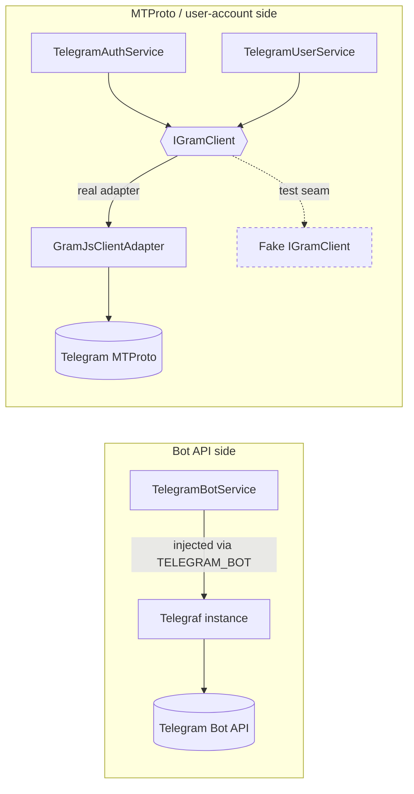

# Testing Guide

This guide covers two distinct audiences:

1. **The library's own test strategy** — how `nestjs-telegram` is tested internally, so contributors know the conventions.
2. **How _you_ (a consumer) test your application code** that depends on this library — without ever touching the Telegram network.

The whole library is designed around testability: the Bot API side hides the raw [Telegraf](https://telegraf.js.org) instance behind an injection token and a typed facade, and the MTProto (user-account) side hides [GramJS](https://gram.js.org) behind a single narrow interface, `IGramClient`. Both seams let you swap in fakes with a one-liner.

---

## 1. The library's own test strategy

| Aspect            | Choice                                                                 |
| ----------------- | ---------------------------------------------------------------------- |
| Runner            | [Jest](https://jestjs.io) 30 with [`ts-jest`](https://kulshekhar.github.io/ts-jest/) |
| Tests             | ~150 specs                                                             |
| Coverage          | ~95% of `src/lib`                                                      |
| Network           | None — every test runs fully offline                                  |
| Type strictness   | Specs compile under the same strict `tsconfig.json` as the source (no `any`, no enums) |

### Configuration

The runner is configured in [`jest.config.ts`](../jest.config.ts). Key points:

```ts
const config: Config = {
  testEnvironment: 'node',
  moduleFileExtensions: ['js', 'json', 'ts'],
  roots: ['<rootDir>/src'],
  testRegex: '\\.spec\\.ts$',
  transform: { '^.+\\.ts$': ['ts-jest', { tsconfig: '<rootDir>/tsconfig.json' }] },
  setupFiles: ['<rootDir>/test/jest-setup.ts'],
  clearMocks: true,
  collectCoverageFrom: [
    'src/lib/**/*.ts',
    '!src/lib/**/index.ts',
    '!src/lib/**/*.module-definition.ts',
  ],
};
```

- **`ts-jest` against the real `tsconfig.json`** means a spec that misuses a type fails to compile — the type system is part of the test suite.
- **`setupFiles: ['<rootDir>/test/jest-setup.ts']`** imports `reflect-metadata` once, which NestJS dependency injection requires inside `@nestjs/testing` module tests. If you write your own Nest tests, do the same (see [`test/jest-setup.ts`](../test/jest-setup.ts)).
- **`clearMocks: true`** resets mock state between tests, so fakes don't leak call history across cases.
- **Coverage** is collected from `src/lib` only; barrels (`index.ts`) and generated module-definition files are excluded.

### Scripts

```bash
npm test            # run once
npm run test:watch  # watch mode
npm run test:cov    # run with coverage
npm run typecheck   # tsc --noEmit (type-level checks only)
```

### How the suite stays offline

There is exactly **one** file that imports the `telegram` (GramJS) package: [`src/lib/client/gramjs-client.adapter.ts`](../src/lib/client/gramjs-client.adapter.ts). Everything else — both user-account services — depends only on the `IGramClient` interface ([`src/lib/client/gram-client.interface.ts`](../src/lib/client/gram-client.interface.ts)). On the Bot API side, `TelegramBotService` only ever talks to a `Telegraf` instance it receives by constructor injection.

That gives two clean seams the tests exploit:

- **Bot side:** construct `TelegramBotService` with a hand-rolled mock `Telegraf`, or in a Nest module override the `TELEGRAM_BOT` token.
- **Client side:** pass a fake `IGramClient` via `clientFactory`, or override the `TELEGRAM_GRAM_CLIENT` token, always with `autoConnect: false`.



In tests you replace the rightmost real boxes (`Telegraf instance`, `GramJsClientAdapter`) with fakes, so no request ever reaches Telegram.

### Reference specs

Use these existing specs as templates when writing tests:

| Spec file | Demonstrates |
| --------- | ------------ |
| [`src/lib/bot/telegram-bot.service.spec.ts`](../src/lib/bot/telegram-bot.service.spec.ts) | Mocking `Telegraf` directly; verifying delegation, error wrapping, and launch/stop lifecycle |
| [`src/lib/bot/telegram-bot.module.spec.ts`](../src/lib/bot/telegram-bot.module.spec.ts) | Resolving `TelegramBotService` + `TELEGRAM_BOT` from a `TestingModule` with `launch: false` |
| [`src/lib/client/telegram-user.service.spec.ts`](../src/lib/client/telegram-user.service.spec.ts) | A reusable `jest.Mocked<IGramClient>` factory; verifying user-account operations |
| [`src/lib/client/telegram-auth.service.spec.ts`](../src/lib/client/telegram-auth.service.spec.ts) | Driving the sign-in state machine against a fake client + fake `SessionStore` |
| [`src/lib/client/telegram-client.module.spec.ts`](../src/lib/client/telegram-client.module.spec.ts) | Wiring the MTProto module with `clientFactory` + `autoConnect: false` |

---

## 2. Testing _your_ application code

You import `nestjs-telegram` from your own NestJS app and inject its services. The goal of your tests is the same as the library's: **never hit the network**. Pick the right seam for the side you depend on.

### 2a. Bot API side

Your service probably injects `TelegramBotService` (the typed facade) or, less commonly, the raw `Telegraf` instance via the `TELEGRAM_BOT` token. You have three strategies, in increasing order of integration:

#### Strategy A — provide a plain mock of `TelegramBotService` (simplest)

If your code calls the facade (`bot.sendMessage(...)`, `bot.getMe()`, etc.), the cleanest approach is to never import `TelegramBotModule` at all. Provide your own object under the `TelegramBotService` class token.

Suppose this is the code under test:

```ts
// notifications.service.ts
import { Injectable } from '@nestjs/common';
import { TelegramBotService } from 'nestjs-telegram';

@Injectable()
export class NotificationsService {
  constructor(private readonly bot: TelegramBotService) {}

  async alertAdmin(chatId: number, text: string): Promise<void> {
    await this.bot.sendMessage(chatId, `[ALERT] ${text}`);
  }
}
```

A complete, network-free test:

```ts
// notifications.service.spec.ts
import { Test } from '@nestjs/testing';
import { TelegramBotService } from 'nestjs-telegram';
import { NotificationsService } from './notifications.service';

describe('NotificationsService', () => {
  let service: NotificationsService;
  // Only stub the methods this unit actually calls.
  const sendMessage = jest.fn().mockResolvedValue({ message_id: 1 });

  beforeEach(async () => {
    const moduleRef = await Test.createTestingModule({
      providers: [
        NotificationsService,
        {
          provide: TelegramBotService,
          useValue: { sendMessage } as Partial<TelegramBotService>,
        },
      ],
    }).compile();

    service = moduleRef.get(NotificationsService);
  });

  it('prefixes the alert and sends it to the chat', async () => {
    await service.alertAdmin(42, 'disk full');

    expect(sendMessage).toHaveBeenCalledWith(42, '[ALERT] disk full');
  });
});
```

> Note: `clearMocks: true` (set in the library's Jest config — do the same in yours) resets `sendMessage` between tests. If you don't enable it, call `jest.clearAllMocks()` in a `beforeEach`.

#### Strategy B — override the `TELEGRAM_BOT` token with a mock `Telegraf`

Use this when your code reaches past the facade to the raw Telegraf instance (`@Inject(TELEGRAM_BOT) bot: Telegraf`), or when you want to exercise the real `TelegramBotService` while stubbing the transport. Import `TelegramBotModule.forRoot({ launch: false })` (the dummy token is never validated against Telegram, and `launch: false` keeps the lifecycle hooks from starting long-polling), then override `TELEGRAM_BOT`:

```ts
// bot-wiring.spec.ts
import { Test } from '@nestjs/testing';
import { Telegraf } from 'telegraf';
import { TELEGRAM_BOT, TelegramBotModule, TelegramBotService } from 'nestjs-telegram';

describe('bot wiring with a mock Telegraf', () => {
  it('routes facade calls through the injected Telegraf', async () => {
    // A mock exposing only the surface the facade touches.
    const telegram = { sendMessage: jest.fn().mockResolvedValue({ message_id: 7 }) };
    const fakeBot = {
      telegram,
      launch: jest.fn().mockResolvedValue(undefined),
      stop: jest.fn(),
      webhookCallback: jest.fn(),
    } as unknown as Telegraf;

    const moduleRef = await Test.createTestingModule({
      imports: [TelegramBotModule.forRoot({ token: '123:test', launch: false })],
    })
      .overrideProvider(TELEGRAM_BOT)
      .useValue(fakeBot)
      .compile();

    const service = moduleRef.get(TelegramBotService);

    await service.sendMessage(42, 'hi');

    expect(telegram.sendMessage).toHaveBeenCalledWith(42, 'hi');
  });
});
```

Two facts make this safe:

- `TelegramBotService.sendMessage(...)` and friends forward to `this.bot.telegram.<method>(...)`, so stubbing the `telegram` object is enough.
- With `launch: false`, the module's `onApplicationBootstrap` hook logs and returns instead of calling `bot.launch()`, so nothing tries to connect even if you call `moduleRef.init()`. (You don't need `init()` for `.get()`-style unit tests.)

> Always pass `launch: false` in tests. Otherwise, once the Nest lifecycle runs, `TelegramBotService` would attempt to start long-polling against Telegram.

#### Strategy C — assert on registered handlers

If you register command/text handlers (`bot.command(...)`, `bot.hears(...)`, `bot.on(...)`, `bot.action(...)`), those delegate to the matching `Telegraf` method. Add the corresponding `jest.fn()` to your mock Telegraf and assert it was called with your trigger and middleware. The facade's `start`/`help`/`command`/`hears`/`action`/`on`/`catch` are all thin pass-throughs, so a mock that records the arguments is sufficient to test your wiring.

### 2b. User-account (MTProto) side

The user-account services — `TelegramAuthService` and `TelegramUserService` — depend only on `IGramClient`, resolved from the `TELEGRAM_GRAM_CLIENT` token. There are two equally good seams.

#### A complete fake `IGramClient`

`IGramClient` has exactly thirteen methods. Here is a complete, typed, in-memory fake you can reuse across tests. It mirrors the factory pattern used in the library's own specs ([`telegram-user.service.spec.ts`](../src/lib/client/telegram-user.service.spec.ts)):

```ts
// test-support/fake-gram-client.ts
import type {
  IGramClient,
  GramUser,
  GramMessage,
} from 'nestjs-telegram';

/** A representative authenticated account. */
export const FAKE_USER: GramUser = {
  id: '1001',
  isSelf: true,
  isBot: false,
  isPremium: false,
  firstName: 'Ada',
  username: 'ada',
};

/** A representative sent message. */
export const FAKE_MESSAGE: GramMessage = {
  id: 5,
  peerId: '1001',
  text: 'hi',
  date: 1_700_000_000,
  out: true,
};

/**
 * Builds a fully-mocked IGramClient. Every method is a jest.fn() with a
 * sensible default; pass `overrides` to change behaviour per test.
 */
export function createFakeGramClient(
  overrides: Partial<IGramClient> = {},
): jest.Mocked<IGramClient> {
  const base: jest.Mocked<IGramClient> = {
    connect: jest.fn().mockResolvedValue(undefined),
    disconnect: jest.fn().mockResolvedValue(undefined),
    isConnected: jest.fn().mockReturnValue(true),
    isAuthorized: jest.fn().mockResolvedValue(true),
    sendCode: jest
      .fn()
      .mockResolvedValue({ phoneCodeHash: 'HASH', isCodeViaApp: true }),
    signInWithCode: jest
      .fn()
      .mockResolvedValue({ status: 'authorized', user: FAKE_USER }),
    signInWithPassword: jest.fn().mockResolvedValue(FAKE_USER),
    logOut: jest.fn().mockResolvedValue(undefined),
    getMe: jest.fn().mockResolvedValue(FAKE_USER),
    getDialogs: jest.fn().mockResolvedValue([]),
    getMessages: jest.fn().mockResolvedValue([]),
    sendMessage: jest.fn().mockResolvedValue(FAKE_MESSAGE),
    exportSession: jest.fn().mockReturnValue('SESSION-STRING'),
  } as jest.Mocked<IGramClient>;

  return Object.assign(base, overrides);
}
```

> The defaults above let `isConnected()` return `true`, so the services skip their lazy `connect()` call. To test the lazy-connect path, override `isConnected: jest.fn().mockReturnValue(false)` and assert `connect` was called.

#### Seam 1 — `options.clientFactory` (recommended)

`TelegramClientModuleOptions` exposes a `clientFactory` whose declared purpose is exactly this: replace the real GramJS client. Combine it with `autoConnect: false` so the module never opens a connection during `forRoot`. This is the pattern in [`telegram-client.module.spec.ts`](../src/lib/client/telegram-client.module.spec.ts).

Suppose this is your code:

```ts
// digest.service.ts
import { Injectable } from '@nestjs/common';
import { TelegramUserService } from 'nestjs-telegram';

@Injectable()
export class DigestService {
  constructor(private readonly user: TelegramUserService) {}

  /** Posts a one-line summary to the account's own Saved Messages. */
  async postUnreadDigest(): Promise<void> {
    const dialogs = await this.user.getDialogs({ limit: 50 });
    const unread = dialogs.reduce((n, d) => n + d.unreadCount, 0);
    await this.user.sendToSelf(`You have ${unread} unread messages.`);
  }
}
```

A complete test that wires the **real** `TelegramClientModule` but a **fake** client:

```ts
// digest.service.spec.ts
import { Test } from '@nestjs/testing';
import { TelegramClientModule, TelegramUserService } from 'nestjs-telegram';
import { createFakeGramClient } from './test-support/fake-gram-client';
import { DigestService } from './digest.service';

describe('DigestService', () => {
  it('sums unread counts and writes a digest to Saved Messages', async () => {
    const fake = createFakeGramClient({
      getDialogs: jest.fn().mockResolvedValue([
        { id: '1', title: 'Alice', type: 'user', unreadCount: 2, pinned: false },
        { id: '2', title: 'Team', type: 'group', unreadCount: 3, pinned: true },
      ]),
    });

    const moduleRef = await Test.createTestingModule({
      imports: [
        TelegramClientModule.forRoot({
          apiId: 1,
          apiHash: 'test-hash',
          autoConnect: false,        // never open a real MTProto connection
          clientFactory: () => fake, // hand the module our fake instead of GramJS
        }),
      ],
      providers: [DigestService],
    }).compile();

    const service = moduleRef.get(DigestService);

    await service.postUnreadDigest();

    expect(fake.getDialogs).toHaveBeenCalledWith({ limit: 50 });
    expect(fake.sendMessage).toHaveBeenCalledWith('me', {
      message: 'You have 5 unread messages.',
    });
  });
});
```

Note how `sendToSelf('...')` lands on the client as `sendMessage('me', { message: '...' })` — `TelegramUserService` normalizes a bare string into a `GramSendMessageParams` object before delegating, and `sendToSelf` targets the `'me'` peer.

#### Seam 2 — `overrideProvider(TELEGRAM_GRAM_CLIENT)`

If you import the client module somewhere central (e.g. a shared `AppModule`) and can't easily inject a `clientFactory`, override the `TELEGRAM_GRAM_CLIENT` token in the `TestingModule` instead. The token is documented as the override point for tests. Keep `autoConnect: false` on the module so the real factory is never asked to connect.

```ts
// app-auth.spec.ts
import { Test } from '@nestjs/testing';
import {
  TELEGRAM_GRAM_CLIENT,
  TelegramAuthService,
  TelegramClientModule,
} from 'nestjs-telegram';
import { createFakeGramClient } from './test-support/fake-gram-client';

describe('account sign-in flow (override token)', () => {
  it('completes a 2FA login', async () => {
    const fake = createFakeGramClient({
      isAuthorized: jest.fn().mockResolvedValue(false),
      // First step accepts the code but demands a 2FA password.
      signInWithCode: jest
        .fn()
        .mockResolvedValue({ status: 'password-required' }),
    });

    const moduleRef = await Test.createTestingModule({
      imports: [
        TelegramClientModule.forRoot({
          apiId: 1,
          apiHash: 'test-hash',
          autoConnect: false,
        }),
      ],
    })
      .overrideProvider(TELEGRAM_GRAM_CLIENT)
      .useValue(fake)
      .compile();

    const auth = moduleRef.get(TelegramAuthService);

    await auth.sendCode('+15551234567');
    const step = await auth.signIn('12345');
    expect(step.status).toBe('password-required');

    const me = await auth.checkPassword('hunter2');
    expect(me).toEqual(
      expect.objectContaining({ id: '1001', username: 'ada' }),
    );

    // The fake recorded each step of the state machine.
    expect(fake.sendCode).toHaveBeenCalledWith('+15551234567', false);
    expect(fake.signInWithCode).toHaveBeenCalledWith({
      phoneNumber: '+15551234567',
      phoneCodeHash: 'HASH',
      phoneCode: '12345',
    });
    expect(fake.signInWithPassword).toHaveBeenCalledWith('hunter2');
  });
});
```

> `TelegramAuthService.signIn(...)` throws a `TelegramAuthError` with `code === 'CODE_NOT_REQUESTED'` if you call it before `sendCode(...)`. The pending phone number and `phoneCodeHash` are held on the instance between the two calls, so your test must call `sendCode` first — exactly as a real login would.

#### Testing session persistence

If your app supplies a `sessionStore`, you can verify persistence without a filesystem by providing a fake `SessionStore` (three methods: `load`, `save`, `clear`). After a successful `signIn` (no 2FA) or `checkPassword`, the auth service calls `sessionStore.save(...)` with the exported session string; on `logOut` it calls `sessionStore.clear()`.

```ts
const store = {
  load: jest.fn().mockResolvedValue(undefined),
  save: jest.fn().mockResolvedValue(undefined),
  clear: jest.fn().mockResolvedValue(undefined),
};

const moduleRef = await Test.createTestingModule({
  imports: [
    TelegramClientModule.forRoot({
      apiId: 1,
      apiHash: 'test-hash',
      autoConnect: false,
      sessionStore: store,
      clientFactory: () => createFakeGramClient(),
    }),
  ],
}).compile();

const auth = moduleRef.get(TelegramAuthService);
await auth.sendCode('+15551234567');
await auth.signIn('12345');           // resolves to { status: 'authorized', ... }
expect(store.save).toHaveBeenCalledWith('SESSION-STRING');
```

For ephemeral end-to-end tests you can also use the built-in `InMemorySessionStore` instead of a mock.

---

## 3. Public testing utilities (`nestjs-telegram/testing`)

Starting from v1.2, the library ships a dedicated **`nestjs-telegram/testing`** subpath that
re-exports every helper you need in one import, with zero runtime network or SDK dependencies.

### Why use these instead of hand-rolling fakes?

The utilities are generated from the same interfaces the library uses internally, so:

- They always stay in sync when the interface changes — your test helpers stay
  valid automatically.
- You only override the one or two methods your test actually exercises; the rest
  get sensible defaults.
- `withMockGramClient` removes the boilerplate of writing a `FactoryProvider`
  object every time you wire a fake into a `TestingModule`.

### Available exports

| Export | Kind | Description |
| ------ | ---- | ----------- |
| `createMockGramClient(overrides?)` | Factory | Returns `jest.Mocked<IGramClient>` — all 13 methods stubbed with `jest.fn()` and safe defaults. |
| `createMockBotContext(overrides?)` | Factory | Returns a spyable Telegraf `Context` — all action/reply methods stubbed. |
| `withMockGramClient(client)` | DI helper | Builds a `FactoryProvider` that registers `client` under `TELEGRAM_GRAM_CLIENT`. |
| `aGramUser(partial?)` | DTO builder | Returns a `GramUser` with sensible defaults, merged with `partial`. |
| `aGramMessage(partial?)` | DTO builder | Returns a `GramMessage` with sensible defaults, merged with `partial`. |
| `aGramDialog(partial?)` | DTO builder | Returns a `GramDialog` with sensible defaults, merged with `partial`. |
| `MockBotContextOverrides` | Type | Overrides shape accepted by `createMockBotContext`. |

### Quick start

```ts
import {
  aGramUser,
  aGramMessage,
  aGramDialog,
  createMockGramClient,
  createMockBotContext,
  withMockGramClient,
} from 'nestjs-telegram/testing';
```

### `createMockGramClient`

Every method is a `jest.fn()` with a safe default:

| Method | Default return |
| ------ | -------------- |
| `connect` / `disconnect` / `logOut` | Resolves `undefined` |
| `isConnected` | Returns `true` |
| `isAuthorized` | Resolves `true` |
| `sendCode` | Resolves `{ phoneCodeHash: 'MOCK_HASH', isCodeViaApp: true }` |
| `signInWithCode` | Resolves `{ status: 'authorized', user: aGramUser() }` |
| `signInWithPassword` | Resolves `aGramUser()` |
| `getMe` | Resolves `aGramUser()` |
| `getDialogs` | Resolves `[]` |
| `getMessages` | Resolves `[]` |
| `sendMessage` | Resolves `aGramMessage()` |
| `exportSession` | Returns `''` |
| `onNewMessage` | Returns a no-op unsubscribe function |

```ts
// Use defaults for everything you don't care about.
const client = createMockGramClient();

// Override only what the test exercises.
const client = createMockGramClient({
  getMe: jest.fn().mockResolvedValue(aGramUser({ username: 'bot', isBot: true })),
});

const service = new TelegramUserService(client);
await service.getMe();
expect(client.getMe).toHaveBeenCalledTimes(1);
```

### `withMockGramClient`

Builds a NestJS `FactoryProvider` that you can drop into a `providers` array (or
use with `overrideProvider`). No need to import `TELEGRAM_GRAM_CLIENT` yourself.

```ts
import { Test } from '@nestjs/testing';
import { TelegramUserService } from 'nestjs-telegram';
import { aGramUser, createMockGramClient, withMockGramClient } from 'nestjs-telegram/testing';
import { DigestService } from './digest.service';

describe('DigestService (using withMockGramClient)', () => {
  it('posts an unread digest to Saved Messages', async () => {
    const client = createMockGramClient({
      getDialogs: jest.fn().mockResolvedValue([
        aGramDialog({ unreadCount: 2 }),
        aGramDialog({ unreadCount: 3 }),
      ]),
    });

    const moduleRef = await Test.createTestingModule({
      providers: [
        TelegramUserService,
        DigestService,
        withMockGramClient(client),   // <-- registers the fake under the token
      ],
    }).compile();

    const service = moduleRef.get(DigestService);
    await service.postUnreadDigest();

    expect(client.sendMessage).toHaveBeenCalledWith('me', {
      message: 'You have 5 unread messages.',
    });
  });
});
```

### `createMockBotContext`

Returns a structural mock of Telegraf's `Context` with every common action
method stubbed as a `jest.fn()`. The mock does not create a real `Telegraf`
instance, so it works without a bot token.

```ts
import { createMockBotContext } from 'nestjs-telegram/testing';

describe('start command handler', () => {
  it('replies with a welcome message', async () => {
    const ctx = createMockBotContext({
      update: { message: { text: '/start', from: { id: 1 } } },
    });

    await startHandler(ctx);

    expect(ctx.reply).toHaveBeenCalledWith('Welcome!');
  });
});
```

The `overrides` object is merged directly onto the context, so you can attach
session data, scene state, or any custom middleware fields:

```ts
const ctx = createMockBotContext({ session: { step: 'await_phone' } });
```

Stubbed action methods (all return `jest.fn()` with a safe default):
`reply`, `replyWithHTML`, `replyWithMarkdown`, `replyWithMarkdownV2`,
`sendMessage`, `answerCbQuery`, `answerInlineQuery`, `editMessageText`,
`editMessageCaption`, `editMessageReplyMarkup`, `deleteMessage`, `getChat`,
`leaveChat`, `pinChatMessage`, `unpinChatMessage`, `banChatMember`,
`unbanChatMember`, `restrictChatMember`, `promoteChatMember`,
`replyWithPhoto`, `replyWithDocument`, `replyWithAudio`, `replyWithVideo`,
`replyWithAnimation`, `replyWithSticker`, `replyWithVoice`,
`replyWithLocation`, `replyWithContact`, `replyWithPoll`, `replyWithDice`,
`replyWithMediaGroup`, `replyWithInvoice`.

### DTO builders

The builders fill in every required field so you only specify what matters:

```ts
const me   = aGramUser({ id: '42', isSelf: true, username: 'me' });
const msg  = aGramMessage({ text: 'Hello!', out: true });
const chat = aGramDialog({ title: 'Team', type: 'group', unreadCount: 10 });
```

All optional fields (e.g. `GramUser.phone`, `GramMessage.senderId`) are omitted
by default and only appear when you include them in `partial`.

---

## 4. Asserting on errors

Every failure this library raises is a subclass of `TelegramError`, so consumer tests can assert precisely:

```ts
import {
  TelegramBotApiError,
  TelegramAuthError,
  isTelegramError,
} from 'nestjs-telegram';

it('wraps a Bot API failure', async () => {
  telegram.sendMessage.mockRejectedValue({ code: 429, message: 'Too Many' });

  const error = await service.sendMessage(42, 'hi').catch((e: unknown) => e);

  expect(error).toBeInstanceOf(TelegramBotApiError);
  expect((error as TelegramBotApiError).statusCode).toBe(429);
  expect((error as TelegramBotApiError).method).toBe('sendMessage');
});

it('classifies an auth failure by code', () => {
  const error: unknown = new TelegramAuthError('PASSWORD_INVALID');
  expect(isTelegramError(error)).toBe(true);
  if (error instanceof TelegramAuthError) {
    expect(error.code).toBe('PASSWORD_INVALID');
  }
});
```

- `TelegramBotService` wraps every Bot API rejection in a `TelegramBotApiError`, extracting Telegram's status from either `error.code` or `error.response.error_code`, and tagging the failing `method`.
- `TelegramAuthError.code` is one of the values in `TELEGRAM_AUTH_ERROR_CODES` (`PHONE_INVALID`, `CODE_INVALID`, `PASSWORD_REQUIRED`, `PASSWORD_INVALID`, `CODE_NOT_REQUESTED`, `SIGN_UP_REQUIRED`, `NOT_AUTHORIZED`, `FLOOD_WAIT`, `UNKNOWN`). Branch on it in your tests, and use `retryAfterSeconds` for `FLOOD_WAIT`.
- `isTelegramError(value)` narrows an `unknown` caught value to `TelegramError`, after which `error.kind` (`'config' | 'bot-api' | 'client' | 'auth' | 'session'`) lets you switch exhaustively.

---

## 5. Do's and don'ts

**Do**

- Always pass `launch: false` (bot) and `autoConnect: false` (client) in tests.
- Prefer the facades' class tokens (`TelegramBotService`, `TelegramUserService`, `TelegramAuthService`) or the documented injection tokens (`TELEGRAM_BOT`, `TELEGRAM_GRAM_CLIENT`) as your override points.
- Use `createMockGramClient()` from `nestjs-telegram/testing` instead of hand-rolling a fake — it stays in sync with `IGramClient` automatically.
- Use `withMockGramClient(client)` to register a fake under `TELEGRAM_GRAM_CLIENT` in a `TestingModule` without writing a `FactoryProvider` object manually.
- Use `aGramUser()` / `aGramMessage()` / `aGramDialog()` to build DTO fixtures — only specify the fields the test needs.
- Type your fakes (`jest.Mocked<IGramClient>`, `Partial<TelegramBotService>`) so the compiler catches drift when you upgrade the library.
- Import `reflect-metadata` once in a Jest `setupFiles` entry if you use `@nestjs/testing`.

**Don't**

- Don't import the `telegram` (GramJS) package into your tests — the whole point of `IGramClient` is that you never need to.
- Don't supply a real bot token or real `apiId`/`apiHash`; dummy values are fine because no test ever reaches the network.
- Don't call `moduleRef.init()`/`app.listen()` in unit tests unless you specifically want lifecycle hooks to run — `moduleRef.get(...)` resolves providers without them.
- Don't assert against the `InlineKeyboardBuilder` / `ReplyKeyboardBuilder` output by importing Telegraf; the builders return plain reply-markup objects you can assert on structurally.
