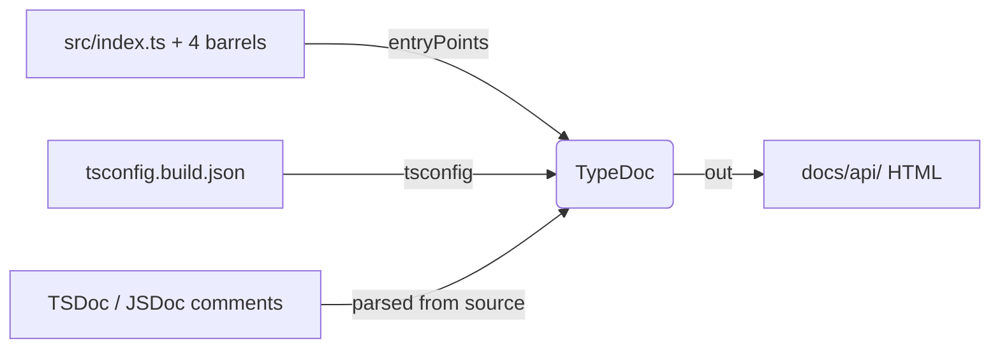
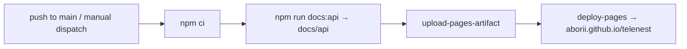

# TypeDoc API Reference

Auto-generated, browsable API documentation for `telenest`, produced by
[TypeDoc](https://typedoc.org) directly from the TSDoc/JSDoc comments that the
codebase already maintains on every public export. This page documents the
generation tooling — how to run it, how it is configured, and how to extend it.

The generated output is a **build artifact** (HTML), not committed to the
repository. Run the generator locally whenever you want an up-to-date reference.

---

## Table of Contents

- [Why TypeDoc](#why-typedoc)
- [Quick Start](#quick-start)
- [Architecture Overview](#architecture-overview)
- [File Structure](#file-structure)
- [Configuration Reference](#configuration-reference)
- [Relationship to the hand-written API-REFERENCE.md](#relationship-to-the-hand-written-api-referencemd)
- [Known Warnings (baseline)](#known-warnings-baseline)
- [How To Extend](#how-to-extend)

---

## Why TypeDoc

The project mandates "Full JSDoc on every file, export, and non-obvious type
member" (see `CLAUDE.md`). TypeDoc turns that existing documentation investment
into a generated, navigable API reference that **never drifts** from the actual
exported types and signatures — unlike a hand-maintained reference.

It mirrors the package's public **subpath exports** (`telenest`, `/bot`,
`/client`, `/common`, `/testing`), so the generated module tree matches exactly
what consumers can import.

---

## Quick Start

```bash
# Generate the HTML API reference into docs/api/
npm run docs:api

# Open the result (any static server / browser)
#   docs/api/index.html
```

The command wraps `typedoc`, which reads [`typedoc.json`](../typedoc.json) at the
repo root. No flags are needed for normal use.

---

## Architecture Overview



TypeDoc reads the five public barrels as entry points, resolves their types
using `tsconfig.build.json` (the same tsconfig used for the published build, so
`*.spec.ts` and `test/` are excluded), extracts the JSDoc, and emits a static
HTML site.

---

## File Structure

```text
telenest/
├── typedoc.json              # TypeDoc configuration (entry points, output, validation)
├── package.json              # "docs:api" script + typedoc devDependency
├── .gitignore                # ignores docs/api (generated artifact)
└── docs/
    ├── TYPEDOC-API-DOCS.md   # this file
    └── api/                  # generated output (git-ignored)
        ├── index.html
        └── modules/
            ├── index.html        # telenest (root export)
            ├── lib_bot.html      # telenest/bot
            ├── lib_client.html   # telenest/client
            ├── lib_common.html   # telenest/common
            └── lib_testing.html  # telenest/testing
```

---

## Configuration Reference

[`typedoc.json`](../typedoc.json):

| Option             | Value                                  | Why                                                                 |
| ------------------ | -------------------------------------- | ------------------------------------------------------------------- |
| `entryPoints`      | the 5 public barrels                   | One generated module per published subpath export.                  |
| `tsconfig`         | `tsconfig.build.json`                  | Same config as the build; excludes specs/test from the reference.   |
| `out`              | `docs/api`                             | Output directory (git-ignored).                                     |
| `excludePrivate`   | `true`                                 | Private class members are not public API.                           |
| `excludeInternal`  | `true`                                 | Honors `@internal`-tagged members.                                  |
| `excludeExternals` | `true`                                 | Keep third-party (`telegraf`/`telegram`) symbols out of the tree.   |
| `readme`           | `none`                                 | The docs index lives in `docs/INDEX.md`; no README cover page.      |
| `githubPages`      | `false`                               | Not deploying to GitHub Pages from this output (no `.nojekyll`).    |
| `validation`       | `invalidLink`, `notExported` on        | Surfaces broken `{@link}` references and leaked non-exported types. |

> **No environment variables** are read by this tooling.

---

## Relationship to the hand-written API-REFERENCE.md

[`API-REFERENCE.md`](./API-REFERENCE.md) remains the **curated, prose** reference
— grouped by use case, with narrative and examples. The TypeDoc output is the
**exhaustive, generated** reference — every export, signature, and type, always
in sync with the code. They are complementary; this change does not replace or
remove the hand-written reference.

---

## Known Warnings (baseline)

`npm run docs:api` currently completes with **0 errors** but ~114 link
**warnings**. These come from existing JSDoc comments that reference other
symbols using TypeScript `import('./path').Symbol` syntax inside `{@link …}`,
which TypeDoc cannot resolve — the TypeDoc-native form is `{@link Symbol}`.

These warnings are **advisory** and do not block generation. Cleaning them up
(migrating the `{@link import('…')…}` comments to TypeDoc's symbol-reference
syntax) is a separate, follow-up effort and is intentionally **out of scope** for
the tooling setup, mirroring how the repo treats `format:check` as a
non-blocking advisory step in CI.

---

## Deployment (GitHub Pages)

The reference is published to **GitHub Pages** at
<https://aborii.github.io/telenest/> by the
[`API Docs` workflow](../.github/workflows/docs.yml). The generated HTML is
**not committed** — CI regenerates it from source and deploys the artifact, so
the hosted site always matches the latest released code.



- **Trigger:** push to `main` (the release branch — `main` only advances on
  release merges) and manual `workflow_dispatch`.
- **`githubPages: true`** in `typedoc.json` makes TypeDoc emit a `.nojekyll`
  file, without which GitHub Pages strips the `_`-prefixed asset paths and the
  site renders unstyled.
- **One-time setup** (cannot be automated): in the repository
  **Settings → Pages**, set **Source = "GitHub Actions"**. Until that is done
  the deploy step has nowhere to publish.

---

## How To Extend

- **Add a new public subpath export?** Add its barrel to `entryPoints` in
  `typedoc.json` so it appears as its own module.
- **Emit Markdown instead of HTML** (e.g. to host on Docusaurus/VitePress):
  install [`typedoc-plugin-markdown`](https://www.npmjs.com/package/typedoc-plugin-markdown)
  and add it under `"plugin"` in `typedoc.json`.
- **Publish a hosted site:** already wired — see
  [Deployment](#deployment-github-pages). To host elsewhere (Netlify, Cloudflare
  Pages, Vercel), point the host at build command `npm run docs:api` and publish
  directory `docs/api`.
- **Gate on doc quality in CI:** once the baseline link warnings are cleaned up,
  add `"treatWarningsAsErrors": true` to `typedoc.json` and run `npm run docs:api`
  as a CI step to keep the JSDoc honest.
