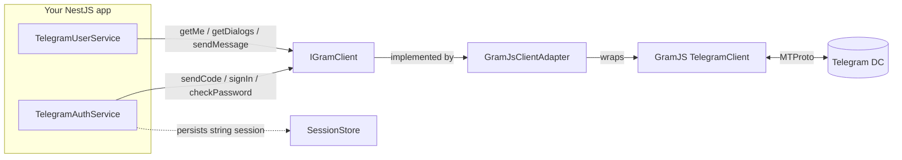
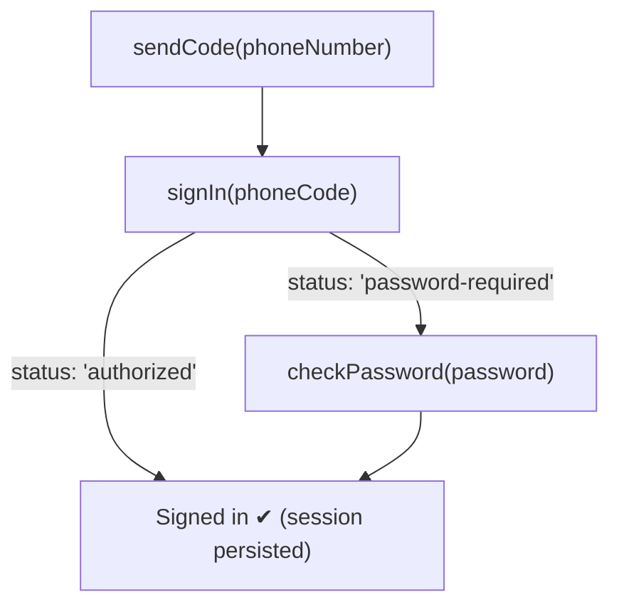

# User-Account Client (MTProto / GramJS) Guide

This guide covers the **MTProto user-account** side of `telenest`: signing in as
**your own Telegram account** (not a bot) over the MTProto protocol via
[GramJS](https://gram.js.org/) (the `telegram` package), reading and sending messages as
yourself, and persisting the resulting session.

For the Bot API (`@BotFather` bot) side, see the bot module documentation. The two modules
are independent and can be used together or separately.

---

> [!WARNING]
> ## Respect Telegram's Terms of Service
>
> A user-account client logs in as **a real human account**, with the same powers and the
> same responsibilities as the official apps. Automating a user account ("user-bots",
> "self-bots") is governed by Telegram's [Terms of Service](https://telegram.org/tos) and
> the [API Terms](https://core.telegram.org/api/terms).
>
> - **Do not spam, scrape, or mass-message.** Bulk or unsolicited messaging, aggressive
>   contact/member harvesting, and automated outreach can get your account **limited or
>   permanently banned** — and the ban applies to *you*, the human, not a disposable bot.
> - **Respect rate limits.** Telegram enforces `FLOOD_WAIT` throttling. This library surfaces
>   it as a typed error (and GramJS can auto-sleep below `floodSleepThreshold`); honor it
>   rather than retrying in a tight loop.
> - **The session string is a credential.** It grants full access to your account without a
>   password or 2FA prompt. Treat it like a password: never commit it, never log it, store it
>   encrypted at rest.
> - **Prefer the Bot API where it fits.** If a bot can do the job, use the bot. User-mode
>   exists for things bots genuinely cannot do (reading your own dialogs, acting as yourself),
>   not as a way to bypass bot limitations.
>
> You are responsible for how you use this. Use it for personal automation and legitimate
> tooling on accounts you own.

---

## Table of contents

1. [What is MTProto user-mode?](#1-what-is-mtproto-user-mode)
2. [Getting `api_id` / `api_hash`](#2-getting-api_id--api_hash)
3. [Configuring `TelegramClientModule`](#3-configuring-telegramclientmodule)
4. [Authentication flow](#4-authentication-flow)
5. [Sessions and `SessionStore`](#5-sessions-and-sessionstore)
6. [`TelegramUserService` operations](#6-telegramuserservice-operations)
7. [DTO shapes](#7-dto-shapes)
8. [The `IGramClient` abstraction and `clientFactory` seam](#8-the-igramclient-abstraction-and-clientfactory-seam)
9. [Error handling](#9-error-handling)

---

## 1. What is MTProto user-mode?

Telegram exposes **two distinct APIs**:

| | **Bot API** | **MTProto client API** |
|---|---|---|
| Library used | Telegraf | GramJS (`telegram`) |
| You authenticate as | a bot created by `@BotFather` | **your own account** |
| Credentials | a bot **token** | `api_id` + `api_hash`, then **phone → code → 2FA** |
| Can read your dialog list? | No | Yes |
| Can message users who never messaged it? | No (users must start the bot) | Yes (subject to ToS) |
| Identity in chats | "MyBot" | you, the human |

MTProto is Telegram's native binary protocol. When you sign in with it, you create a new
**authorized session** for your account — the same kind of session you see under
*Settings → Devices → Active sessions* in the official app. This library reports that session
with a configurable device/app name (see [`deviceModel`](#deviceModel) below) so you can
recognize and revoke it.

The flow is: **authenticate the application** (`api_id` / `api_hash`) and **authenticate the
account** (phone number → login code → optional 2FA password). The result is a portable
**string session** that lets you reconnect later without repeating the login.



Everything above `IGramClient` speaks in library DTOs (`GramUser`, `GramDialog`,
`GramMessage`) and never imports GramJS — only `GramJsClientAdapter` touches the `telegram`
package.

---

## 2. Getting `api_id` / `api_hash`

These credentials authenticate the **application**, not the account. Obtain them once:

1. Go to **<https://my.telegram.org>** and log in with your phone number.
2. Open **"API development tools"**.
3. Create an application (any title/short-name; platform "Other" is fine).
4. Copy the **`api_id`** (an integer) and the **`api_hash`** (a hex string).

Store them as environment variables — for example in a `.env` file consumed by
`@nestjs/config`:

```dotenv
TG_API_ID=1234567
TG_API_HASH=0123456789abcdef0123456789abcdef
# After your first login (see below), paste the printed session here:
TG_SESSION=
```

> `api_id` / `api_hash` identify your app to Telegram. Keep `api_hash` private; do not embed
> it in client-side/browser bundles you ship to third parties.

---

## 3. Configuring `TelegramClientModule`

`TelegramClientModule` is a dynamic Nest module with `forRoot` (synchronous) and
`forRootAsync` (factory-based) static methods. Because `api_id` / `api_hash` almost always
come from configuration, `forRootAsync` is the recommended form:

```ts
import { Module } from '@nestjs/common';
import { ConfigModule, ConfigService } from '@nestjs/config';
import { FileSessionStore, TelegramClientModule } from 'telenest';

@Module({
  imports: [
    ConfigModule.forRoot({ isGlobal: true }),
    TelegramClientModule.forRootAsync({
      isGlobal: true,
      inject: [ConfigService],
      useFactory: (config: ConfigService) => ({
        apiId: Number(config.getOrThrow<string>('TG_API_ID')),
        apiHash: config.getOrThrow<string>('TG_API_HASH'),
        // Resume from an env-provided session if present:
        session: config.get<string>('TG_SESSION'),
        // Persist newly-created sessions across restarts:
        sessionStore: new FileSessionStore('./.telegram.session'),
        deviceModel: 'telenest',
        appVersion: '1.0.0',
      }),
    }),
  ],
})
export class AppModule {}
```

A synchronous `forRoot` is also available when values are known at import time:

```ts
TelegramClientModule.forRoot({
  apiId: Number(process.env.TG_API_ID),
  apiHash: process.env.TG_API_HASH!,
  sessionStore: new FileSessionStore('./.telegram.session'),
  isGlobal: true,
});
```

If you want **both** the bot and the client wired from one synchronous call, use the umbrella
`TelegramModule.forRoot({ bot, client, isGlobal })`. For configuration that depends on a
provider such as `ConfigService`, import each module directly and use its `forRootAsync`
factory (as above).

### All `TelegramClientModuleOptions`

The factory must return a `TelegramClientModuleOptions` object:

| Option | Type | Required | Default | Description |
|---|---|---|---|---|
| `apiId` | `number` | **yes** | — | Application `api_id` from my.telegram.org. |
| `apiHash` | `string` | **yes** | — | Application `api_hash` from my.telegram.org. |
| `session` | `string` | no | — | An existing string session to start from. **Takes precedence** over a value loaded from `sessionStore`. |
| `sessionStore` | `SessionStore` | no | — | Pluggable session persistence. When set, the module loads the initial session from it (if `session` is unset) and the auth service writes the session back after a successful login. |
| `connectionRetries` | `number` | no | `5` | Automatic reconnection attempts on transport errors. |
| `deviceModel` <a id="deviceModel"></a> | `string` | no | GramJS default | Reported device model — shows up in the account's *active sessions* list. |
| `systemVersion` | `string` | no | GramJS default | Reported system version. |
| `appVersion` | `string` | no | GramJS default | Reported application version. |
| `useWSS` | `boolean` | no | `false` | Use WebSocket transport (required in browsers). |
| `floodSleepThreshold` | `number` | no | GramJS default | `FLOOD_WAIT` threshold in **seconds** below which GramJS waits and retries transparently instead of throwing. |
| `autoConnect` | `boolean` | no | `true` | Whether to connect on module initialization. Set `false` to connect lazily/manually (e.g. in tests or CLI login scripts). |
| `replayBufferSize` | `number` | no | `0` | Catch-up depth for the inbound update streams. When `> 0`, each stream replays up to this many recent events to a subscriber added after bootstrap. See [Receiving inbound updates](#receiving-inbound-updates). |
| `retry` | `TelegramClientRetryDefaults` | no | `{ retries: 2 }` | Module-level defaults for the opt-in `FLOOD_WAIT` retry helper `user.withRetry(...)`. `{ retries?: number; maxDelayMs?: number }`; per-call options always win. See [Automatic FLOOD_WAIT retry](#automatic-flood_wait-retry-withretry). |
| `clientFactory` | `GramClientFactory` | no | builds a real GramJS client | Override client construction. Primarily a **test seam** — see [section 8](#8-the-igramclient-abstraction-and-clientfactory-seam). |

> [!NOTE]
> **Initial session precedence.** When the module builds the client it resolves the starting
> session in this order:
> 1. `options.session`
> 2. `sessionStore.load()` (if a store is configured)
> 3. empty string → a fresh phone/code login is required.
>
> **Connection on bootstrap.** Unless `autoConnect` is `false`, the module connects the client
> during initialization. A connection failure is **logged, not thrown**, so a Telegram outage
> does not crash the bootstrap of unrelated modules. Operations called later will attempt to
> connect again on demand.

The module exports `TelegramAuthService`, `TelegramUserService`, and the
`TELEGRAM_GRAM_CLIENT` / `TELEGRAM_SESSION_STORE` injection tokens.

---

## 4. Authentication flow

Signing in is a small state machine driven by `TelegramAuthService`:



The relevant `TelegramAuthService` methods:

| Method | Signature | Purpose |
|---|---|---|
| `sendCode` | `(phoneNumber: string, forceSMS?: boolean) => Promise<GramSendCodeResult>` | Request a login code for a phone number (international format). `forceSMS` forces SMS instead of the in-app code. |
| `signIn` | `(phoneCode: string) => Promise<GramSignInResult>` | Complete sign-in with the received code. Returns `{ status: 'authorized', user }` or `{ status: 'password-required' }`. On success the session is persisted. |
| `checkPassword` | `(password: string) => Promise<GramUser>` | Complete a 2FA-protected login with the two-step-verification password. Persists the session. |
| `logOut` | `() => Promise<void>` | Log out (invalidates the session on Telegram's servers) and clear the stored session. |
| `isAuthorized` | `() => Promise<boolean>` | Whether the current session is already authorized. |
| `exportSession` | `() => string` | Serialize the current session string for manual persistence/inspection (empty when unauthenticated). |

> The service holds the pending phone number and code hash on the instance. It is built to
> manage **exactly one account**; do not share a single instance across concurrent logins for
> different numbers. Calling `signIn` before `sendCode` throws `TelegramAuthError` with code
> `CODE_NOT_REQUESTED`.

### Inside a Nest provider

```ts
import { Injectable } from '@nestjs/common';
import { TelegramAuthService } from 'telenest';

@Injectable()
export class LoginService {
  constructor(private readonly auth: TelegramAuthService) {}

  /** Step 1: request a code. */
  async requestCode(phone: string): Promise<void> {
    await this.auth.sendCode(phone); // e.g. '+15551234567'
  }

  /**
   * Step 2: submit the code (and 2FA password if required).
   * The session is persisted to the configured SessionStore automatically.
   */
  async submitCode(code: string, password?: string): Promise<void> {
    const step = await this.auth.signIn(code);
    if (step.status === 'password-required') {
      if (!password) throw new Error('This account has 2FA enabled; a password is required.');
      await this.auth.checkPassword(password);
    }
  }
}
```

### One-time interactive login (recommended for first run)

Because the login code arrives on your phone, the simplest first-time flow is an interactive
CLI that prints a string session you then save as `TG_SESSION`. The repository ships
[`examples/login-cli.ts`](../examples/login-cli.ts) which demonstrates using the library
**outside of Nest DI** by constructing the client directly:

```ts
import 'dotenv/config';
import { stdin as input, stdout as output } from 'node:process';
import { createInterface } from 'node:readline/promises';
import { createGramJsClient, isTelegramError, TelegramAuthService } from 'telenest';

const apiId = Number(process.env.TG_API_ID);
const apiHash = process.env.TG_API_HASH ?? '';

const client = createGramJsClient({ apiId, apiHash }, process.env.TG_SESSION ?? '');
const auth = new TelegramAuthService(client);
const rl = createInterface({ input, output });

try {
  if (!(await auth.isAuthorized())) {
    await auth.sendCode(await rl.question('Phone (+countrycode…): '));
    const step = await auth.signIn(await rl.question('Login code: '));
    if (step.status === 'password-required') {
      await auth.checkPassword(await rl.question('2FA password: '));
    }
  }
  output.write(`\n=== SESSION STRING (save as TG_SESSION) ===\n${auth.exportSession()}\n`);
} catch (error) {
  if (isTelegramError(error)) output.write(`\nTelegram error [${error.kind}]: ${error.message}\n`);
} finally {
  rl.close();
  await client.disconnect();
}
```

Copy the printed string into `.env` as `TG_SESSION`. On subsequent app starts the module
reconnects from that session and **no login is needed**.

---

## 5. Sessions and `SessionStore`

A **string session** encodes the auth keys that let the client reconnect without re-running
the phone/code/2FA flow. **It is as sensitive as a password** — anyone holding it has full
access to your account.

`SessionStore` is the pluggable persistence contract. All methods may be sync or async (the
library always awaits them):

```ts
interface SessionStore {
  /** Load the persisted session, or `undefined` when none is stored. */
  load(): Awaitable<string | undefined>;
  /** Persist the session, overwriting any previous value. */
  save(session: string): Awaitable<void>;
  /** Remove any persisted session (used on logout). */
  clear(): Awaitable<void>;
}
```

The library wires the store both ways: on bootstrap it calls `load()` for the initial session
(unless `options.session` is set), and after a successful login `TelegramAuthService` calls
`save()` with the new session. `logOut()` calls `clear()`.

### `InMemorySessionStore`

Volatile, process-local. Useful for tests and short-lived processes, but **not durable** — the
session is lost on restart, forcing a fresh login next time. Optionally seed it from an env var:

```ts
import { InMemorySessionStore } from 'telenest';

const store = new InMemorySessionStore(process.env.TG_SESSION);
```

### `FileSessionStore`

Durable, file-backed. Persists the session to a single UTF-8 file with `0o600` permissions
(owner read/write only) on POSIX systems. A missing file simply means "no session yet"; other
I/O errors surface as `TelegramSessionError`.

```ts
import { FileSessionStore } from 'telenest';

const store = new FileSessionStore('./.telegram.session');
```

> Add the session file to `.gitignore` and keep it off shared volumes.

### `RedisSessionStore`

Stores the session under a single Redis key via an **injected** client, so the
library takes no hard dependency on `redis`/`ioredis` — any client exposing
`get`/`set`/`del` (or a test fake) works. Read/write/delete failures surface as
`TelegramSessionError`.

```ts
import { createClient } from 'redis';
import { RedisSessionStore } from 'telenest';

const redis = createClient();
await redis.connect();
const store = new RedisSessionStore(redis, 'tg:session');
```

### `KeyValueSessionStore`

A generic adapter over any async `get`/`set`/`delete` backend — a database DAO,
[Keyv](https://keyv.org), an HTTP KV — so you rarely need to hand-roll a store:

```ts
import Keyv from 'keyv';
import { KeyValueSessionStore } from 'telenest';

const store = new KeyValueSessionStore(new Keyv('postgres://…'), 'tg:session');
```

### `EncryptedSessionStore`

A decorator that **AES-256-GCM** encrypts the session before delegating to any
inner store, and authenticates on decrypt — so a tampered payload or wrong key
**fails closed** with `TelegramSessionError` rather than returning garbage. Use
it to protect the credential at rest on top of Redis, a DB, or a file:

```ts
import { EncryptedSessionStore, RedisSessionStore } from 'telenest';

const store = new EncryptedSessionStore(
  new RedisSessionStore(redis, 'tg:session'),
  process.env.TG_SESSION_KEY!, // high-entropy secret; never hard-code
);
```

See **[SESSION-STORES.md](./SESSION-STORES.md)** for the full reference,
security notes, and the encryption format.

### Writing a custom store

The `SessionStore` interface is exported, so any custom backend is just the
three methods — wrap storage failures in `TelegramSessionError` to keep them in
the library's single error hierarchy. (For most async backends, prefer
`KeyValueSessionStore` over writing one by hand.)

```ts
TelegramClientModule.forRootAsync({
  inject: [ConfigService, RedisClient],
  useFactory: (config: ConfigService, redis: RedisClient) => ({
    apiId: Number(config.getOrThrow('TG_API_ID')),
    apiHash: config.getOrThrow('TG_API_HASH'),
    sessionStore: new EncryptedSessionStore(
      new RedisSessionStore(redis),
      config.getOrThrow('TG_SESSION_KEY'),
    ),
  }),
});
```

---

## 6. `TelegramUserService` operations

`TelegramUserService` is the facade for acting **as the logged-in account**. Inject it
anywhere after the module is registered. Every method requires an authorized session and
returns library DTOs; the service transparently connects the client on first use.

| Method | Signature | Returns |
|---|---|---|
| `getMe` | `() => Promise<GramUser>` | The logged-in account's profile. |
| `getDialogs` | `(params?: GramGetDialogsParams) => Promise<GramDialog[]>` | The dialog (conversation) list. |
| `getMessages` | `(peer: GramPeer, params?: GramGetMessagesParams) => Promise<GramMessage[]>` | Recent messages from a peer, newest first. |
| `sendMessage` | `(peer: GramPeer, text: string \| GramSendMessageParams) => Promise<GramMessage>` | Sends a message; returns the sent message. |
| `sendToSelf` | `(text: string) => Promise<GramMessage>` | Convenience for messaging your own *Saved Messages* (peer `'me'`). |
| `sendFile` | `(peer: GramPeer, params: GramSendFileParams) => Promise<GramMessage>` | Sends a photo / video / document; returns the sent message. |
| `downloadMedia` | `(peer: GramPeer, messageId: number) => Promise<Buffer \| undefined>` | Downloads a message's media, or `undefined` when it has none. |
| `downloadProfilePhoto` | `(peer: GramPeer) => Promise<Buffer \| undefined>` | Downloads a peer's profile photo, or `undefined` when absent. |
| `getMediaInfo` | `(peer: GramPeer, messageId: number) => Promise<GramMediaInfo \| undefined>` | Media metadata (kind/MIME/size/dimensions) without downloading the bytes. |
| `downloadMediaRange` | `(peer: GramPeer, messageId: number, range: GramMediaRange) => Promise<Buffer \| undefined>` | A single byte range of a message's media (for HTTP `206`). |
| `streamMedia` | `(peer: GramPeer, messageId: number, options?: GramStreamMediaOptions) => Promise<AsyncIterable<Buffer>>` | Lazy byte-chunk stream for progressive playback. |
| `joinChannel` | `(peer: GramPeer) => Promise<void>` | Joins a public channel or group. |
| `leaveChannel` | `(peer: GramPeer) => Promise<void>` | Leaves a channel or group. |
| `getParticipants` | `(peer: GramPeer, params?: GramGetParticipantsParams) => Promise<GramUser[]>` | Lists a group/channel's participants. |
| `searchMessages` | `(peer: GramPeer, query: string, params?: GramSearchMessagesParams) => Promise<GramMessage[]>` | Searches a peer's history for a text query. |
| `getFullChat` | `(peer: GramPeer) => Promise<GramChatInfo>` | Extended info (description, member count) for a chat/channel/user. |
| `editMessage` | `(peer: GramPeer, messageId: number, text: string) => Promise<GramMessage>` | Edits a message's text; returns the edited message. |
| `deleteMessages` | `(peer: GramPeer, messageIds: number[], params?: GramDeleteMessagesParams) => Promise<void>` | Deletes messages (for everyone by default). |
| `forwardMessages` | `(toPeer: GramPeer, fromPeer: GramPeer, messageIds: number[]) => Promise<GramMessage[]>` | Forwards messages between peers. |
| `markAsRead` | `(peer: GramPeer) => Promise<void>` | Marks a peer's history as read. |
| `pinMessage` | `(peer: GramPeer, messageId: number, params?: GramPinMessageParams) => Promise<void>` | Pins a message in a chat. |

A `GramPeer` is `string | number`: the literal `'me'`, a public `@username`, or a numeric
user/chat id.

```ts
import { Injectable } from '@nestjs/common';
import { TelegramUserService } from 'telenest';

@Injectable()
export class MyAccountService {
  constructor(private readonly user: TelegramUserService) {}

  async whoAmI() {
    const me = await this.user.getMe();
    // me: GramUser
    return `${me.firstName ?? ''} (@${me.username ?? 'no-username'}), id=${me.id}`;
  }

  async recentChats() {
    // Up to 20 non-archived dialogs:
    const dialogs = await this.user.getDialogs({ limit: 20, archived: false });
    return dialogs.map((d) => `${d.type}: ${d.title} (${d.unreadCount} unread)`);
  }

  async lastMessagesFrom(username: string) {
    // Newest first; supports minId/maxId for pagination.
    const messages = await this.user.getMessages(username, { limit: 50 });
    return messages.map((m) => ({ out: m.out, text: m.text, at: m.date }));
  }
}
```

### Sending messages and `parseMode`

`sendMessage` accepts either a plain string (sent as-is) or a full `GramSendMessageParams`
object. The MTProto parse modes are **`'html'`** and **`'md'`** (`GramParseMode`) — note these
differ from the Bot API's `ParseMode` (`'HTML' | 'Markdown' | 'MarkdownV2'`).

```ts
// Plain text:
await this.user.sendMessage('@durov', 'Hi from my own account!');

// Formatted (HTML), as a reply, silently:
await this.user.sendMessage('@channel', {
  message: '<b>Build passed</b> ✅',
  parseMode: 'html',     // 'html' | 'md'
  replyTo: 12345,        // message id to reply to
  silent: true,          // no notification sound
});

// Markdown:
await this.user.sendMessage('me', { message: '*reminder*: ship it', parseMode: 'md' });

// Note to self (your Saved Messages chat):
await this.user.sendToSelf('Remember to renew the api credentials.');
```

`GramSendMessageParams`:

| Field | Type | Description |
|---|---|---|
| `message` | `string` | Message text. |
| `parseMode` | `'html' \| 'md'` | Optional formatting mode applied to `message`. |
| `replyTo` | `number` | Id of the message to reply to. |
| `silent` | `boolean` | Send without a notification sound. |

`GramGetDialogsParams` accepts `limit` and `archived`; `GramGetMessagesParams` accepts
`limit`, `minId`, and `maxId` (for pagination).

### Media, chats, and message operations

Beyond text, `TelegramUserService` exposes the common MTProto operations real automations
need. Every one returns library DTOs and goes through the `IGramClient` seam, so the GramJS
isolation boundary holds and your code/tests never import `telegram`.

```ts
// ── Media ──────────────────────────────────────────────────────────────────
// Send a document; pass a local path, a direct URL, or a Buffer (give a Buffer a
// `.name` to control the filename). `asPhoto` chooses photo vs. document presentation.
await this.user.sendFile('me', { file: './report.pdf', caption: 'done' });
await this.user.sendFile('@me', { file: photoBuffer, asPhoto: true });

// Download a message's media. `GramMessage.hasMedia` tells you when there's anything
// to fetch; the bytes come back as a Buffer (or `undefined` when there is none).
const [latest] = await this.user.getMessages('@channel', { limit: 1 });
if (latest?.hasMedia) {
  const bytes = await this.user.downloadMedia(latest.peerId, latest.id);
}
const avatar = await this.user.downloadProfilePhoto('@durov');

// ── Chats & channels ────────────────────────────────────────────────────────
await this.user.joinChannel('@some_public_channel');
await this.user.leaveChannel('@some_public_channel');

// Always pass a `limit` — with none, GramJS fetches *every* member, which is
// slow and can trip FLOOD_WAIT (and looks like member harvesting) on big peers.
const members = await this.user.getParticipants('@my_group', { limit: 100 });
const hits = await this.user.searchMessages('@my_group', 'invoice', { limit: 20 });

const info = await this.user.getFullChat('@my_group');
// info: GramChatInfo — { id, type, title, about?, participantsCount?, username?, verified }

// ── Message operations ──────────────────────────────────────────────────────
const sent = await this.user.sendMessage('me', 'draft');
await this.user.editMessage('me', sent.id, 'final');
await this.user.pinMessage('me', sent.id, { notify: false });
await this.user.markAsRead('@my_group');
await this.user.forwardMessages('me', '@my_group', [sent.id]);
await this.user.deleteMessages('me', [sent.id]); // revoke: true by default
```

`GramSendFileParams`:

| Field | Type | Description |
|---|---|---|
| `file` | `string \| Buffer` | Local path, direct URL, or in-memory bytes. |
| `caption` | `string` | Optional caption shown beneath the media. |
| `asPhoto` | `boolean` | `true` → viewable photo/video; `false` → document; omitted → inferred from the extension. |
| `parseMode` | `'html' \| 'md'` | Optional formatting mode applied to `caption`. |
| `replyTo` | `number` | Id of the message to reply to. |
| `silent` | `boolean` | Send without a notification sound. |

`getParticipants` takes `GramGetParticipantsParams` (`limit`, `search`); `searchMessages` takes
`GramSearchMessagesParams` (`limit`); `deleteMessages` takes `GramDeleteMessagesParams`
(`revoke`, default `true` — delete for everyone); `pinMessage` takes `GramPinMessageParams`
(`notify`, default `false`).

> [!NOTE]
> `downloadMedia` takes the message's `peerId` and `id` (rather than a raw GramJS message) so
> the DTO boundary stays intact — the adapter re-fetches the message and downloads its media.

### Streaming media (progressive video / HTTP Range)

`downloadMedia` buffers the **whole** file — fine for photos and small documents, but not for a
multi-hundred-MB video you want the user to start watching immediately. For that, three methods
let you serve media incrementally so an HTML5 `<video>` (or any range-aware player) plays and
seeks without a full download:

- **`getMediaInfo(peer, id)`** → a `GramMediaInfo` (kind, MIME, size, duration, dimensions) —
  everything you need for `Content-Type` / `Content-Length` / `Accept-Ranges`. `undefined` when
  the message has no downloadable media.
- **`downloadMediaRange(peer, id, { offset, limit })`** → exactly the requested bytes (shorter
  at end-of-file). Use it to answer an HTTP `Range` request with `206 Partial Content`.
- **`streamMedia(peer, id, { offset?, limit? })`** → a lazy `AsyncIterable<Buffer>` you pipe
  straight to the response; nothing is buffered server-side.

```ts
import { Controller, Get, Headers, Param, Res } from '@nestjs/common';
import type { Response } from 'express';
import { TelegramUserService } from 'telenest';

@Controller()
export class MediaController {
  constructor(private readonly user: TelegramUserService) {}

  /** Streams a chat's media to a browser, honouring HTTP Range requests. */
  @Get('media/:peer/:id')
  async stream(
    @Param('peer') peer: string,
    @Param('id') id: string,
    @Headers('range') range: string | undefined,
    @Res() res: Response,
  ): Promise<void> {
    const messageId = Number(id);
    const info = await this.user.getMediaInfo(peer, messageId);
    if (!info?.size) {
      res.status(404).end();
      return;
    }

    res.setHeader('Accept-Ranges', 'bytes');
    res.setHeader('Content-Type', info.mimeType ?? 'application/octet-stream');

    // ── No Range header → stream the whole file with a 200. ──────────────────
    if (!range) {
      res.setHeader('Content-Length', info.size);
      for await (const chunk of await this.user.streamMedia(peer, messageId))
        res.write(chunk);
      res.end();
      return;
    }

    // ── Range header → 206 Partial Content. `end` is inclusive (RFC 7233). ───
    const [startRaw, endRaw] = range.replace('bytes=', '').split('-');
    const start = Number(startRaw);
    const end = endRaw ? Number(endRaw) : info.size - 1;
    const limit = end - start + 1;

    res.status(206);
    res.setHeader('Content-Range', `bytes ${start}-${end}/${info.size}`);
    res.setHeader('Content-Length', limit);
    for await (const chunk of await this.user.streamMedia(peer, messageId, {
      offset: start,
      limit,
    }))
      res.write(chunk);
    res.end();
  }
}
```

Point a player at it and seeking just works:

```html
<video src="/media/@my_channel/1234" controls></video>
```

> [!NOTE]
> Telegram requires download offsets to be 4096-aligned; the adapter aligns the offset down and
> trims the surplus internally, so you pass plain byte offsets. Aggressive seeking issues many
> range requests — heavy seeking can trip `FLOOD_WAIT` (surfaced as `TelegramClientError`).
> Non-streamable containers (some MKV/AVI) won't play inline in browsers regardless — that's a
> format concern, not a library limit.

### Receiving inbound updates

The user account can **react** to inbound activity, not just send it. Four kinds of update are
surfaced, each as a multicast RxJS stream on `TelegramUserService` **and** a matching method
decorator. All map raw GramJS events to plain DTOs (no GramJS imported in your code):

| Kind | Stream | Decorator | Payload |
|---|---|---|---|
| New message | `updates$` | `@OnUserMessage` | `GramMessage` |
| Edited message | `editedMessages$` | `@OnUserEdited` | `GramMessage` (edited content) |
| Deleted message(s) | `deletedMessages$` | `@OnUserDeleted` | `GramDeletedMessages` |
| Chat action | `chatActions$` | `@OnChatAction` | `GramChatActionEvent` |

**1. The `updates$` observable** — a hot, multicast RxJS stream on `TelegramUserService`:

```ts
@Injectable()
export class Watcher implements OnModuleInit {
  constructor(private readonly user: TelegramUserService) {}

  onModuleInit() {
    this.user.updates$
      .pipe(filter((m) => !m.out)) // incoming only
      .subscribe((m) => console.log(`[${m.peerId}] ${m.text}`));
  }
}
```

**2. The `@OnUserMessage()` decorator** — declare a handler method on any provider and the
module discovers and wires it at bootstrap (and tears it down on shutdown):

```ts
import { OnUserMessage, GramMessage, GramUserMessageContext } from 'telenest';

@Injectable()
export class AutoReply {
  @OnUserMessage({ incoming: true, pattern: /^ping$/i })
  async onPing(message: GramMessage, ctx: GramUserMessageContext) {
    await ctx.reply('pong'); // replies in the same chat
  }

  @OnUserMessage({ chatId: '@mychannel' })
  onChannelPost(message: GramMessage) {
    // ...
  }
}
```

The second argument is a `GramUserMessageContext`: `{ message, reply(text) }`, where `reply`
sends back to the chat the message came from. A handler that throws is logged and isolated —
it never breaks delivery for the other handlers.

**3. Edited, deleted, and chat-action handlers** — the same discovery/teardown, on the other
three streams:

```ts
import {
  OnUserEdited, OnUserDeleted, OnChatAction,
  GramMessage, GramDeletedMessages, GramChatActionEvent, GramUserMessageContext,
} from 'telenest';

@Injectable()
export class ActivityWatcher {
  // Edited messages share GramMessage + the reply context (message.text is the new content).
  @OnUserEdited({ incoming: true })
  onEdit(message: GramMessage, ctx: GramUserMessageContext) { /* ... */ }

  // Deletions carry the ids (and, for channels/supergroups only, the peer).
  @OnUserDeleted()
  onDelete(event: GramDeletedMessages) { /* event.messageIds, event.peerId */ }

  // Typing / recording / online-offline signals.
  @OnChatAction({ actions: ['online', 'offline'] })
  onPresence(event: GramChatActionEvent) { /* event.userId, event.action */ }
}
```

All four decorators take the same optional second `{ client }` argument to scope a handler to a
named account in a multi-account app (see [§3](#3-configuring-telegramclientmodule)).

#### Filters

All present fields must match (logical AND); omit a field to ignore it. `@OnUserMessage` and
`@OnUserEdited` share `OnUserMessageFilter`:

| Field | Type | Matches |
|---|---|---|
| `incoming` | `boolean` | Messages **not** sent by the logged-in account. |
| `outgoing` | `boolean` | Messages **sent by** the logged-in account. |
| `pattern` | `RegExp \| string` | `RegExp` is tested against the text; a `string` must equal it exactly. |
| `chatId` | `GramPeer \| GramPeer[]` | One or more chat/peer ids (matched against `message.peerId`). |

A deletion and a chat action carry no message body or direction, so their filters are narrower:

- **`OnUserDeletedFilter`** — `{ chatId? }` only. Telegram reports the originating chat for
  channel/supergroup deletions only, so a `chatId` filter never matches a deletion that arrived
  without a peer.
- **`OnChatActionFilter`** — `{ chatId?, actions? }`, where `actions` is one or more
  `GramChatAction` kinds (e.g. `'typing'`, `'online'`).

#### Catch-up (replay) buffer

By default the streams are **hot**: a subscriber added after an event has already fired misses
it. Set `replayBufferSize` on the module options to give late subscribers a bounded backlog —
each stream then replays up to that many of its most recent events on subscription:

```ts
TelegramClientModule.forRoot({ apiId, apiHash, replayBufferSize: 50 });
```

> Note: events only flow while the client is connected (the default). With `autoConnect: false`
> you manage the connection yourself, and the streams stay idle until you connect.

---

## 7. DTO shapes

The user-facing services speak in plain, GramJS-free DTOs so consumers and tests never import
`telegram`. The adapter is the single place that maps GramJS `Api.*` objects into these shapes.

> [!IMPORTANT]
> Telegram ids can exceed `2^53`, so user/chat/peer ids are returned as **decimal strings**,
> not `number`. Message ids (`GramMessage.id`) are scoped to a chat and remain `number`.

### `GramUser`

```ts
interface GramUser {
  id: string;          // Telegram user id as a decimal string
  isSelf: boolean;     // true when this is the logged-in account itself
  isBot: boolean;      // whether the account is a bot
  isPremium: boolean;  // whether the account has Telegram Premium
  firstName?: string;
  lastName?: string;
  username?: string;   // without the leading '@'
  phone?: string;      // international format, when visible
}
```

### `GramDialog`

```ts
interface GramDialog {
  id: string;                // peer id as a decimal string
  title: string;             // chat title or the user's name
  type: 'user' | 'group' | 'channel';
  unreadCount: number;
  pinned: boolean;
}
```

### `GramMessage`

```ts
interface GramMessage {
  id: number;          // message id within its chat
  peerId: string;      // chat/user the message belongs to, as a decimal string
  text: string;        // plain-text body ('' for non-text/service messages)
  date: number;        // unix timestamp in seconds
  out: boolean;        // true when sent by the logged-in account
  senderId?: string;   // sender id as a decimal string, when known
  hasMedia?: boolean;  // true when the message carries downloadable media
}
```

`hasMedia` is always populated on messages produced by the adapter (it is optional only so a
hand-built `IGramClient` fake may omit it). When `true`, fetch the bytes with
`downloadMedia(message.peerId, message.id)`.

### `GramDeletedMessages`

```ts
interface GramDeletedMessages {
  messageIds: number[];  // ids of the deleted messages
  peerId?: string;       // originating chat (decimal string) — channels/supergroups only
}
```

Telegram omits the peer for private chats and small groups (message ids are globally unique
there), so `peerId` is present only for channel/supergroup deletions.

### `GramChatActionEvent`

```ts
interface GramChatActionEvent {
  peerId: string;   // chat/user the action occurred in, as a decimal string
  userId?: string;  // id of the acting user, when known
  action: GramChatAction;
}
```

`GramChatAction` is a string union covering the transient typing/recording signals plus the
two presence transitions: `'typing'`, `'cancel'`, `'recording-video'`, `'uploading-video'`,
`'recording-voice'`, `'uploading-audio'`, `'uploading-photo'`, `'uploading-document'`,
`'recording-round'`, `'uploading-round'`, `'picking-location'`, `'choosing-contact'`,
`'choosing-sticker'`, `'playing-game'`, `'online'`, `'offline'`, and `'unknown'` for any action
the library does not model individually. (Use the exported `GRAM_CHAT_ACTIONS` record for the
named constants.)

### `GramChatInfo`

```ts
interface GramChatInfo {
  id: string;                // peer id as a decimal string
  type: 'user' | 'group' | 'channel';
  title: string;             // chat/channel title, or the user's full name
  username?: string;         // without the leading '@'
  about?: string;            // bio (user) or description (group/channel)
  participantsCount?: number; // member count for groups/channels; undefined for users
  verified: boolean;         // whether the peer has Telegram's verified badge
}
```

### `GramMediaInfo`

Returned by `getMediaInfo`; carries what an HTTP layer needs to serve the bytes plus light
playback metadata. `size` is a `number` — media is far below `2^53` bytes (unlike entity ids).

```ts
interface GramMediaInfo {
  kind: 'photo' | 'video' | 'audio' | 'voice' | 'document';
  mimeType?: string;          // e.g. 'video/mp4'
  size?: number;              // bytes
  fileName?: string;
  durationSeconds?: number;   // video / audio / voice
  width?: number;             // video
  height?: number;            // video
  supportsStreaming?: boolean; // uploader flagged the video as streamable
}
```

Related sign-in DTOs you may encounter: `GramSendCodeResult`
(`{ phoneCodeHash, isCodeViaApp }`) and the discriminated `GramSignInResult`
(`{ status: 'authorized', user } | { status: 'password-required' }`).

---

## 8. The `IGramClient` abstraction and `clientFactory` seam

Every MTProto service depends only on **`IGramClient`**, an interface that mirrors the
operations above (`connect`, `disconnect`, `isConnected`, `isAuthorized`, `sendCode`,
`signInWithCode`, `signInWithPassword`, `logOut`, `getMe`, `getDialogs`, `getMessages`,
`sendMessage`, `sendFile`, `downloadMedia`, `downloadProfilePhoto`, `getMediaInfo`,
`downloadMediaRange`, `streamMedia`, `joinChannel`,
`leaveChannel`, `getParticipants`, `searchMessages`, `getFullChat`, `editMessage`,
`deleteMessages`, `forwardMessages`, `markAsRead`, `pinMessage`, `exportSession`,
`onNewMessage`, `onEditedMessage`, `onDeletedMessages`, `onChatAction`). The concrete
`GramJsClientAdapter` — created by `createGramJsClient` — is the **only** implementation that
touches the `telegram` package.

This boundary makes the services unit-testable with a trivial fake and keeps GramJS out of
consumer compilation units. There are two ways to substitute a fake:

**(a) Construct a service directly** with a fake `IGramClient` (no Nest required):

```ts
import type { IGramClient } from 'telenest';
import { TelegramUserService } from 'telenest';

// Abbreviated for illustration — a complete `IGramClient` also implements the
// media / chat / message operations (`sendFile`, `downloadMedia`, `joinChannel`,
// `getParticipants`, `getFullChat`, `editMessage`, …) and `onNewMessage`.
const fake: IGramClient = {
  isConnected: () => true,
  connect: async () => {},
  disconnect: async () => {},
  isAuthorized: async () => true,
  getMe: async () => ({ id: '42', isSelf: true, isBot: false, isPremium: false }),
  getDialogs: async () => [],
  getMessages: async () => [],
  sendMessage: async (_peer, params) => ({
    id: 1, peerId: '42', text: params.message, date: 0, out: true,
  }),
  // …media / chat / message ops + onNewMessage omitted for brevity…
  sendCode: async () => ({ phoneCodeHash: 'h', isCodeViaApp: true }),
  signInWithCode: async () => ({ status: 'authorized', user: { id: '42', isSelf: true, isBot: false, isPremium: false } }),
  signInWithPassword: async () => ({ id: '42', isSelf: true, isBot: false, isPremium: false }),
  logOut: async () => {},
  exportSession: () => '',
} as IGramClient;

const user = new TelegramUserService(fake);
```

> [!TIP]
> For a **complete**, ready-made fake, use `createMockGramClient()` from the
> `telenest/testing` subpath — every method is a pre-stubbed `jest.fn()`, so you only
> override the calls your test cares about. See [§ Testing](./TESTING.md).

**(b) Pass `clientFactory`** so the module builds your fake instead of a real GramJS client.
`GramClientFactory` has the signature `(options, session) => IGramClient`. Combine it with
`autoConnect: false` in tests that must never hit the network:

```ts
TelegramClientModule.forRoot({
  apiId: 1,
  apiHash: 'test',
  autoConnect: false,
  clientFactory: (_options, _session) => fake, // your IGramClient
});
```

In tests you can alternatively override the exported `TELEGRAM_GRAM_CLIENT` provider token
directly. Both approaches guarantee no real connection is opened.

---

## 9. Error handling

Every failure this library raises is an instance of the abstract `TelegramError`, so you can
catch one base type and narrow via the discriminated `kind` field (or with the `isTelegramError`
type guard). The MTProto side raises two of them:

- **`TelegramClientError`** (`kind: 'client'`) — generic client/transport failures that are
  **not** part of the sign-in flow: a failed `getMe`, `getDialogs`, `getMessages`,
  `sendMessage`, `connect`, `isAuthorized`, or `logOut`. It carries an optional `operation`
  (e.g. `'getDialogs'`) and a `cause` (the wrapped GramJS error).
- **`TelegramAuthError`** (`kind: 'auth'`) — raised during sign-in, with a machine-readable
  `code` (`TelegramAuthErrorCode`) so you can drive the login UI. For `FLOOD_WAIT` it also
  carries `retryAfterSeconds`.
- **`TelegramSessionError`** (`kind: 'session'`) — a session could not be loaded or persisted
  by the `SessionStore`.

`TelegramAuthErrorCode` is one of: `PHONE_INVALID`, `CODE_INVALID`, `PASSWORD_REQUIRED`,
`PASSWORD_INVALID`, `CODE_NOT_REQUESTED`, `SIGN_UP_REQUIRED`, `NOT_AUTHORIZED`, `FLOOD_WAIT`,
`UNKNOWN`.

### Handling client operation failures

```ts
import { TelegramClientError, isTelegramError } from 'telenest';

try {
  await this.user.sendMessage('@somebody', 'hi');
} catch (error) {
  if (error instanceof TelegramClientError) {
    // error.operation === 'sendMessage', error.cause holds the underlying GramJS error.
    // On a rate-limit, error.retryAfterSeconds holds the FLOOD_WAIT delay (seconds).
    this.logger.error(`MTProto ${error.operation ?? 'op'} failed: ${error.message}`);
  } else if (isTelegramError(error)) {
    this.logger.error(`Telegram error [${error.kind}]: ${error.message}`);
  } else {
    throw error;
  }
}
```

### Automatic `FLOOD_WAIT` retry (`withRetry`)

Rather than hand-rolling the wait/retry loop, wrap a rate-limit-prone operation in
`user.withRetry(...)`. It mirrors the Bot side's `withRetry`: when Telegram throttles the call
with a `FLOOD_WAIT`, it sleeps **exactly** the number of seconds Telegram asked for and retries,
up to a bounded attempt budget. Anything that is **not** a flood-wait propagates immediately —
it never retries arbitrary failures.

```ts
// Retry a rate-limited send up to 5 times (overrides the module default of 2).
const sent = await this.user.withRetry(
  () => this.user.sendMessage('@channel', text),
  { retries: 5, maxDelayMs: 60_000 },
);
```

Key points:

- **Opt-in, per operation.** Only the call you wrap participates, so non-idempotent operations
  are never retried behind your back. Wrap reads/sends you want backed off; leave the rest raw.
- **Configurable.** Module-level defaults come from `options.retry`
  (`{ retries?: number; maxDelayMs?: number }`); per-call options passed to `withRetry` always
  take precedence. `retries` is the number of retries **after** the first attempt (default `2`);
  `maxDelayMs` caps a single back-off so a pathological `FLOOD_WAIT` cannot hang a call for
  minutes.
- **Observable.** Every flood-wait it observes — each retry *and* the final give-up — increments
  the account's `FLOOD_WAITS` metric (see [Observability](./OBSERVABILITY.md)). Pass an
  `onFloodWait` hook to additionally log or react.
- **Complements `floodSleepThreshold`.** GramJS still auto-sleeps *small* waits below
  `floodSleepThreshold` transparently; `withRetry` handles the larger ones that surface as a
  `TelegramClientError` (with `retryAfterSeconds`).

The standalone `withClientRetry(fn, options)` is also exported for use outside the service.

### Handling auth failures (and flood waits)

```ts
import { TelegramAuthError } from 'telenest';

try {
  const step = await this.auth.signIn(code);
  if (step.status === 'password-required') {
    await this.auth.checkPassword(password);
  }
} catch (error) {
  if (error instanceof TelegramAuthError) {
    switch (error.code) {
      case 'CODE_INVALID':
        return 'That login code was wrong or expired — request a new one.';
      case 'PASSWORD_INVALID':
        return 'Incorrect 2FA password.';
      case 'FLOOD_WAIT':
        return `Rate limited. Try again in ${error.retryAfterSeconds ?? '?'}s.`;
      case 'CODE_NOT_REQUESTED':
        return 'Call sendCode() before signIn().';
      default:
        return `Sign-in failed (${error.code}).`;
    }
  }
  throw error;
}
```

> [!TIP]
> Respect `FLOOD_WAIT`. When `error.code === 'FLOOD_WAIT'`, wait at least
> `error.retryAfterSeconds` before retrying. For user operations, prefer
> [`user.withRetry(...)`](#automatic-flood_wait-retry-withretry), which does this back-off for
> you. For low thresholds you can let GramJS handle it transparently by setting
> `floodSleepThreshold`. Hammering through rate limits is exactly the kind of behavior that gets
> accounts restricted — see the warning at the top of this guide.

---

## See also

- [`examples/login-cli.ts`](../examples/login-cli.ts) — interactive one-time login.
- [`examples/example-app.module.ts`](../examples/example-app.module.ts) — reference NestJS wiring of both modules.
- Telegram [Terms of Service](https://telegram.org/tos) and [API Terms](https://core.telegram.org/api/terms).
