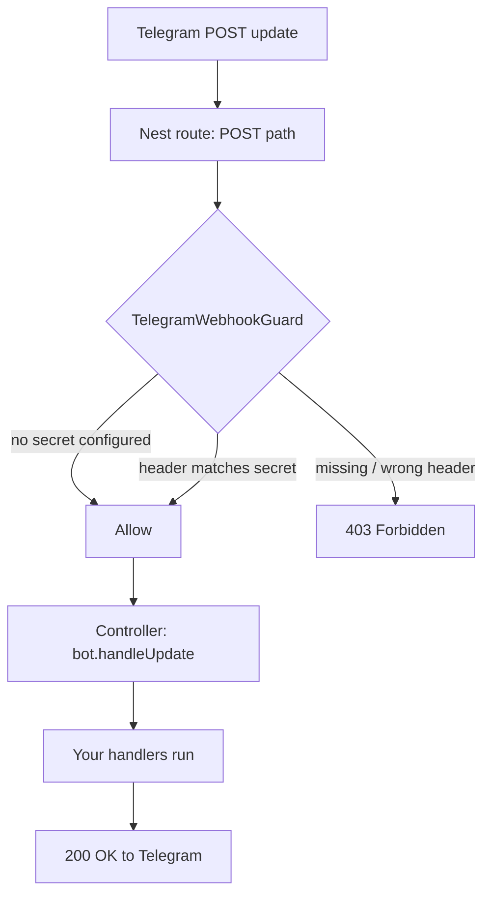

# Built-in Webhook Controller

A drop-in NestJS HTTP controller that runs your bot in **webhook mode** without
hand-mounting `bot.webhookCallback(path)` on your server. Enable it with one
`webhook` option and the module stands up a `POST {path}` route that verifies
Telegram's secret token (constant-time), feeds each update into the bot, and —
optionally — registers the webhook URL with Telegram on startup.

This is the batteries-included alternative to the manual
[`launch: false` + `webhookCallback`](./BOT-API.md#4-polling-vs-webhook) pattern.

---

## Table of contents

- [When to use it](#when-to-use-it)
- [Quick start](#quick-start)
- [Architecture overview](#architecture-overview)
- [File structure](#file-structure)
- [Options reference](#options-reference)
- [Request flow](#request-flow)
- [HTTP reference](#http-reference)
- [Auto-registration on bootstrap](#auto-registration-on-bootstrap)
- [Multiple bots](#multiple-bots)
- [Security notes](#security-notes)
- [How to extend](#how-to-extend)

---

## When to use it

Webhook mode is the production-recommended deployment: Telegram **pushes**
updates to your HTTPS endpoint instead of you long-polling. Use the built-in
controller when you want that with minimal wiring and a hardened secret-token
check. Reach for the [manual `webhookCallback`](./BOT-API.md#4-polling-vs-webhook)
approach instead when you need full control over the raw request handling.

> **Run one mode at a time.** When you enable the webhook controller, set
> `launch: false` so `TelegramBotService` does **not** also start long-polling.

---

## Quick start

```ts
// app.module.ts
import { Module } from '@nestjs/common';
import { TelegramBotModule } from 'nestjs-telegram';

@Module({
  imports: [
    TelegramBotModule.forRoot({
      token: process.env.BOT_TOKEN!,
      launch: false, // webhook mode — do not also long-poll
      webhook: {
        path: '/telegram/webhook',
        domain: 'https://bot.example.com',
        secretToken: process.env.TELEGRAM_WEBHOOK_SECRET,
        registerOnBootstrap: true,
      },
    }),
  ],
})
export class AppModule {}
```

That's it — no `main.ts` changes. On bootstrap the module calls
`setWebhook('https://bot.example.com/telegram/webhook', { secret_token })`, and
every delivery to `POST /telegram/webhook` carrying the correct
`X-Telegram-Bot-Api-Secret-Token` header is dispatched to your handlers.

Your handlers are registered exactly as in polling mode (decorator-based
`@TelegramUpdate` / `@Command`, or `bot.command(...)` etc.) — the controller only
changes how updates *arrive*.

---

## Architecture overview

The webhook lives entirely inside the Bot API side (`src/lib/bot`) and shares no
code with the MTProto client. Enabling it adds four things to the bot's module:

| Piece | Role |
| --- | --- |
| **Webhook controller** (generated per registration) | `POST {path}` route; injects the bot and calls `Telegraf.handleUpdate`. |
| **`TelegramWebhookGuard`** | Verifies the `X-Telegram-Bot-Api-Secret-Token` header in constant time; rejects mismatches with `403`. |
| **`TelegramWebhookRegistrar`** | On bootstrap, optionally calls `setWebhook`; warns when the route has no secret. |
| **Alias providers** | `TELEGRAM_WEBHOOK_OPTIONS` (this bot's webhook config) and `TELEGRAM_WEBHOOK_BOT` (`useExisting` → this bot's `Telegraf`). |

The controller is **generated per registration** because Nest bakes a
controller's route into class metadata, while the path is configurable (and, for
`forRootAsync`, unknown until call time). For that reason the `webhook` config is
a module *extra* — read synchronously at registration, just like `name`.

---

## File structure

```text
src/lib/bot/webhook/
├── index.ts                          # Barrel (options type, guard, header const)
├── telegram-webhook.options.ts       # TelegramBotWebhookOptions
├── telegram-webhook.constants.ts     # Secret header name + DI alias tokens
├── secret-token.ts                   # Constant-time secret comparison
├── telegram-webhook.helpers.ts       # joinWebhookUrl + assertValidWebhookOptions
├── telegram-webhook.guard.ts         # TelegramWebhookGuard (CanActivate)
├── telegram-webhook.controller.ts    # createTelegramWebhookController(path)
└── telegram-webhook.registrar.ts     # TelegramWebhookRegistrar (OnApplicationBootstrap)
```

---

## Options reference

The `webhook` object on `TelegramBotModule.forRoot` / `forRootAsync`:

| Field | Type | Required | Description |
| --- | --- | --- | --- |
| `path` | `string` | ✅ | HTTP route the controller listens on (e.g. `/telegram/webhook`). Leading slash optional. |
| `domain` | `string` | only with `registerOnBootstrap` | Public HTTPS origin (e.g. `https://bot.example.com`); joined with `path` for `setWebhook`. |
| `secretToken` | `string` | recommended | Verified against the `X-Telegram-Bot-Api-Secret-Token` header on every request. Omit → route is **unauthenticated** (a warning is logged). |
| `registerOnBootstrap` | `boolean` | — | When `true`, call `setWebhook(domain + path, { secret_token })` on bootstrap. Defaults to `false`. Requires `domain`. |

Invalid config (empty `path`, or `registerOnBootstrap` without a valid `http(s)`
`domain`) throws a `TelegramConfigError` **synchronously at registration**, so
mistakes surface immediately rather than as a confusing runtime failure.

### Environment variables

The library reads **no** environment variables itself; wire your own
(`BOT_TOKEN`, `TELEGRAM_WEBHOOK_SECRET`, `PUBLIC_URL`, …) into the options as
shown in [Quick start](#quick-start). Because `webhook` is read synchronously,
source these from `process.env` (synchronous) when registering.

---

## Request flow



The secret comparison hashes both values with SHA-256 and uses
`crypto.timingSafeEqual`, so it runs in time independent of the input — neither
the secret's bytes nor its length leak through timing.

---

## HTTP reference

| Method | Path | Auth | Success | Failure |
| --- | --- | --- | --- | --- |
| `POST` | `{webhook.path}` | `X-Telegram-Bot-Api-Secret-Token` header (when `secretToken` is set) | `200 OK` (update dispatched) | `403 Forbidden` (missing/wrong token) |

The request body is the raw Telegram [`Update`](https://core.telegram.org/bots/api#update)
JSON; Nest's JSON body parser must be enabled (it is by default on the Express
and Fastify platforms).

---

## Auto-registration on bootstrap

With `registerOnBootstrap: true`, `TelegramWebhookRegistrar` calls
`setWebhook(joinWebhookUrl(domain, path), { secret_token })` during
`onApplicationBootstrap`. A failed call is **logged, not thrown**, so a transient
Telegram/network error never aborts your app's startup — the same non-fatal
policy `TelegramBotService` applies to `launch`.

Leave `registerOnBootstrap` unset (the default) if you prefer to register the URL
from an infra script or deploy step; the controller still serves the route.

---

## Multiple bots

Each `TelegramBotModule.forRoot({ name, webhook })` registration gets its **own**
controller, guard, and registrar, isolated in its own module scope. Give every
bot a **distinct `path`** or the routes will collide:

```ts
imports: [
  TelegramBotModule.forRoot({
    name: 'notify',
    token: process.env.NOTIFY_TOKEN!,
    launch: false,
    webhook: { path: '/hooks/notify', secretToken: process.env.NOTIFY_SECRET },
  }),
  TelegramBotModule.forRoot({
    name: 'support',
    token: process.env.SUPPORT_TOKEN!,
    launch: false,
    webhook: { path: '/hooks/support', secretToken: process.env.SUPPORT_SECRET },
  }),
],
```

Each route only accepts its own bot's secret and dispatches to only its own bot.
See [MULTIPLE-BOTS.md](./MULTIPLE-BOTS.md) for the wider multi-bot model.

---

## Security notes

- **Always set `secretToken` in production.** Without it the endpoint is
  unauthenticated — anyone who learns the path can POST spoofed updates. The
  registrar logs a warning on bootstrap when no secret is configured.
- **The secret is never logged.** Only the fact that a request was rejected is
  logged, never the expected or received token.
- **Constant-time comparison** prevents byte-by-byte recovery of the secret via
  response timing.
- **Use HTTPS.** Telegram only delivers to HTTPS endpoints; terminate TLS at your
  proxy/load balancer or the app.
- The secret token must be 1–256 characters of `A-Z`, `a-z`, `0-9`, `_`, `-`
  (Telegram's constraint).

---

## How to extend

- **Reuse the guard** on your own routes: it's exported as `TelegramWebhookGuard`
  and reads the secret from the per-bot `TELEGRAM_WEBHOOK_OPTIONS` provider.
- **Custom request handling** beyond `handleUpdate`: skip the controller and use
  the manual [`webhookCallback`](./BOT-API.md#4-polling-vs-webhook) pattern, or
  add your own controller injecting the raw `Telegraf` via
  [`TELEGRAM_BOT`](./BOT-API.md#6-injecting-the-raw-telegraf-instance-telegram_bot)
  (or `getBotInstanceToken(name)` for a named bot).
- **Deregister on shutdown**: call `deleteWebhook()` from
  [`TelegramBotService`](./API-REFERENCE.md) in your own shutdown hook if you want
  the URL removed when the app stops (the registrar intentionally leaves it in
  place so deploys don't drop updates).
```
